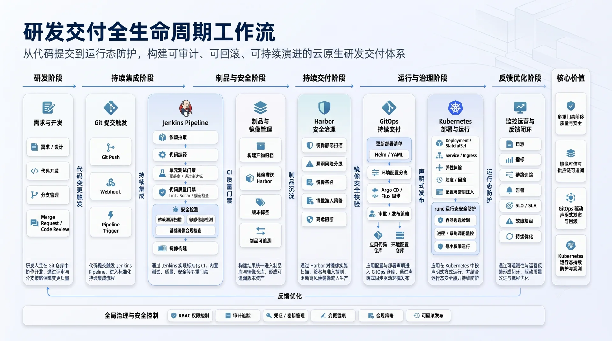
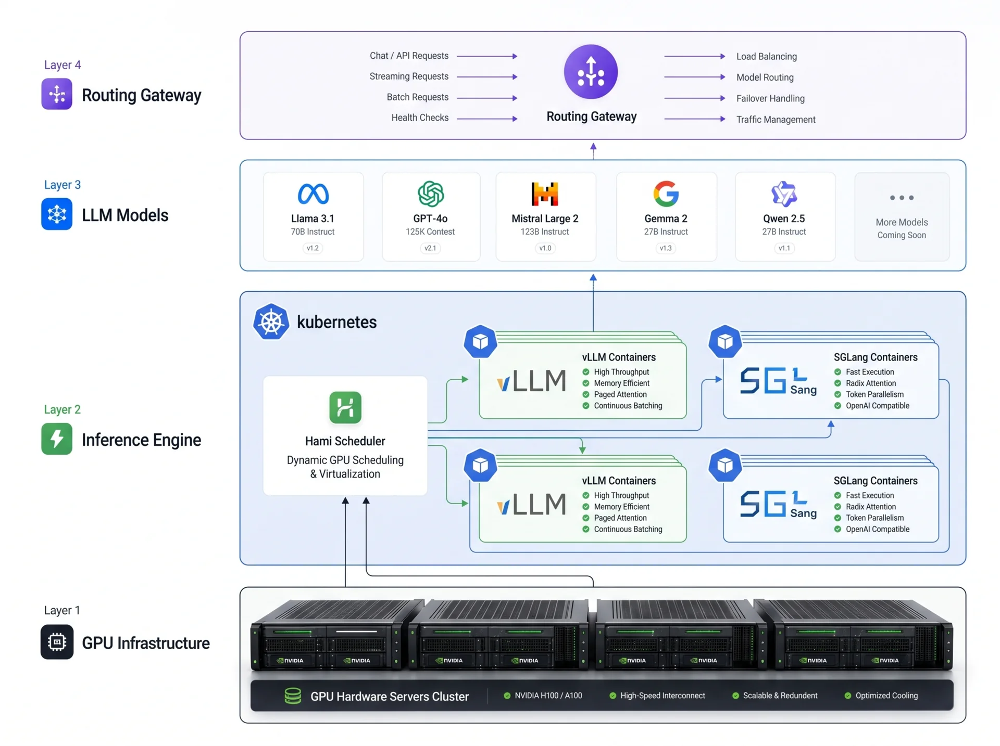
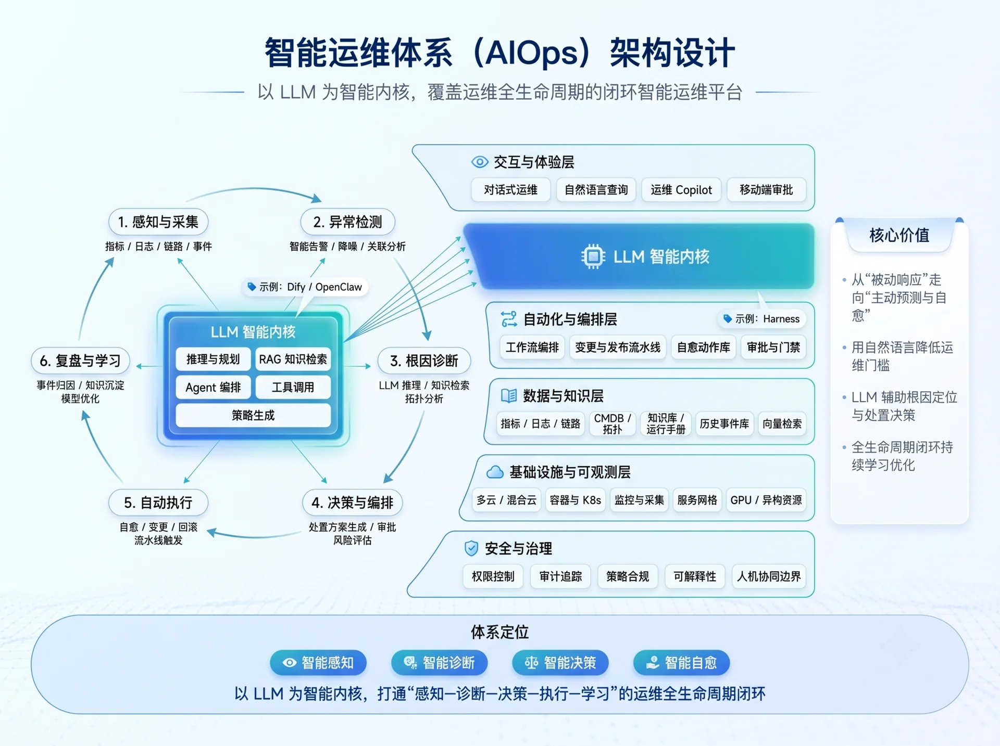

<!-- Left Column: Profile, Capabilities, Skills -->

<!-- Profile Card -->

<h1 class="profile-name">隽戈</h1>

Cloud-Native Architect / SRE Engineer / Tech Blogger

A <strong>hybrid profile</strong> combining <strong>SRE, Cloud-Native, Observability, Data Engineering, Machine Learning</strong> and <strong>Platform Development</strong>. Long-term focus on large-scale distributed system stability governance and AIOps platform construction, with strong platform engineering capabilities to independently complete AIOps system architecture design, core module development, and stability assurance.

<a href="https://github.com/autherlj" target="_blank" class="btn btn-outline-dark btn-sm me-2 mb-2">
<i class="fab fa-github"></i> autherlj
</a>
<a href="mailto:your-email@example.com" class="btn btn-outline-primary btn-sm mb-2">
<i class="fas fa-envelope"></i> Email
</a>

<!-- Core Capabilities -->

<h3 class="section-title">Core Capabilities</h3>

🛡️ SRE Stability Governance
☁️ Cloud-Native Architecture

📊 Observability Platform
📐 Data Engineering

🤖 Machine Learning
🔧 Platform Development

<!-- Tech Stack -->

<h3 class="section-title">Tech Stack</h3>

<!-- Programming Languages -->

Languages

Python
Golang
Java
JavaScript
Terraform
Ansible

<!-- Core Domains -->

Core Domains

Kubernetes
AIOps
Prometheus
OpenTelemetry
Grafana
Platform Engineering

<!-- Observability -->

Observability

Metric
Log
Trace
Event
ELK
Skywalking

<!-- Data & Messaging -->

Data & Messaging

Kafka
Flink
ClickHouse
Elasticsearch

<!-- DevOps Tools -->

CI/CD & DevOps

Jenkins
GitLab CI
ArgoCD
Helm
Kustomize

<!-- Community -->

<h3 class="section-title">Community & Open Source</h3>

<h6 class="fw-bold mb-3">Active Communities</h6>
<ul class="list-unstyled community-list mb-4">
<li>Expert Ops Community</li>
<li>HAMI Project Community</li>
<li>Xinference Community</li>
<li>CNCF Cloud-Native Southwest China</li>
<li>ArkSphere AI Community</li>
</ul>

<h6 class="fw-bold mb-3">Open Source Experience</h6>

kubeasz
Project-HAMi
higress
vllm
sglang
xinference
OpenKruise

<!-- Right Column: Typing, Background, Projects -->

<!-- Typing Animation -->

Hi, I'm JunGe.

<!-- Engineering Philosophy -->

<h3 class="section-title">My Engineering Philosophy</h3>

In the AI era, a developer's role shifts from writing code to making <strong>strategic design</strong> decisions.
AI is your tactical executor—it writes code, runs tests, and refactors—but <strong>strategic-level decisions</strong> must be made by humans.
The following four principles are the underlying logic behind my engineering decisions:

<h6 style="color: #1e293b; font-weight: 700; margin-bottom: 0.5rem;">🔷 I Design, Not Pile Up</h6>

A <strong>Deep Module</strong>—rich in functionality but simple in interface—beats a sea of shallow, fragmented code.
Encapsulate complexity behind the interface, so each interaction only requires understanding the interface, not every detail.

<h6 style="color: #1e293b; font-weight: 700; margin-bottom: 0.5rem;">🔷 I Unify, Not Guess</h6>

People, code, and AI speak the same vocabulary. A <strong>Ubiquitous Language</strong> isn't documentation—it's the engineering discipline of eliminating ambiguity.
In the AI era, this value is amplified tenfold.

<h6 style="color: #1e293b; font-weight: 700; margin-bottom: 0.5rem;">🔷 I Think First, Then Act</h6>

Let the design be interrogated before writing code. <strong>Dependencies, edge cases, data models</strong>—
AI won't make decisions for you; it only accelerates the decisions you've already made. If you haven't thought it through, AI only accelerates the chaos.

<h6 style="color: #1e293b; font-weight: 700; margin-bottom: 0.5rem;">🔷 I Verify, Then Deliver</h6>

Every step is verifiable. In an era where AI generates hundreds of lines of code, <strong>TDD's role shifts from quality assurance to process control</strong>—keeping every step within control and correcting deviations the moment they appear.

These principles aren't new inventions—they come from <em>Domain-Driven Design</em>, <em>A Philosophy of Software Design</em>, and Extreme Programming. In the AI era, they haven't been made obsolete—they've become more important.

<!-- Career Background -->

<h3 class="section-title">Career Background</h3>

Held a key technical leadership role in <strong>Singapore Telecom Smart City Project</strong>, driving the complete infrastructure evolution from early <strong>Mesos</strong> to modern <strong>Kubernetes</strong> cloud-native architecture.

During tenure at <strong>Ant Group</strong> and leading internet banks, deeply involved in cloud-native transformation of financial-grade core systems. Focused on high-availability infrastructure and platform engineering capabilities, significantly improving delivery efficiency and system elasticity while maintaining financial-grade stability.

<!-- Projects -->

<h3 class="section-title">Featured Projects</h3>

<h5 class="fw-bold">Enterprise DevOps Platform</h5>

Architecture / Implementation / DevOps Level 3 Certification

Built enterprise-class private R&D workflow platform from scratch based on <strong>GitOps + CI/CD + Kubernetes</strong>. Standardized pipelines and automated delivery systems significantly shortened development cycles. Led platform to achieve <strong>DevOps Level 3 Certification</strong>, establishing industry-leading engineering standards.

<h5 class="fw-bold">AI Heterogeneous Computing Infrastructure</h5>

HAMi / vLLM / sglang / GPU Scheduling

Built high-performance heterogeneous computing platform based on <strong>HAMi + Kubernetes</strong>, achieving vGPU resource pooling and dynamic elastic scheduling. Successfully deployed <strong>vLLM / sglang</strong> LLM containerization solutions, providing unified, efficient, and scalable computing infrastructure for multi-scenario inference tasks.

<h5 class="fw-bold">Next-Gen AIOps System</h5>

Dify / OpenClaw / Harness / n8n / LLM Application

Explored deep LLM applications in operations domain using <strong>Dify</strong> / <strong>OpenClaw</strong> / <strong>Harness</strong> / <strong>n8n</strong> framework. Implemented intelligent log attribution analysis, automated fault diagnosis, and self-service ops chatbot, building an AIOps closed-loop system from reactive response to proactive governance.

<h5 class="fw-bold">Data Center Equipment Management System (Vibe Coding)</h5>

Codex / Claude Code / Windsurf / Redfish / DCIM

Using <strong>Vibe Coding</strong> (AI-assisted development with <strong>Codex / Claude Code / Windsurf</strong>), built a Data Center Infrastructure Management (DCIM) system from scratch. It covers full-category <strong>asset management</strong>—unified multi-brand management of rack equipment, security appliances, storage devices, and network devices; integrates <strong>out-of-band BMC</strong> data via the standard <strong>Redfish</strong> protocol and automated crawlers for automated collection and ops workflow optimization; and provides <strong>data-center rack topology visualization</strong>, combined with <strong>MAC address</strong>-based automatic network link tracing, significantly improving asset visibility and operational efficiency.

<!-- Personal Vision -->

<h3 class="section-title">Personal Vision</h3>

Beyond work, committed to connecting with the community through <strong>video content creation</strong> and technical sharing. Continuously producing high-quality tech Vlogs, sharing practical experience in a visual and systematic way to promote cloud-native and AI technology adoption.

<ul class="list-inline mt-2">
<li class="list-inline-item me-3">📚 <strong>Knowledge:</strong> Building systematic tech knowledge base</li>
<li class="list-inline-item me-3">💡 <strong>Insights:</strong> Sharing industry trend perspectives</li>
<li class="list-inline-item">📷 <strong>Life:</strong> Documenting colorful moments beyond technology</li>
</ul>

