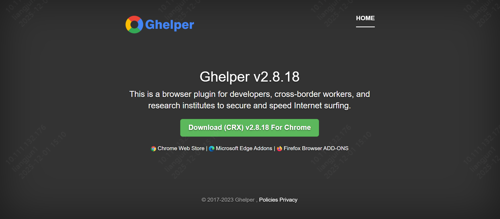

**Ghelper** 是一个浏览器插件，专门为科研、外贸、跨境电商、海淘人员、开发人员服务的上网加速工具，Chrome 内核浏览器专用！

它可以解决 Chrome 扩展无法自动更新的问题，同时可以访问 Google 搜索、Gmail 邮箱等谷歌产品。它可以帮助用户提高跨境访问网站的速度，突破地区限制，提高工作和学习的效率。

## 如何安装

支持 Chrome / Edge / 360 等 Chromium 内核浏览器。

### 方法一：手动安装（推荐）

1.  **下载插件**：访问 [Ghelper 官网](https://ghelper.net/)，下载 CRX package。下载后是一个 zip 文件，请解压缩取得 `.crx` 文件。

2.  **打开扩展程序管理页面**：

    *   打开浏览器，点击地址栏最右边的三个点（菜单），选择 **"更多工具" -> "扩展程序"**。
    *   或者直接在地址栏输入 `chrome://extensions/` 并回车。
3.  **开启开发者模式**：确保页面右上角的 **Developer mode (开发者模式)** 处于打开状态。
4.  **拖拽安装**：将第一步解压得到的 `.crx` 文件拖放到浏览器的扩展程序页面上，浏览器会提示是否添加扩展，点击“添加扩展程序”即可安装完成。

### 方法二：在线安装（Edge 浏览器）

如果是 Edge 浏览器，可以直接访问 Microsoft Edge Addons 商店：

[谷歌上网助手-VIP版](https://microsoftedge.microsoft.com/addons/detail/%E8%B0%B7%E6%AD%8C%E4%B8%8A%E7%BD%91%E5%8A%A9%E6%89%8B-vip%E7%89%88/eoboojokdmamahfilfmamjjkcmkmddgk?hl=zh-CN)

点击页面右上角的 **"获取"** 按钮即可自动安装完成。

## 使用说明

1.  安装完成后，点击浏览器右上角的插件图标。
2.  点击 **"登录"** 按钮进行账号登录（如果没有账号请先注册）。
3.  登录成功后，可以看到插件主界面，以及当前 VIP 的有效期。

*(请将登录界面截图命名为 login_interface.png 并放在本文件同级目录下)*

> **提示**：请确保您的 VIP 状态有效以享受加速服务。

<!-- 
**如何设置列表页封面图（Featured Image）：**
只需将您想要显示的封面图片放入本文件夹（ghelper/）下，并确保文件名包含 "featured" 字样。
例如：命名为 `featured-cover.png` 或 `featured-logo.jpg`。
Hugo 会自动检测并将其显示在博客列表页的摘要旁边。
-->
