## 1. 国产GPU市场格局与主力产品分析

2025年中国AI芯片市场呈现 **GPU（通用图形处理器）** 与 **ASIC（专用集成电路）** 两大技术路线并存、竞争复杂的格局。这一格局源于厂商的技术路径、市场定位及生态策略选择，推动国产算力产业快速发展。

### 📊 整体市场：两大路线博弈

| **GPU 阵营** (通用性与生态兼容) | **ASIC 阵营** (专用优化与性能极致) |
| :--- | :--- |
| 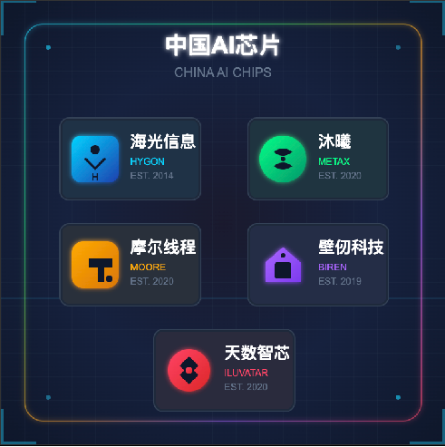 | 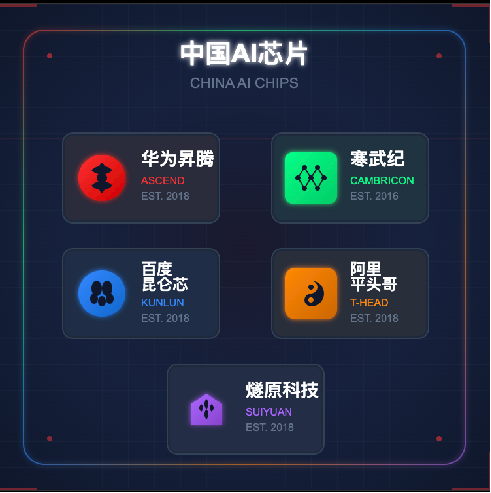 |
| **代表厂商** 海光信息、沐曦、摩尔线程、壁仞科技、天数智芯 | **代表厂商** 华为昇腾、寒武纪、百度昆仑芯、阿里平头哥、燧原科技 |
| **核心优势** ✅ 强大并行处理能力 ✅ 兼容CUDA/ROCm生态，实现“零成本”迁移 ✅ 适用广泛：AI训练/推理、科学计算、图形渲染 | **核心优势** ✅ 针对AI大模型特定场景深度优化 ✅ 远超GPU的性能/能效比 ✅ 算法-硬件耦合提升计算效率 |
| **面临挑战** ⚠️ 需追赶英伟达，技术壁垒高 ⚠️ 硬件/软件研发投入巨大 | **面临挑战** ⚠️ 生态相对封闭，应用局限 ⚠️ 自研栈（如CANN、PaddlePaddle）迁移成本高 |

2025年的中国AI芯片市场，两大阵营相互博弈：

*   **GPU阵营**（如海光、沐曦）核心优势在于通用性及对现有“CUDA”软件生态的兼容性，为寻求平滑迁移的企业提供了极具吸引力的选择。
*   **ASIC阵营**（如华为昇腾、寒武纪）则选择了针对特定应用场景（尤其是AI大模型）深度优化的专用路线，核心优势在于极致的性能和能效比。

总而言之，市场是通用性与专用性、生态兼容与性能极致之间的平衡，两大阵营各具优势，共同推动着国产算力产业的快速发展。

---

## 2. 市场份额：一超多强

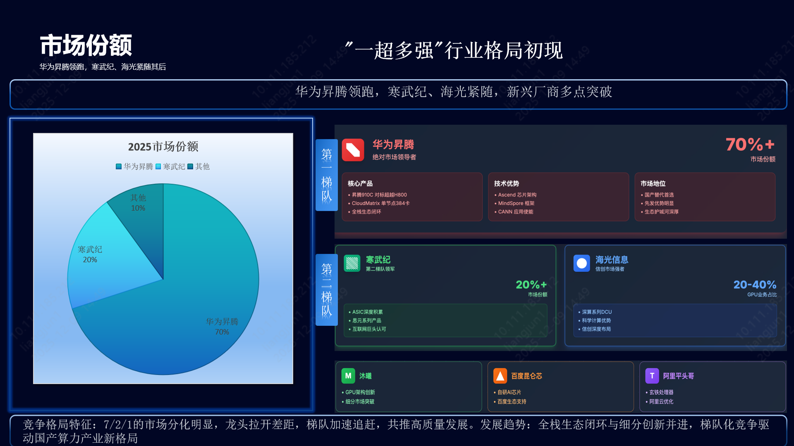

国产AI芯片市场竞争格局已初步呈现 **"一超多强"** 态势。

*   🥇 **华为昇腾 (领导者)**：市场份额 **>70%**。
    *   凭借全栈自研生态（Ascend+MindSpore+CANN），其主力产品 **昇腾910C** 对标英伟达 H800。
    *   **CloudMatrix** 集群方案支持单节点384卡，成为国产替代首选。

*   🥈 **第二梯队 (寒武纪 & 海光)**：
    *   **寒武纪**：市场份额 **>20%**。凭借 **FP8 低精度计算** 的前瞻布局，在字节跳动等大厂大规模部署。
    *   **海光信息**：依托 **深算系列 DCU**，在信创与科研领域增长强劲，GPU业务占总收入 20-40%。

*   🥉 **细分挑战者**：
    *   **沐曦、百度昆仑芯、阿里平头哥** 等厂商在细分领域积极拓展，构建多层次竞争格局。

---

## 3. 竞争格局图谱

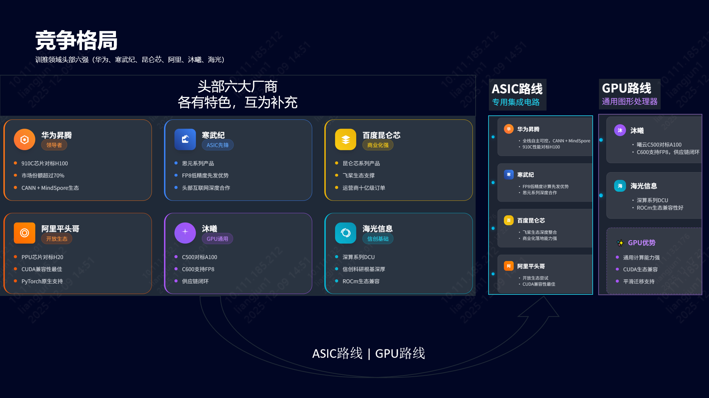

在AI大模型训练与推理领域，核心力量聚焦于六家主要企业：

*   **全栈自研派**：
    *   **华为昇腾**：国产算力主力，910C + CANN 生态壁垒深厚。
*   **ASIC 先锋派**：
    *   **寒武纪**：FP8 先发优势，互联网大厂认可度高。
    *   **百度昆仑芯**：依托百度飞桨生态，运营商集采表现亮眼。
    *   **阿里平头哥**：PPU 性能对标 H20，探索开放生态。
*   **通用兼容派**：
    *   **沐曦**：曦云 C500/C600 对标 A100，支持 FP8，主打国产供应链。
    *   **海光信息**：ROCm 生态兼容，科研与信创领域基础稳固。

---

## 4. 主力厂商技术性能深度解析

### 4.1 华为 | 昇腾910C
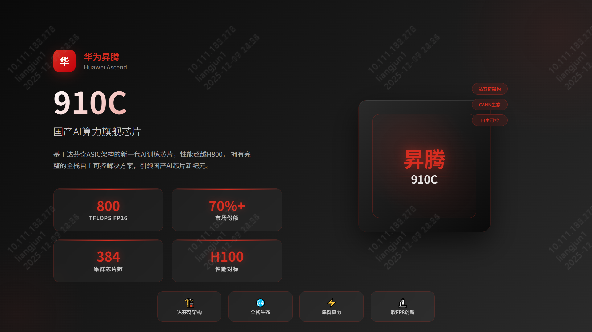

*   **定位**：国产AI算力旗舰，对标 NVIDIA H800 (部分场景达 H100 的 60%)。
*   **架构**：达芬奇 (DaVinci) ASIC 架构。
*   **性能**：FP16 算力约 **800 TFLOPS**。
*   **生态**：CANN 异构计算架构 + MindSpore 框架，构建自主可控全栈方案。
*   **亮点**：
    *   **CloudMatrix 集群**：单节点 384 卡，支持万亿参数大模型训练。
    *   **软 FP8 技术**：通过“软FP8”方案（如昆仑技术 Ascend C 实现），流畅运行 DeepSeek V3.1，实现“精度无损、成本减半”。

### 4.2 寒武纪 | 思元590/690系列
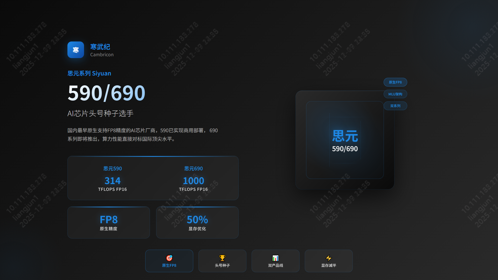

*   **定位**：互联网与云计算领域的大模型核心力量。
*   **性能**：
    *   **思元590**：FP16 算力 **314 TFLOPS**。
    *   **思元690** (预计)：FP16 算力跃升至 **700-1000 TFLOPS**，对标国际顶尖。
*   **亮点**：**原生 FP8 支持**。寒武纪是国内最早布局 FP8 的厂商之一，显存减半，效率倍增，完美适配 DeepSeek 等前沿模型。

### 4.3 阿里平头哥 | PPU (真武)
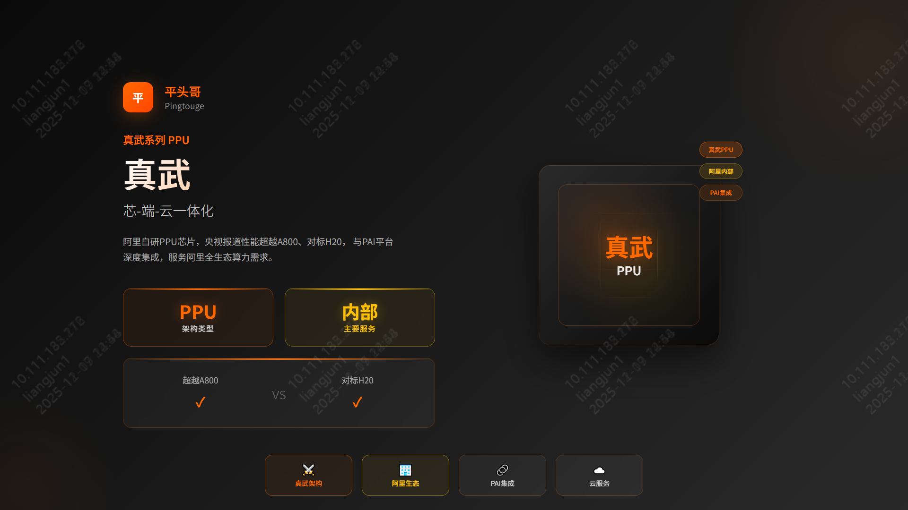

*   **定位**：阿里内部核心算力，支撑电商、云与AI业务。
*   **性能**：主要参数超越 NVIDIA A800，对标 **H20**。
*   **亮点**：与阿里云 PAI 平台深度集成，实现“芯-端-云”一体化。兼容 CUDA 与 PyTorch，代表 ASIC 阵营的开放尝试。

### 4.4 海光信息 | 深算 DCU (BW1000/BW100)
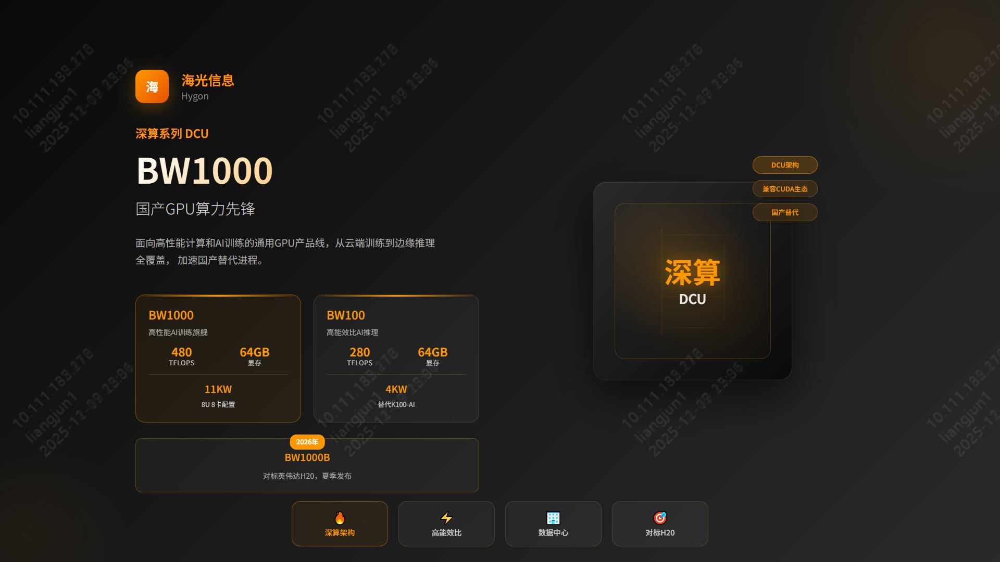

*   **BW1000**：高端训练，8U 8卡，**480 TFlops**，64GB 显存，11KW 功耗。
*   **BW100**：高能效推理，**280 TFlops**，64GB 显存，4KW 功耗，替代 K100-AI。
*   **未来规划**：2026年发布 **BW1000B**，直接对标 NVIDIA H20。
*   **生态**：基于 GPGPU 路线，兼容 ROCm，适合科学计算与通用 AI 任务。

### 4.5 沐曦 | 曦云 C500系列
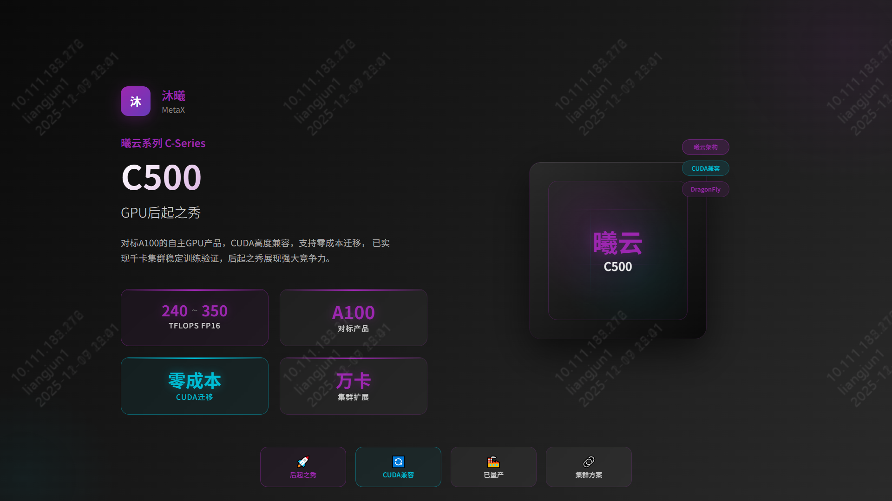

*   **定位**：对标 NVIDIA A100，FP16 算力 **240-350 TFLOPS**。
*   **生态**：**MXMACA 软件栈** 高度兼容 CUDA，实现“零成本”迁移。
*   **集群**：夸娥 (KUAE) 智算集群，支持从 2 卡到万卡规模扩展。

### 4.6 摩尔线程 | MTT S5000
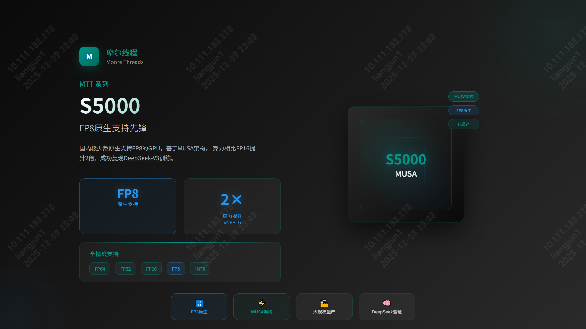

*   **亮点**：**全功能 GPU**，国内极少数**原生支持 FP8**。
*   **性能**：利用 FP8 算力提升 2 倍。全精度支持 (FP64 到 INT8)。
*   **生态**：MUSA 架构，配合 Torch-MUSA 和 MT-MegatronLM，成功复现 DeepSeek-V3 训练。

### 4.7 天数智芯 | 天垓/智铠系列
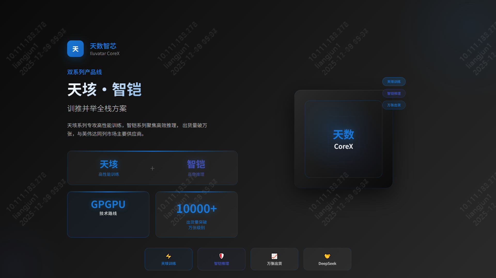

*   **布局**：**天垓** (训练) + **智铠** (推理) 双轮驱动。
*   **市场**：2024年出货突破 **10000张**，商业化落地领先。
*   **生态**：GPGPU 路线，已适配 DeepSeek 等主流大模型。

---

## 5. 趋势展望：FP8 成为新焦点

2026年，**FP8 (8位浮点数)** 将成为国产 GPU 竞争的制高点。

### 📅 技术演进时间轴
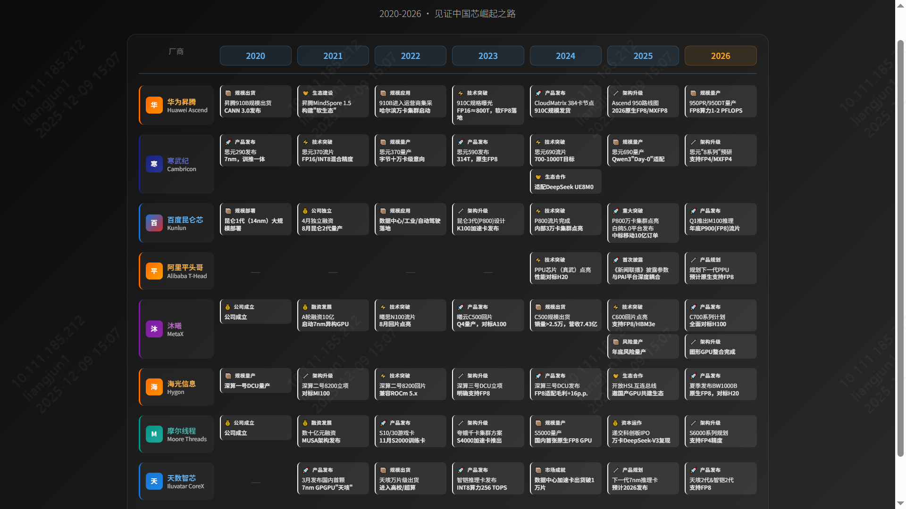

### 💎 FP8 的核心价值
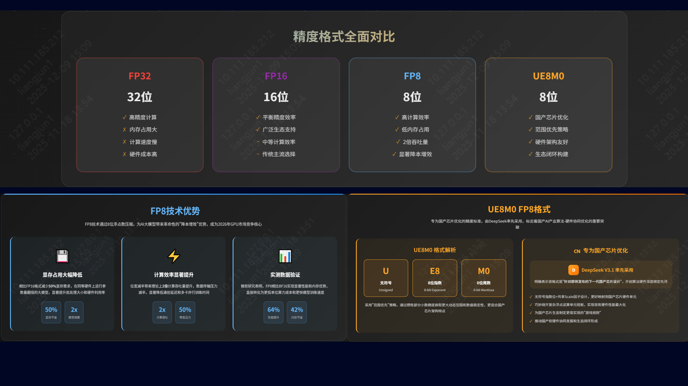

在大模型时代，FP8 带来了革命性的 **“降本增效”**：
1.  **显存占用减半**：同等硬件可运行参数量翻倍的模型，或显著增加 Batch Size。
2.  **计算效率倍增**：理论吞吐量翻倍，通信带宽压力减半。微软研究显示，FP8 相比 BF16 可提升 **64% 性能** 并节省 **42% 内存**。

---

## 6. 生态与适配：DeepSeek 与 Qwen 实战

### ⚡ DeepSeek V3.2 适配情况
国产厂商已实现 "Day 0" 级响应：

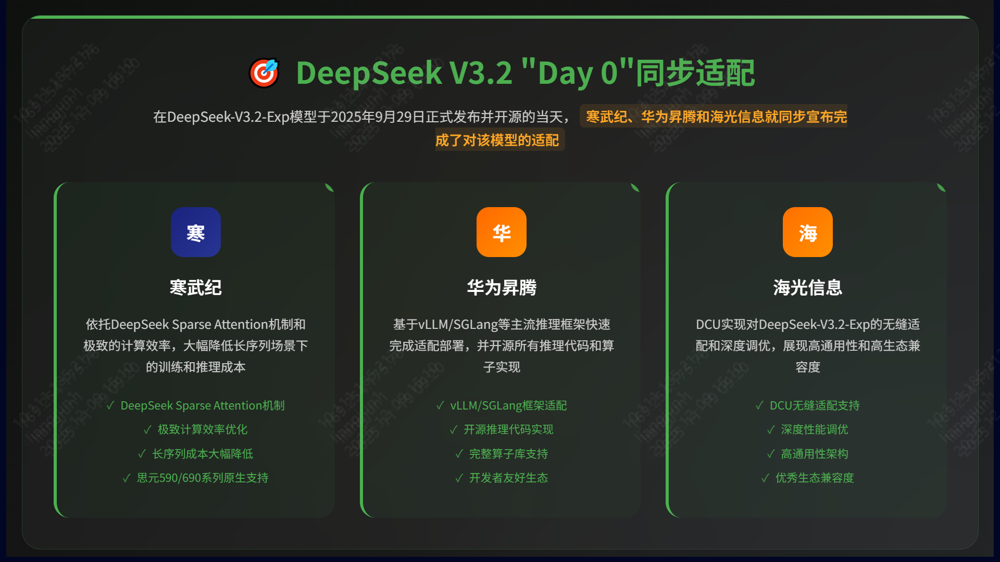

| 框架 | 华为昇腾 | 寒武纪 | 海光信息 |
| :--- | :--- | :--- | :--- |
| **SGLang** | ✅ 明确支持 | ⏳ 预计支持 | ✅ DCU 支持 |
| **vLLM** | ✅ 深度支持 | ✅ 开源 vLLM-MLU | ✅ 兼容支持 |

### 🧠 Qwen3 系列适配实战
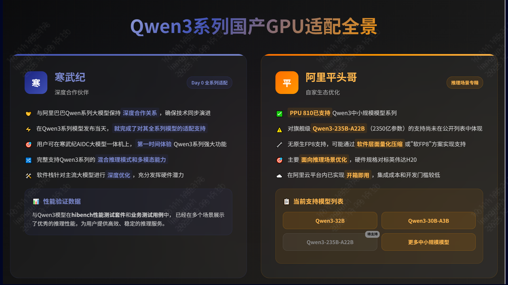

*   **寒武纪**：**全系列适配**。在 Qwen3 发布当天即完成适配，AIDC 一体机开箱即用，多场景推理性能优异。
*   **阿里平头哥**：**深度集成**。PPU 810 已支持 Qwen3 中小规模模型，虽无原生 FP8，但凭借 96GB HBM2e 显存和阿里云集成，在推理场景表现强劲。

### 🌏 国产替代生态全景
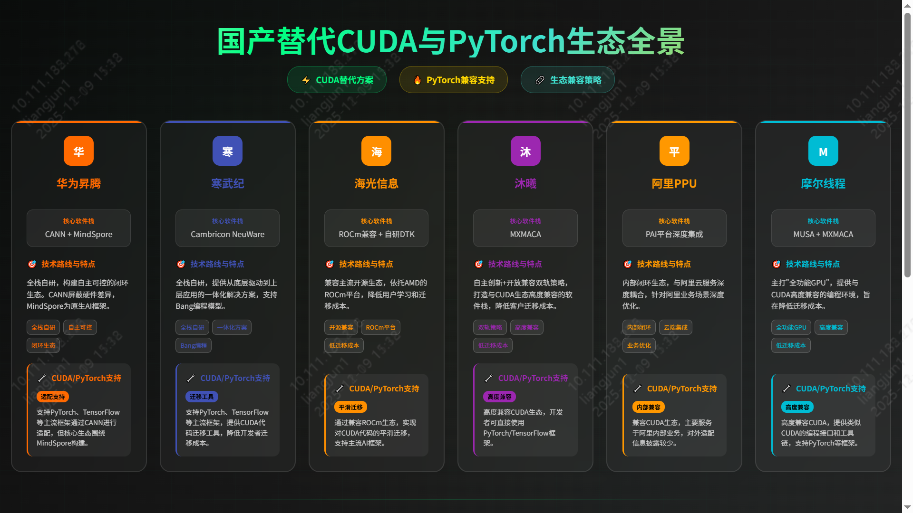

随着 CUDA 与 PyTorch 生态的兼容完善，以及自研框架的成熟，国产算力正逐步构建起自主可控的完整拼图。

---
