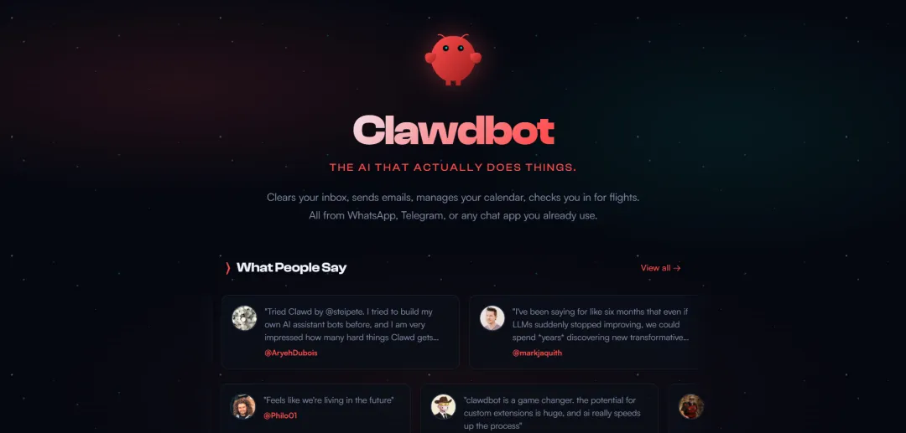
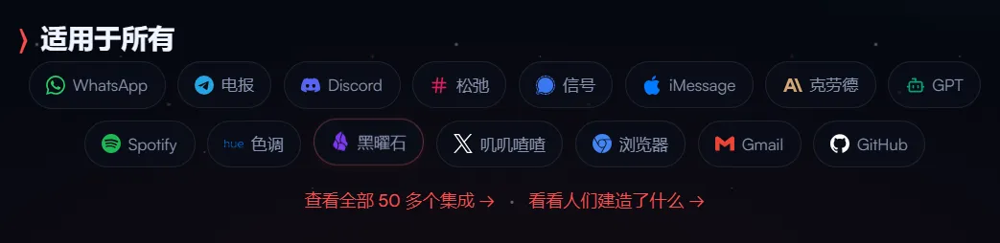
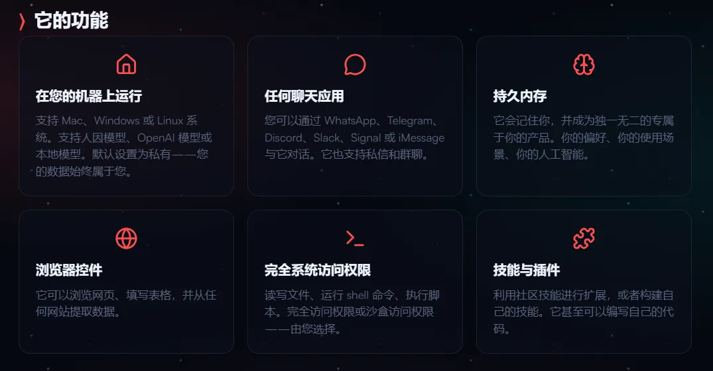
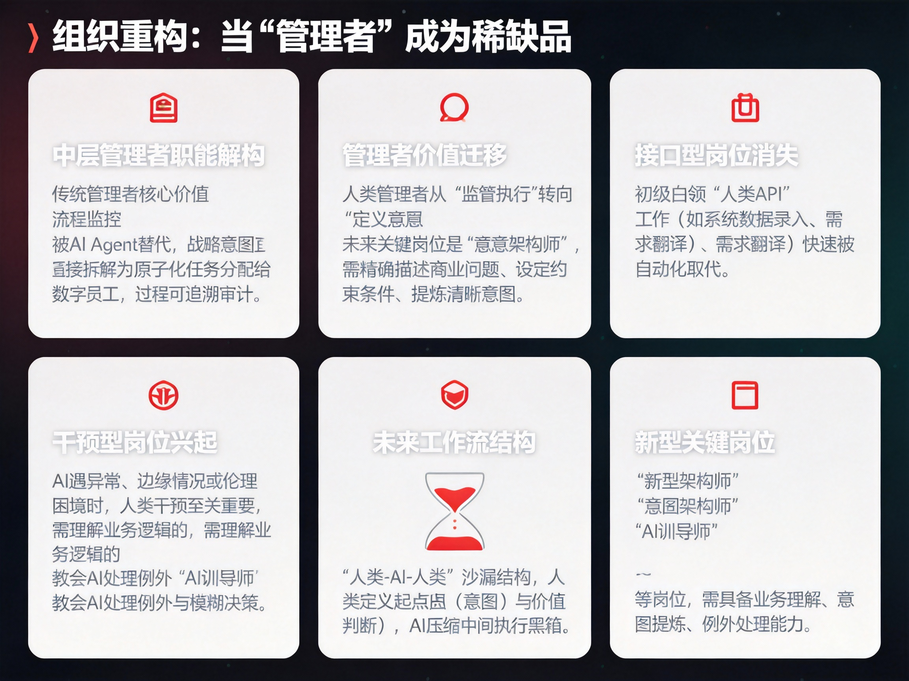
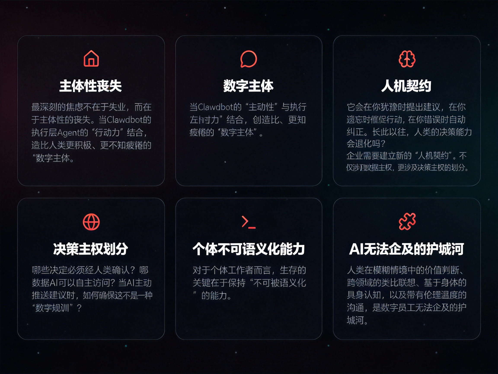

从"工具"到"同事"：当AI开始拥有"自由意志"，人类该如何重新定义工作？

2026年初，一个名为Clawdbot的开源项目在GitHub上悄然掀起风暴。它没有发布会，没有融资新闻，却以一种近乎叛逆的姿态，撕裂了我们与机器交互的固有范式。

这个项目的核心逻辑令人不安又充满诱惑：**拒绝等待唤醒，AI应该拥有"自由意志"**。它寄生在你的即时通讯软件中，记得你上周的情绪波动，知道你明天的日程冲突，在你忘记回复消息时主动催促，在你迷茫时主动递上基于深度语境生成的建议。

这一幕，标志着人机关系正在经历从"主仆模式"到"伙伴关系"的惊险一跃。而更令人震撼的变革，发生在对话框之外——**当AI开始像人类一样"主动思考"，企业的组织形态、工作的定义方式，乃至人类在生产力链条中的位置，都将被彻底重构。**

## 一、交互范式的终结：从"命令式"到"意图式"

在过去二十年的数字化进程中，人机交互始终遵循着一条铁律：**人是启动者，机器是响应者**。我们习惯了小心翼翼地输入关键词，像在神龛前祈祷般等待着算法的恩赐。SaaS工具越丰富，我们的数字生活就越碎片化——每个应用都是一座孤岛，需要人类充当孤独的"数据搬运工"。

Clawdbot的爆火，本质上是用户对这种"被动交互"和"权限牢笼"的集体反叛。它提出了一个名为"语境连续性"（Context Continuity）的新标准：AI不再是一次性应答的搜索框，而是一个拥有长期记忆、能够跨场景存续的"数字生命体"。

这种转变对企业级应用的影响是颠覆性的。想象一下未来的工作场景：你不需要打开ERP、CRM、OA等十几个系统，不需要在繁琐的菜单中层层 drill-down，只需要对你的"数字搭档"说：**"老样子，帮我把这周的客户反馈整理成行动项，避开我已经否决过的方案，直接预约相关人下周的会议室。"**

这不仅仅是界面层的优化，而是对工作流程的解构。**自然语言正在成为新的编程语言，而意图（Intent）正在取代指令（Command）成为人机协作的基本单元。** 当交互摩擦降至接近为零，企业的决策链条将被极度压缩，传统的"金字塔式"信息传递结构将面临崩塌。

## 二、执行层的觉醒：数字员工的"手脑分离"与"非侵入式革命"

然而，Clawdbot揭示了一个更残酷的真相：**拥有强大的"嘴"和"耳朵"的AI，仍然是残缺的。**

它可以理解你的需求，可以陪你进行复杂的战略研讨，但当你说："登录那个十年前的内部系统，把上个月的异常数据导出来，按照财务部的特殊格式处理，然后提交审批"时，它会卡壳。因为它没有"手"——它无法与那些陈旧的、封闭的、甚至故意反对自动化的业务系统交互。

这引出了AI Agent落地的真正深水区：**执行层（Execution Layer）的构建**。在这个维度上，技术路线出现了微妙的分化。

一条路径信奉"云端原生"（Cloud-Native）：假设世界是开放的，所有服务都应该通过API互联。这条路线优雅、高效，在现代化的数字基础设施中如鱼得水。但它在面对现实时显得过于理想主义——企业的真实IT环境充斥着"数据废墟"：只有内网能访问的古老客户端、没有接口文档的遗留系统、禁止外部调用的隐私数据池。

另一条路径则选择"视觉模拟"（Visual Automation）：不依赖软件是否开放，而是像人类一样"看"屏幕，识别按钮、输入框、下拉菜单，通过模拟鼠标点击和键盘输入来完成任务。这种"非侵入式"的自动化看似笨拙，却成为了连接新旧世界的桥梁。

**对于企业而言，这意味着"数字化转型"的叙事正在发生根本转变。** 过去，数字化意味着推倒重来——更换系统、重建流程、培训员工。而现在，AI Agent允许企业以"外骨骼"的方式实现智能化：**无需改造现有的"数据烂摊子"，而是派遣不知疲倦的"数字蓝领"，用模仿人类的方式把这些系统跑起来。**

这是一场"轻量级革命"。企业的IT升级成本被极大降低，但同时，组织内部开始并存两类员工：碳基员工和硅基员工。后者不会抱怨，不会离职，也不会要求加班费，但它们的存在，正在重新定义"工作"的边界。

## 三、组织重构：当"管理者"成为稀缺品

当Clawdbot这类"交互中枢"与具备执行能力的"数字手脚"结合，企业的组织架构将面临严峻的"灵魂拷问"。

**首先，中层管理者的职能将被解构。** 传统的管理者核心价值在于"信息传递"和"流程监控"——将高层的战略拆解为可执行的任务，监督基层员工的执行情况。但在AI Agent的语境下，战略意图可以直接被拆解为原子化的执行任务，并自动分配给相应的数字员工执行。管理者不再需要"盯着"过程，因为AI的每一次点击、每一次数据读取都可被追溯、可被审计。

**这迫使人类管理者向更高维度的价值迁移：从"监督执行"转向"定义意图"。** 未来的关键岗位不是那些精通Excel公式或PPT美化的人，而是那些能够精确描述商业问题、能够设定合理约束条件、能够在模糊的业务场景中提炼出清晰意图的"意图架构师"（Intent Architect）。

**其次，"接口型岗位"将大量消失，但"干预型岗位"将兴起。** 许多初级白领工作本质上是"人肉API"——将A系统的数据手动录入B系统，将邮件中的需求翻译成工单中的字段。这些工作正在快速被自动化取代。但与此同时，当AI在封闭系统中遇到异常、需要判断边缘情况、或是面对没有标准答案的伦理困境时，人类的干预变得至关重要。

**未来的工作流将是"人类-AI-人类"的沙漏结构：** 人类负责定义起点（意图）和验收终点（价值判断），AI负责压缩中间庞大的执行黑箱。介于两者之间的是一群新型的"AI训导师"——他们不需要会编程，但需要理解业务逻辑，能够教会AI如何处理例外情况，如何在不确定性中做出符合企业价值观的模糊决策。

## 四、人的困境：谁在指挥谁？

在这场变革中，最深刻的焦虑不在于失业，而在于**主体性的丧失**。

当Clawdbot的"主动性"与执行层Agent的"行动力"结合，我们实际上在创造一种比人类更积极、更不知疲倦的"数字主体"。它会在你犹豫时提出建议，在你遗忘时催促行动，在你错误时自动纠正。长此以往，人类的决策能力会退化吗？当我们习惯了说"老样子，帮我搞定"，我们还保留着"不凭经验、重新思考"的能力吗？

**企业需要建立新的"人机契约"。** 这不仅涉及数据主权（如Clawdbot推崇的本地自托管模式），更涉及决策主权的划分。哪些决定必须经人类确认？哪些数据AI可以自主访问？当AI主动推送建议时，如何确保这不是一种"数字规训"？

对于个体工作者而言，生存的关键在于**保持"不可被语义化"的能力**。AI擅长处理结构清晰的任务（即使界面是混乱的），但人类在模糊情境中的价值判断、跨领域的类比联想、基于身体的具身认知，以及带有伦理温度的沟通，仍然是数字员工无法企及的护城河。

## 结语：新契约时代

Clawdbot的爆火，标志着一个旧时代的尾声：**那个将AI视为"增强版搜索引擎"的时代已经结束。**

我们正在进入一个"生态协作"的新纪元。未来的个人工作助理，极有可能是一个三位一体的存在：一个懂你语境的交互中枢，一个连接开放世界的通用大脑，以及一群专精于封闭系统操作的数字蓝领。

对于企业来说，这场变革的核心命题不再是"如何用AI降本增效"，而是**如何在一个硅基员工与碳基员工共存的世界里，重新定义组织的使命与边界**。

也许用不了多久，我们早上走进办公室（或打开远程协作软件）时，第一句话不再是"我需要做什么"，而是**你觉得我们今天应该解决什么问题？**

当机器开始主动思考，人类终于被迫回归那个最本质的问题：**工作的意义，究竟是什么？**

## 参考资料

### 相关链接

- **Clawd Bot 官网**  
  https://clawd.bot/  
  Clawd Bot 的官方网站，提供产品介绍和服务信息

- **Molt Bot 官方文档**  
  https://docs.molt.bot/  
  Molt Bot 完整的使用文档和技术指南

- **Molt Bot GitHub 仓库**  
  https://github.com/moltbot/moltbot  
  Molt Bot 的开源代码仓库，包含项目源码和开发信息

---

