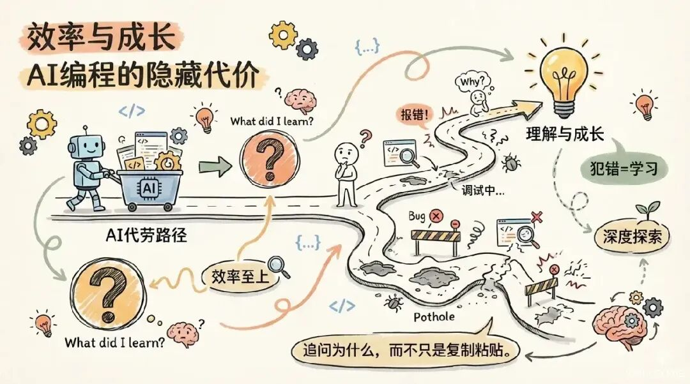

**AI 编程能力的平民化，让"做一个小工具然后靠广告产生被动收入"这件事，从需要学几个月编程，变成了一下午就能搞定的实操流程。**

做一个工具放在网上，用户免费使用，页面上的广告被看到或点击，你就赚钱。接单是一锤子买卖，做工具是数字资产——盖一次房子，收一辈子租。

这是独立开发者圈子里一个被反复验证的模式。过去你至少需要掌握 HTML/CSS/JavaScript 和服务器部署才能起步，现在有了 AI 编程助手，门槛被压缩到了"会打字就行"。本文从技术实践角度，拆解从 0 到 1 的完整链路。

  
  
  
  
  

## 一、选品：做什么样的工具才有流量

**高频、极简**，四个字定方向。高频意味着用户反复需要的刚需功能，极简意味着一个页面解决所有问题，用完即走。

不要做功能复杂的大平台。一个 10 万人能用上的小工具，远比一个 100 万人用不上的大平台值钱。

### 已验证的流量方向

| 类型 | 代表工具 | 流量特点 |
|------|---------|---------|
| **实用工具类** | 文字转语音、图片压缩、PDF 合并、九宫格切图、二维码生成 | 需求硬，搜索量大，长尾效应强 |
| **趣味生成类** | 毒鸡汤生成器、表情包制作、AI 起名器、每日运势 | 社交传播性高，容易出圈 |
| **垂直查询类** | 高校录取分数线、药品说明书、商标查询 | 广告单价高，精准流量 |

### 选品三原则

<ul class="numbered-list">
<li>1<strong>从自身痛点出发</strong>——你曾经搜过"XX 在线工具"却找不到好用的那种感觉，就是最佳产品方向。只有真实体验过需求，才可能做出比现有产品更好的体验。</li>
<li>2<strong>功能越单一越好</strong>——一个页面能搞定的事，不要做成多页应用。开发速度快，用户决策成本低，留存率更高。</li>
<li>3<strong>看一眼搜索量</strong>——在搜一搜或百度搜索"XX 在线""免费 XX"，有搜索量就意味着有自然流量可以吃。</li>
</ul>

新手最稳妥的起步选项：**文字转语音** 或 **图片压缩**。需求硬、结构简单、一个下午就能上线。

  
  
  
  
  

## 二、开发：用 AI 把工具"聊"出来

这是整个流程的核心变化所在。以前做一个工具原型，要么自己学一个月代码，要么花几千块找外包。现在你打开一个 AI 编程工具，用自然语言描述功能需求，代码就出来了。

### 推荐工具

| 工具 | 出品方 | 特点 | 适用阶段 |
|------|--------|------|---------|
| **MarsCode** | 字节跳动 | 对话式编程体验成熟，全程中文，操作直观，支持在线预览和部署 | 新手首选 |
| **通义灵码** | 阿里云 | 中文支持好，深度集成 VS Code/JetBrains | 有一定基础后进阶 |
| **腾讯云 AI 代码助手** | 腾讯 | 与微信小程序开发无缝衔接 | 想做小程序版本时 |

### 实操演示：做一个文字转语音工具

打开 MarsCode，用中文直接提需求：

<pre><code>
帮我做一个在线文字转语音的网页工具。页面上方是一个大文本框，用户可以在里面输入文字。下面有一个"开始朗读"按钮和一个"暂停"按钮。再下面有一个语速调节的滑块。点击开始朗读后，用浏览器自带的语音合成功能把文字读出来。页面设计简洁干净，背景是浅灰色，按钮是圆角的蓝色，整体风格清新。底部预留一个横条广告位，现在先用浅色背景占位。
</code></pre>

AI 会自动生成一个可直接预览的 HTML 文件。然后不断迭代调整：

> "按钮改成绿色" → "字体调大一号" → "再加一个选择声音性别的下拉菜单" → "把 Web Speech API 的语音合成服务用 SSE 包装一下，便于后续迁移到云端 TTS"

整个过程通常在 **30 到 60 分钟** 内，就能拿到一个可用的网页文件。

<strong>技术提示：</strong>如果最终需要高保真合成效果，浏览器内置的 SpeechSynthesis API 音质有限，建议用 AI 生成 HTML 原型 + 后续对接 Azure TTS / MiniMax TTS 接口。原型阶段先用浏览器原生 API 验证交互流程。

### 进阶：转成微信小程序

把生成的 HTML 丢给 AI：**"帮我把这个 HTML 网页转成微信小程序代码"**，然后在微信开发者工具里预览调试。用 AI 辅助转换，第一次做小程序通常几天内能搞定。

  
  
  
  
  

## 三、部署：让全世界能访问

HTML 在本地只是文件，放到公网上才是产品。

### 方案对比

| 方案 | 费用 | 国内访问 | 推荐场景 |
|------|------|---------|---------|
| **腾讯云 CloudBase** | 有免费额度 | ✅ 快 | 国内用户为主，推荐首选 |
| **GitHub Pages + Cloudflare** | 完全免费 | ⚠️ 需备案 | 练手/海外用户 |
| **微信小程序** | 个人免费注册 | ✅ 流量池大 | 已验证网页版后复制 |

### 腾讯云 CloudBase 部署流程

1. 微信扫码注册腾讯云 CloudBase，获取免费额度
2. 将 AI 生成的 HTML 文件下载到本地
3. 进入 CloudBase 后台 → **静态网站托管**
4. 上传文件，系统自动生成访问链接
5. （可选）绑定自定义域名，提交 ICP 备案

### GitHub Pages 部署流程

1. 注册 GitHub 账号，创建仓库 `你的用户名.github.io`
2. 上传 AI 生成的网页文件到仓库
3. 开启 GitHub Pages 功能
4. 等几分钟，网站通过 `https://你的用户名.github.io` 可访问
5. 配合 Cloudflare DNS 接入自定义域名

<strong>建议策略：</strong>先用网页版验证需求和广告模式，跑通后再复制一份做成小程序版，双端流量一起吃。

  
  
  
  
  

## 四、变现：接入广告体系

### 国内用户流量 → 腾讯优量汇

1. 注册腾讯优量汇账号并完成开发者认证
2. 创建媒体，选择"网站"或"小程序"
3. 填写应用名称、域名等信息，提交审核
4. 审核通过后创建广告位（推荐 **Banner 横幅广告**）
5. 嵌入广告代码到 HTML 页面

### 海外用户流量 → Google AdSense

1. 注册 Google AdSense 账号
2. 添加网站 URL 提交审核
3. 审核通过后创建广告单元，选择展示广告
4. 将广告代码嵌入工具页面

### 微信小程序 → 微信流量主

1. 小程序累计独立访客达 **1000 人** 后申请开通
2. 创建 Banner 广告或插屏广告
3. 按千次展示收费，不同类目单价差异大

<strong>关键提醒：</strong>广告位置不能遮挡核心功能按钮，否则影响用户体验。可以先不挂广告，等流量稳定后再接入——审核通过率更高，留存也更好。

  
  
  
  
  

## 五、获客：把雪球滚起来

工具上线只完成了一半，另一半是让足够多的人知道它。以下五个经过验证的获客渠道，按推荐优先级排列：

<ul class="numbered-list">
<li>1<strong>小红书"工具安利贴"</strong>——把工具截图发成笔记，标题 "我不允许还有人不知道这个免费 XX 工具"。有实操案例：一篇图片压缩工具安利贴，一周带来 2 万+ 访问。</li>
<li>2<strong>知乎"怎么 XX"问题回答</strong>——搜索工具对应的需求关键词，写高质量回答把工具放进系统性解决方案里。知乎搜索权重高，一条优质回答吃一年长尾流量。</li>
<li>3<strong>微信搜一搜（蓝海渠道）</strong>——公众号写工具教程，标题包含 "免费 XX""在线 XX 工具" 等搜索词，稳定排名后持续获客。</li>
<li>4<strong>搜索引擎优化（长期策略）</strong>——HTML 的 title 和 meta description 包含核心关键词，三个月左右搜索引擎会开始稳定收录。</li>
<li>5<strong>短视频平台"教程类"内容</strong>——把使用过程录制成 15-30 秒短视频，发到抖音/快手。工具类内容天然适合合集推荐，转化率高。</li>
</ul>

### 矩阵化复制：真正的放大模式

当第一个工具跑通并产生第一笔广告费后，用同样的流程做第二、第三个工具，工具之间互相导流：

> 图片压缩工具 → 推荐 PDF 合并工具 → 推荐 文字转语音工具

每个工具单独挂广告，加起来就是一份可观的稳定收入。有独立开发者用这个方法搭建了六七个在线工具站，全站日均数万访问，广告月入近万元。矩阵模式已经是验证过的轻创业路线。

  
  
  
  
  

## 六、收益参考

根据公开分享的真实案例：

800-1500 元/月
中文在线转语音工具，日均访问 1500-2000 人，优量汇广告

300-600 美元/月
PDF 合并工具汉化版，Google AdSense 面向海外，月访问约 1.5 万

2000-4000 元/月
毒鸡汤/废话文学生成器小程序，日活 2000-3000，微信流量主

说所有普通人做都能月入过万不切实际，但跑通流程月入一两千非常现实，矩阵复制后过万也完全有希望。

  
  
  
  
  

## 避坑指南

<strong>❌ 别做太复杂的工具</strong>——第一个功能越少越好，一个页面解决全部需求。先跑通极简版，再迭代优化。
  
<strong>❌ 别一上来就想收费</strong>——靠广告变现的前提是有足够流量。免费先把用户规模做起来，流量才是核心资产。
  
<strong>❌ 别忽视合规</strong>——国内运营必须 ICP 备案，小程序需通过内容审核，广告不能诱导点击，否则封号。
  
<strong>❌ 别买"全自动爆文工具"课程</strong>——自动采集、伪原创、自动发布在各大平台属于作弊行为，会导致封号。老老实实做有用的工具，慢但稳。

  
  
  
  
  

## 立即启动的三件事

<ul class="numbered-list">
<li>1<strong>今天</strong>——确定一个工具方向，就一个。推荐：文字转语音或图片压缩。</li>
<li>2<strong>本周末</strong>——打开 MarsCode 或通义灵码，把工具用自然语言"聊"出来，部署上线。不用纠结功能完不完美，先上线再说。</li>
<li>3<strong>下周</strong>——在至少两个平台（小红书/知乎/朋友圈/抖音）发出工具链接，让第一批用户用上。</li>
</ul>

<strong>能上线的工具，比完美的计划值钱一万倍。</strong>  
你的第一个工具做得再粗糙，只要有人用，你就赚到第一块钱了。之后就是不断改进、不断复制。  
AI 最大的价值，不是帮你省钱，而是帮你创造之前创造不了的收入。

---

*原文链接：<https://mp.weixin.qq.com/s/GJEFFPCOOxQ7X5G8bZm97w> | 博客原文：<https://jungelife.me/zh/blog/tech/ai-tool-ad-monetization/>*
