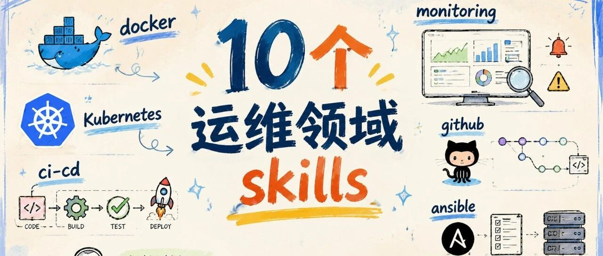
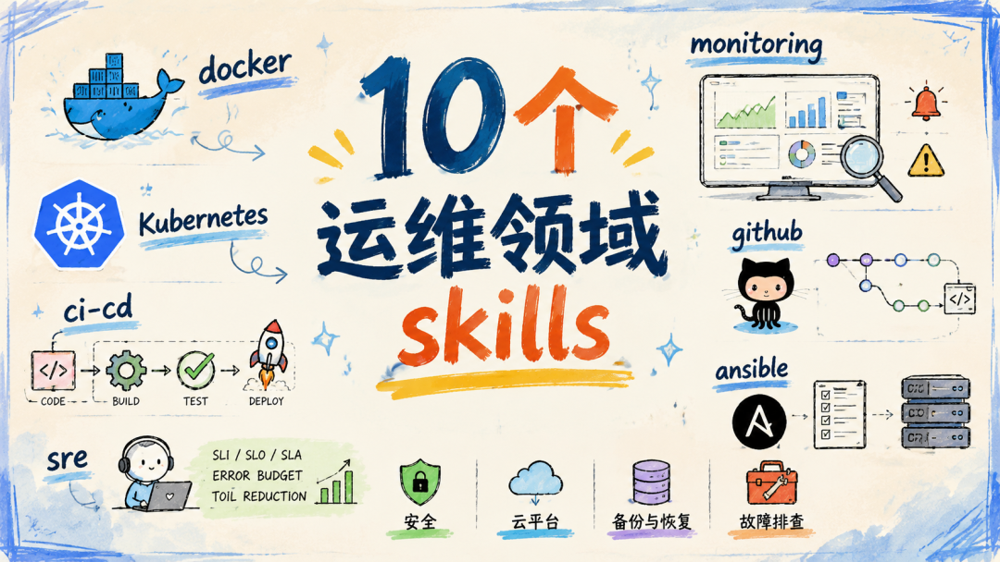

研究AIOps大半年，目前手里有不少可落地的方案。越研究越发现Skills的重要性——用好Skills，可以让我们事半功倍。

**一句话说清楚：** AI Agent Skills 不是大模型能力的替代，而是能力的"精准化"——给 AI 一套明确的工具和上下文，让它从"什么都会但什么都不精"变成"某个场景特别能打"。今天分享10个运维领域里最有实战价值的 Skills。

**研究 AIOps 越久，就越发现 Skills 的重要性。** 当然不只是在 AIOps 场景中，其它场景里 Skills 同样重要。用好 Skills 可以让我们事半功倍，让 AI 从"通用助手"升级为"领域专家"。

今天这篇文章给大家整理了 10 个运维领域里非常实用的 Skills。

---

## 一、Docker

把应用装进容器里，把 Dockerfile 写得更稳、更小、更安全。

**能力：**
<ul class="numbered-list">
<li>1帮你写 Dockerfile</li>
<li>2把 Dockerfile 改得更小、更快</li>
<li>3帮你写 docker-compose</li>
<li>4排查容器启动失败</li>
<li>5加 healthcheck、端口、环境变量、volume、网络配置</li>
<li>6检查安全问题（root 用户、敏感信息泄露）</li>
</ul>

**用在哪：** Java / Python / Node / Go 应用做成 Docker 镜像、Dockerfile 太胖想瘦身、docker-compose 起不来、生产环境容器配置规范化。

**用法示例：** "这是我的 Node.js 项目结构，请帮我写一个生产可用的 Dockerfile，并解释每一行作用。" 或者 "这个 Dockerfile 构建太慢，帮我优化一下，要求镜像尽量小、不要用 root 用户运行。"

---

## 二、Kubernetes Specialist

把服务部署到 Kubernetes，处理 Pod、Service、Ingress、RBAC、网络策略、存储和故障排查。

**能力：**
<ul class="numbered-list">
<li>1写 Deployment / StatefulSet / Service / Ingress</li>
<li>2配置 ConfigMap / Secret / PV/PVC</li>
<li>3配置资源限制和健康检查（readinessProbe / livenessProbe）</li>
<li>4配置 RBAC 权限和 NetworkPolicy</li>
<li>5写 Helm Chart</li>
<li>6排查 Pod CrashLoopBackOff、服务访问不通、Ingress 异常</li>
</ul>

**用在哪：** 服务部署到 K8s、Pod 一直 CrashLoopBackOff、镜像拉不下来、Ingress 访问不了、服务之间无法通信、想把裸 YAML 改成 Helm Chart。

---

## 三、Terraform Engineer

用 Terraform 管理云资源——服务器、网络、数据库、权限、环境隔离。

**能力：**
<ul class="numbered-list">
<li>1写 Terraform 代码和目录结构设计</li>
<li>2拆分 dev / test / prod 多环境</li>
<li>3设计可复用 Module</li>
<li>4配置 remote state 和 state lock</li>
<li>5配置 AWS / Azure / GCP provider</li>
<li>6检查 Terraform 代码的安全性和可维护性</li>
</ul>

---

## 四、Ansible Automation

批量管理服务器——装软件、改配置、打补丁、重启服务。

**能力：**
<ul class="numbered-list">
<li>1写 Ansible playbook 和 inventory 主机清单</li>
<li>2写可复用的 Role</li>
<li>3批量安装软件、修改配置、打补丁、重启服务</li>
<li>4检查 playbook 是否幂等</li>
</ul>

**适用场景：** 还没完全上 Kubernetes，仍然有很多 VM 或物理机需要统一管理。适合批量部署 Nginx、配置防火墙、下发系统参数等操作。

---

## 五、CI/CD

设计和优化自动化流水线——从代码提交到测试、构建、扫描、部署。

**能力：**
<ul class="numbered-list">
<li>1写 CI/CD 流水线（GitHub Actions / GitLab CI）</li>
<li>2优化流水线速度（缓存、并行、增量构建）</li>
<li>3加安全扫描：SAST / DAST / SCA</li>
<li>4加 Docker 镜像构建和自动部署</li>
<li>5设计多环境发布流程</li>
<li>6管理流水线里的密钥和 OIDC</li>
</ul>

---

## 六、GitHub Actions Workflow

专门用来写 GitHub Actions，配置测试、构建、安全扫描、发布和部署。

**能力：**
<ul class="numbered-list">
<li>1写 .github/workflows/*.yml</li>
<li>2配置 push / pull request 触发和条件执行</li>
<li>3配置 matrix 多版本测试</li>
<li>4配置依赖缓存和 artifact 管理</li>
<li>5配置发布流程（npm / PyPI / Docker 镜像）</li>
</ul>

---

## 七、Monitoring & Observability

设计监控、告警、日志、链路追踪——让系统出问题时能看得见、找得到、说得清。

**能力：**
<ul class="numbered-list">
<li>1设计监控指标体系（四大黄金信号）</li>
<li>2写 Prometheus 告警规则</li>
<li>3设计 Grafana dashboard</li>
<li>4分析日志模式和异常链路</li>
<li>5设计 OpenTelemetry 链路追踪</li>
<li>6计算 SLO 和 error budget</li>
<li>7优化告警，减少"狼来了"</li>
</ul>

---

## 八、SRE Engineer

从"救火式运维"升级到"可靠性工程"——定义 SLO、管理故障预算、减少重复人工操作。

**能力：**
<ul class="numbered-list">
<li>1定义服务可靠性目标（SLI / SLO）</li>
<li>2计算和管理 error budget</li>
<li>3设计 on-call 机制和值班流程</li>
<li>4识别并减少 toil（重复运维工作）</li>
<li>5设计混沌工程实验</li>
<li>6做容量规划</li>
</ul>

---

## 九、Incident Triage

线上出事时，快速分诊——发生了什么、影响多大、该找谁、下一步怎么处理。

**能力：**
<ul class="numbered-list">
<li>1看告警内容和日志，提取关键信号</li>
<li>2判断影响范围和严重等级</li>
<li>3整理事件时间线</li>
<li>4给出初步处置建议</li>
<li>5判断是否需要升级处理</li>
<li>6帮值班人员交接，生成复盘模板</li>
</ul>

---

## 十、Postmortem

故障结束后，写无责复盘——找根因、列改进项、明确负责人和截止时间。

**能力：**
<ul class="numbered-list">
<li>1整理故障复盘报告</li>
<li>2用 5 Whys 做根因分析</li>
<li>3用鱼骨图拆问题</li>
<li>4区分直接原因和系统性原因</li>
<li>5生成改进项，分配 owner 和截止时间</li>
<li>6沉淀 lessons learned</li>
</ul>

**核心认知：** 复盘不是"甩锅大会"。好的 postmortem 关注"系统为什么允许这个错误发生"，而不是"谁犯了错"。

---

## 写在最后

10 个 Skills 覆盖了从**容器化 → 编排 → IaC → 配置管理 → CI/CD → 监控 → SRE → 故障处理 → 复盘**的完整运维链路。每一个都可以让 AI 从一个"通用助手"变成某个领域的"专家搭档"。

AIOps 的核心不在于大模型本身，而在于**你能否为你的运维场景设计出精准的 Skills**。

---

## 参考资料

### 相关链接

- **Docker Skill** — [agent-skills.md/skills/cosmix/claude-loom/docker](https://agent-skills.md/skills/cosmix/claude-loom/docker)
- **Kubernetes Specialist** — [agent-skills.md/skills/Jeffallan/claude-skills/kubernetes-specialist](https://agent-skills.md/skills/Jeffallan/claude-skills/kubernetes-specialist)
- **Terraform Engineer** — [agent-skills.md/skills/Jeffallan/claude-skills/terraform-engineer](https://agent-skills.md/skills/Jeffallan/claude-skills/terraform-engineer)
- **Ansible Automation** — [agent-skills.md/skills/aj-geddes/useful-ai-prompts/ansible-automation](https://agent-skills.md/skills/aj-geddes/useful-ai-prompts/ansible-automation)
- **CI/CD Skill** — [agent-skills.md/skills/ahmedasmar/devops-claude-skills/ci-cd](https://agent-skills.md/skills/ahmedasmar/devops-claude-skills/ci-cd)
- **Monitoring & Observability** — [agent-skills.md/skills/ahmedasmar/devops-claude-skills/monitoring-observability](https://agent-skills.md/skills/ahmedasmar/devops-claude-skills/monitoring-observability)
- **SRE Engineer** — [agent-skills.md/skills/Jeffallan/claude-skills/sre-engineer](https://agent-skills.md/skills/Jeffallan/claude-skills/sre-engineer)

---

博客地址：https://jungelife.me/zh/
