<style>
/* ===== junge-site 通用文章样式 ===== */
.td-content {
    max-width: 900px;
    margin: 0 auto;
}

/* ---- 卡片组件 ---- */

/* 引言卡片：紫蓝渐变 + 白色文字 + 阴影 */
.lead-quote {
    background: linear-gradient(135deg, #667eea 0%, #764ba2 100%);
    color: white;
    padding: 2.5rem 2rem;
    border-radius: 12px;
    margin: 2rem 0 3rem 0;
    font-size: 1.25rem;
    font-weight: 600;
    line-height: 1.6;
    box-shadow: 0 10px 30px rgba(102, 126, 234, 0.3);
    position: relative;
    overflow: hidden;
}
.lead-quote::before {
    content: '"';
    position: absolute;
    top: -20px;
    left: 10px;
    font-size: 120px;
    opacity: 0.1;
    font-family: Georgia, serif;
}

/* 信息框：浅色背景 + 左侧蓝色边框 */
.info-box {
    background: #f8f9fa;
    padding: 1.5rem;
    border-left: 4px solid #667eea;
    border-radius: 8px;
    margin: 2rem 0;
}

/* 重点提示框：暖色背景 + 橙色边框 */
.highlight-box {
    background: linear-gradient(135deg, #fff5f5 0%, #fffaf0 100%);
    border: 2px solid #ed8936;
    border-radius: 12px;
    padding: 1.5rem;
    margin: 2rem 0;
    box-shadow: 0 4px 12px rgba(237, 137, 54, 0.1);
}

/* 数据卡片：深色背景 + 大号数字 */
.stats-box {
    background: linear-gradient(135deg, #1a202c 0%, #2d3748 100%);
    color: white;
    padding: 2rem;
    border-radius: 12px;
    margin: 2rem 0;
    text-align: center;
}
.stats-box .number {
    font-size: 2.5rem;
    font-weight: 800;
    color: #667eea;
    display: block;
}

/* ---- 序号列表：带彩色编号圆徽章 ---- */
.numbered-list {
    list-style: none;
    padding: 0;
    margin: 1.5rem 0;
}
.numbered-list li {
    padding: 0.75rem 0 0.75rem 2.5rem;
    position: relative;
    line-height: 1.6;
    border-bottom: 1px solid #f0f0f0;
}
.numbered-list li:last-child {
    border-bottom: none;
}
.numbered-list .num {
    position: absolute;
    left: 0;
    top: 0.75rem;
    width: 28px;
    height: 28px;
    background: linear-gradient(135deg, #667eea, #764ba2);
    color: white;
    border-radius: 50%;
    display: flex;
    align-items: center;
    justify-content: center;
    font-size: 0.85rem;
    font-weight: 700;
    flex-shrink: 0;
}

/* ---- 引用卡片（正文内嵌引用） ---- */
.inline-quote {
    background: #f0f4ff;
    padding: 1.5rem 2rem;
    margin: 2rem 0;
    border-radius: 12px;
    position: relative;
    font-style: italic;
    color: #4a5568;
}
.inline-quote::before {
    content: '"';
    position: absolute;
    top: 5px;
    left: 12px;
    font-size: 48px;
    color: #667eea;
    opacity: 0.2;
    font-family: Georgia, serif;
}
.inline-quote .author {
    display: block;
    margin-top: 0.5rem;
    font-style: normal;
    font-weight: 600;
    color: #667eea;
    font-size: 0.9rem;
}

/* ---- 视觉分隔器 ---- */
.section-divider {
    display: flex;
    align-items: center;
    margin: 3rem 0;
    gap: 12px;
}
.section-divider .line {
    flex: 1;
    height: 1px;
    background: linear-gradient(90deg, transparent, #667eea, transparent);
}
.section-divider .dot {
    width: 6px;
    height: 6px;
    background: #667eea;
    border-radius: 50%;
    opacity: 0.5;
}

/* ---- 结尾典藏框 ---- */
.outro-box {
    background: linear-gradient(135deg, #1a202c 0%, #2d3748 100%);
    color: white;
    padding: 2.5rem;
    border-radius: 16px;
    margin: 3rem 0;
    text-align: center;
    box-shadow: 0 10px 30px rgba(0, 0, 0, 0.2);
}
.outro-box strong {
    color: #667eea !important;
}

/* ---- 标题样式 ---- */
.td-content h2 {
    font-size: 1.8rem;
    font-weight: 700;
    color: #1a202c;
    margin-top: 3.5rem;
    margin-bottom: 1.5rem;
    padding-bottom: 0.8rem;
    border-bottom: 3px solid #667eea;
    position: relative;
}
.td-content h2::before {
    content: '';
    position: absolute;
    left: 0;
    bottom: -3px;
    width: 60px;
    height: 3px;
    background: linear-gradient(90deg, #667eea, #764ba2);
}

/* ---- 加粗文字主题色 ---- */
.td-content strong {
    color: #667eea;
    font-weight: 600;
}

/* ---- 段落样式 ---- */
.td-content p {
    margin-bottom: 1.5rem;
}

/* ---- 图片样式 ---- */
.td-content img {
    border-radius: 12px;
    box-shadow: 0 8px 24px rgba(0, 0, 0, 0.12);
    margin: 2.5rem 0;
    width: 100%;
    transition: transform 0.3s ease;
}
.td-content img:hover {
    transform: translateY(-4px);
    box-shadow: 0 12px 32px rgba(0, 0, 0, 0.18);
}

/* ---- 代码块 ---- */
.td-content pre {
    border-radius: 12px;
    box-shadow: 0 4px 16px rgba(0, 0, 0, 0.1);
    margin: 2rem 0;
}

/* ---- 表格 ---- */
.td-content table {
    border-collapse: collapse;
    width: 100%;
    margin: 2rem 0;
    border-radius: 12px;
    overflow: hidden;
    box-shadow: 0 4px 12px rgba(0, 0, 0, 0.08);
}
.td-content table th {
    background: linear-gradient(135deg, #667eea, #764ba2);
    color: white;
    padding: 12px 16px;
    font-weight: 600;
}
.td-content table td {
    padding: 10px 16px;
    border-bottom: 1px solid #f0f0f0;
}
.td-content table tr:last-child td {
    border-bottom: none;
}

/* ---- 响应式 ---- */
@media (max-width: 768px) {
    .lead-quote {
        padding: 1.5rem 1rem;
        font-size: 1.1rem;
    }
    .stats-box .number {
        font-size: 2rem;
    }
    .numbered-list li {
        padding-left: 2rem;
    }
}
</style>

**Claude Code 的源码堪称 AI Agent 工程的教科书。** 前段时间源码泄露后，社区得以窥见 Anthropic 在多 Agent 设计上的工业级实践。这篇文章从源码视角，拆解 Claude Code 中三套不同的多 Agent 机制：常规 Subagent、Fork Subagent 和 Coordinator 协调者模式。

<div class="lead-quote">
Multi-Agent 不是多个 LLM 实例的简单堆叠，而是一套围绕隔离、通信、并发和成本精心设计的工程体系。Claude Code 的源码告诉我们：真正能打的多 Agent 系统，其工程复杂度不亚于一个分布式中间件。
</div>

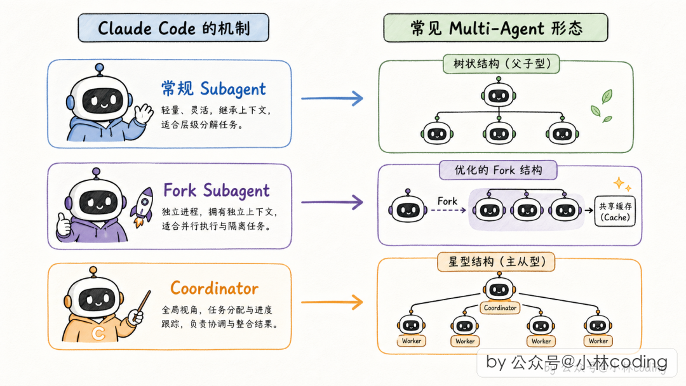

## 一、Multi-Agent 的本质与三种形态

### 为什么一个 Agent 不够用？

回到最朴素的 Agent 模型：一个 LLM + 一堆工具 + 一个循环（agentic loop）。看起来够用，但遇到真实项目问题就暴露了：

**上下文爆炸。** 调研阶段要看大量文档，实现阶段要读写项目代码，评审阶段要重新审视。三个阶段的内容全塞到一个 Agent 的上下文里，token 蹭蹭往上涨。

**职责混乱。** 一个 Agent 既当研究员又当程序员又当评审员，调研到一半就开始写代码，代码写到一半又去查文档。

**无法并发。** 一个 Agent 一次只能做一件事，在查文档时，其他工作只能干等。

Multi-Agent 的思路很直观：**把一个大任务拆给多个职责清晰的 Agent 去做，通过某种机制通信和协作。**

### 工业界常见的三种形态

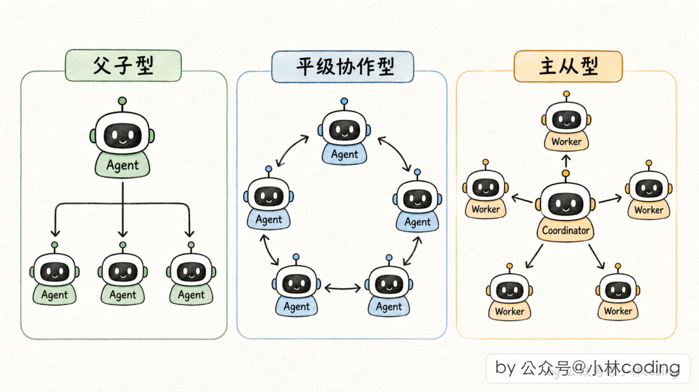

| 形态 | 模型 | 说明 |
|------|------|------|
| **父子型** | 主 Agent 派 Subagent 做事，拿结果继续 | Claude Code 的 Task 工具 |
| **平级协作型** | 多 Agent 共享状态、互相通信 | 工程上落地困难，状态同步复杂 |
| **主从型** | 协调者派 Worker，Worker 间互不通信 | 高并发场景标配，Claude Code 的 Coordinator 模式 |

Claude Code 源码里，常规 Subagent 对应父子型，Coordinator 模式对应主从型，Fork Subagent 是父子型的优化变体。

<div class="section-divider">
  <span class="line"></span>
  <span class="dot"></span>
  <span class="dot"></span>
  <span class="dot"></span>
  <span class="line"></span>
</div>

## 二、Subagent 的隔离机制

多 Agent 系统本质是"一堆 Agent 共处一个进程、共享一个底层运行时"。隔离做不好，一个 Subagent 偷偷污染父 Agent 的状态，整个系统就乱了。Claude Code 从 **两个维度** 做隔离：工具隔离和上下文隔离。

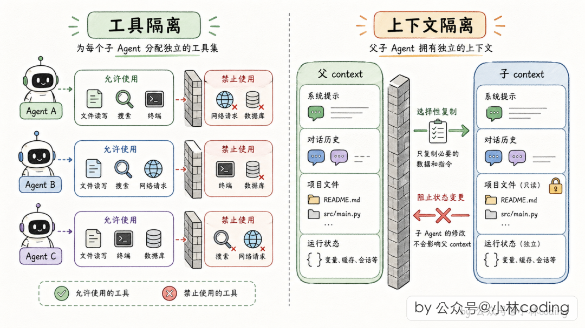

### 第一维度：工具隔离——定制工具箱

主 Agent 拥有几十个工具（读文件、写文件、执行命令、派 Subagent、问用户……），但不能原封不动丢给 Subagent。Claude Code 按 **三道准入门** 过滤：

**第一道：全局黑名单。** 所有 Subagent 都不能用的工具：
- 能派新 Subagent 的工具——防递归嵌套
- 能主动问用户的工具——Subagent 不该抢对话权
- 能切换规划模式的工具——子没有资格
- 能停止其他任务的工具——任务管理是主线程专属

**第二道：自定义 Agent 加严黑名单。** 用户自写的 Agent 比内置 Agent 多一层防护。

**第三道：后台异步 Agent 走白名单。** 默认不准用，只有明确列出的才能用（读文件、搜代码、执行命令等）。

```typescript
// src/tools/AgentTool/agentToolUtils.ts:70
export function filterToolsForAgent(
  { tools, isBuiltIn, isAsync, permissionMode }
): Tools {
  return tools.filter(tool => {
    if (tool.name.startsWith('mcp__')) return true   // MCP 全放行
    if (ALL_AGENT_DISALLOWED_TOOLS.has(tool.name)) return false
    if (!isBuiltIn && CUSTOM_AGENT_DISALLOWED_TOOLS.has(tool.name)) return false
    if (isAsync && !ASYNC_AGENT_ALLOWED_TOOLS.has(tool.name)) return false
    return true
  })
}
```

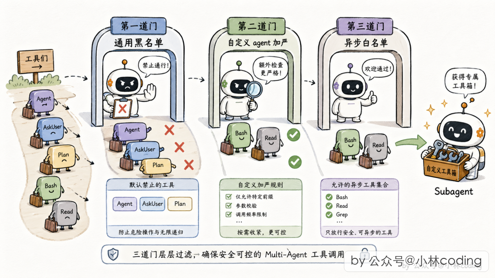

### 第二维度：上下文隔离——按字段粒度决策

这是 Claude Code 最精髓的设计之一。父 Agent 的运行时上下文很庞大（文件缓存、UI 状态、中止信号、权限状态、任务注册表……）。

两个直觉方案都走不通：
- **完全共享**：子 agent 读文件读了 200 行，父的缓存被刷成 200，以为自己也读过，数据出错
- **完全新建**：用户 Ctrl+C 中止，子 agent 因为全新上下文收不到中止信号，自顾自跑

<div class="highlight-box">
<strong>Claude Code 的做法：不按"整体"决策，而是按"字段"决策。</strong> 每项状态单独判断该克隆、该共享、该屏蔽，还是该新建。
</div>

**四个关键决策：**

<ul class="numbered-list">
  <li><span class="num">1</span><strong>读文件缓存 → 克隆一份。</strong> 子怎么折腾都不影响父的文件视图。</li>
  <li><span class="num">2</span><strong>写全局状态 → 关闭。</strong> 子 agent 完全没有写 UI 状态的权限，防止界面抢写。</li>
  <li><span class="num">3</span><strong>任务注册通路 → 保留。</strong> 子 agent 起的后台进程需要登记到全局任务表，不然变孤儿进程。</li>
  <li><span class="num">4</span><strong>发独立 ID + 深度 +1。</strong> 系统随时知道当前嵌套层数，深度超阈值时报警停止。</li>
</ul>

```typescript
// src/utils/forkedAgent.ts:345
export function createSubagentContext(parentContext, overrides): ToolUseContext {
  return {
    // 决策一：文件读缓存克隆一份
    readFileState: cloneFileStateCache(parentContext.readFileState),
    // 决策二：写全局状态直接设为空操作
    setAppState: () => {},
    // 决策三：但任务注册的通路例外保留
    setAppStateForTasks: parentContext.setAppStateForTasks ?? parentContext.setAppState,
    // 决策四：独立 ID + 深度 +1
    agentId: overrides?.agentId ?? createAgentId(),
    queryTracking: {
      chainId: randomUUID(),
      depth: (parentContext.queryTracking?.depth ?? -1) + 1,
    },
    // ...
  }
}
```

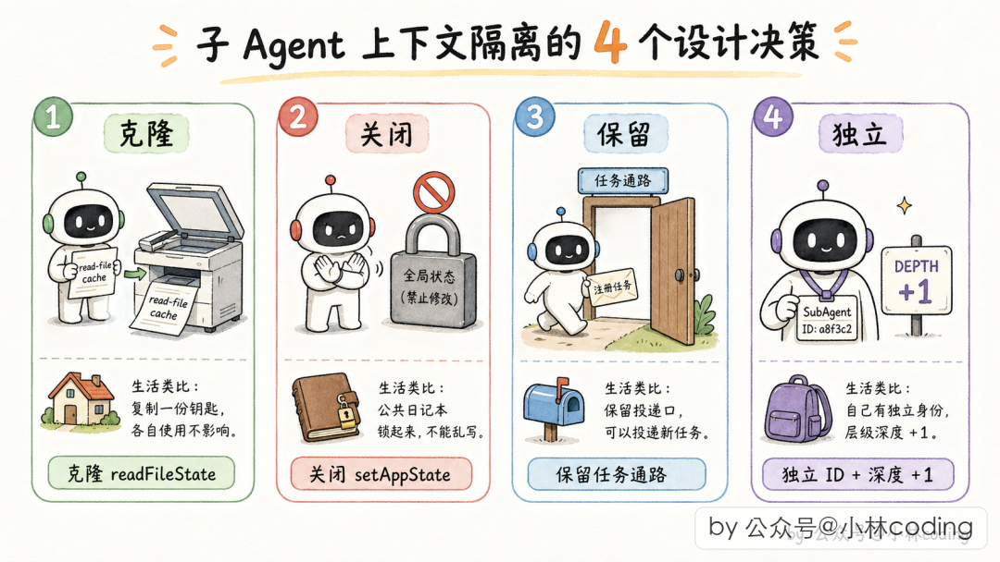

<div class="section-divider">
  <span class="line"></span>
  <span class="dot"></span>
  <span class="dot"></span>
  <span class="dot"></span>
  <span class="line"></span>
</div>

## 三、父子 Agent 的通信机制

隔离只是开始，决定系统好不好用的是 **怎么通信**。

### 为什么不用函数调用？

直觉方案是"父 Agent 调个函数，等 Subagent 跑完返回"。但有两个致命问题：

1. **同步阻塞**：Subagent 跑 5 分钟，父 Agent 啥也干不了，用户说话没反应
2. **无法并发**：要派 5 个 Subagent 调研 5 个模块，要么排队阻塞，要么手动搓并发代码

Claude Code 换了一个完全不同的路子：**消息驱动**。

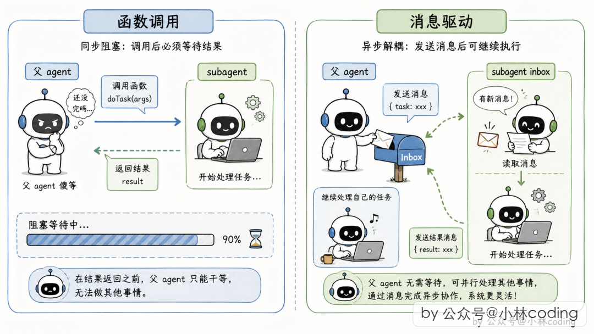

### Subagent 的"员工档案"

每个 Subagent 有一个对象，记录 ID、状态、信箱（待处理消息数组）、进度等：

```typescript
// src/tasks/LocalAgentTask/LocalAgentTask.tsx:116
export type LocalAgentTaskState = TaskStateBase & {
  type: 'local_agent';
  agentId: string;
  prompt: string;
  status: TaskStatus;   // pending / running / completed / failed / killed
  result?: AgentToolResult;
  pendingMessages: string[];  // 信箱：父扔进来的待处理消息
  // ...
};
```

### 父 → 子：扔字条 + 子自己取

父 Agent 调 `SendMessage` 工具，往目标 Subagent 的信箱末尾追加一条消息，然后立刻返回。Subagent 在每轮工具调用结束后，瞄一眼自己的信箱，有新消息就注入对话历史。

如果 Subagent 已经完成，Claude Code 会自动唤醒它——从 transcript 恢复对话历史，拼上新消息重新跑起来。

### 子 → 父：把通知伪装成用户消息

Subagent 跑完后，**把完成通知拼成 XML 消息，伪装成用户消息塞给父 Agent 的对话历史**：

```xml
<task-notification>
  <task-id>agent-a1b</task-id>
  <status>completed</status>
  <summary>Agent "Investigate auth bug" completed</summary>
  <result>Found null pointer in src/auth/validate.ts:42...</result>
  <usage>
    <total_tokens>12345</total_tokens>
    <tool_uses>8</tool_uses>
    <duration_ms>34567</duration_ms>
  </usage>
</task-notification>
```

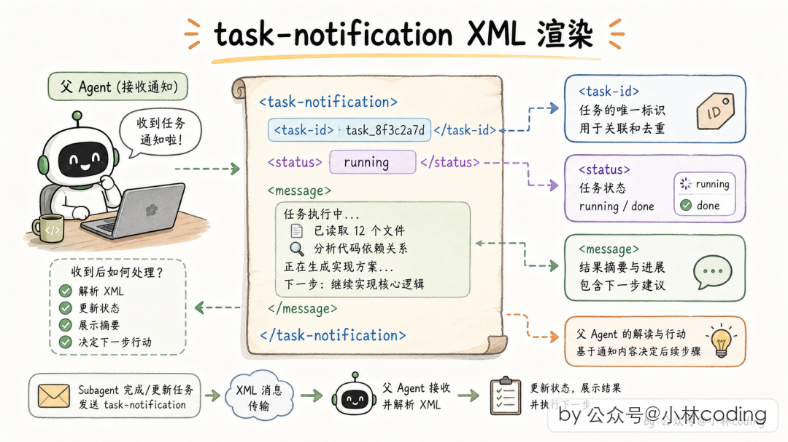

**为什么要用 XML？** Anthropic 训练 Claude 时就强调 XML 结构化表达；XML 是纯文本可塞进对话历史；伪装成用户消息，天然复用 Agent 的 agentic loop 处理逻辑。

### Auto-background：同步到异步的自动降级

Subagent 跑起来后，如果 30 秒内完成，父在前台阻塞等；超过 2 分钟，自动转到后台（auto-background），父 Agent 先干别的。2 分钟后 Subagent 完成，通过 task-notification 把结果送回。

```typescript
// src/tools/AgentTool/AgentTool.tsx:72
function getAutoBackgroundMs(): number {
  if (isEnvTruthy(process.env.CLAUDE_AUTO_BACKGROUND_TASKS)
    || getFeatureValue_CACHED_MAY_BE_STALE('tengu_auto_background_agents', false)) {
    return 120_000; // 2 分钟
  }
  return 0;
}
```

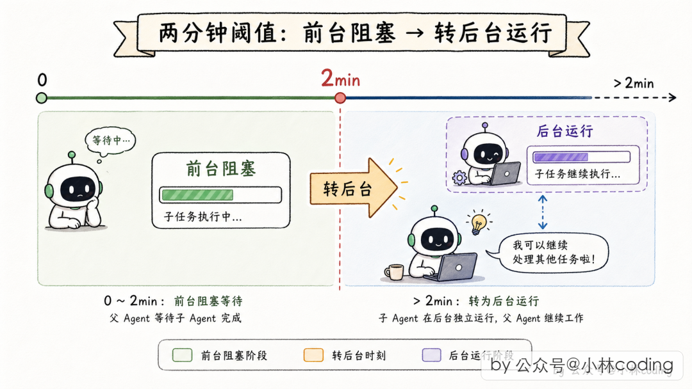

整个通信体系就两个关键字：**异步 + 消息**。没有直接函数调用，没有锁，没有回调地狱，全靠读写共享的任务状态和消息队列。

<div class="section-divider">
  <span class="line"></span>
  <span class="dot"></span>
  <span class="dot"></span>
  <span class="dot"></span>
  <span class="line"></span>
</div>

## 四、Fork Subagent：省钱又省延迟的隐藏大招

### Subagent 的隐藏成本

Claude Code 的 system prompt 上万 token。每派一个 Subagent，LLM API 要对这一万多 token 重新算一遍。Anthropic 的 prompt 缓存机制可以缓解——如果请求前缀跟之前某次一样，前缀可以走缓存，只需原来 10% 的价格。

**但缓存命中的条件是：字节级别完全相同。** 一个字、一个空格不一样，缓存就不命中。

### Fork 的核心思路：派一个"字节级相同"的分身

Fork Subagent 的设计目标是：让 Subagent 的 API 请求前缀跟父 Agent **字节级一致**，从而复用父的缓存。

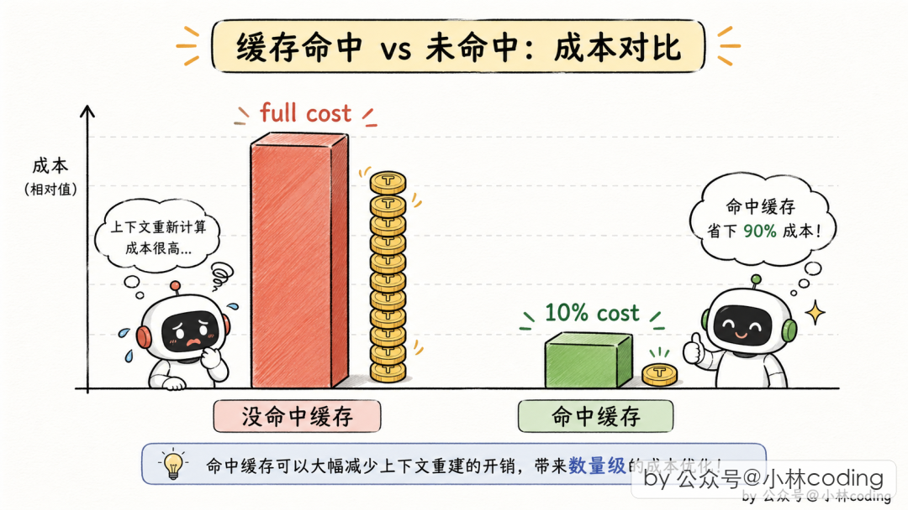

要对齐五样东西：

<ol class="numbered-list">
  <li><span class="num">1</span><strong>系统 prompt 内容</strong> — 最核心</li>
  <li><span class="num">2</span><strong>用户上下文</strong> — 当前项目的 CLAUDE.md 等</li>
  <li><span class="num">3</span><strong>系统上下文</strong> — system prompt 后的环境信息</li>
  <li><span class="num">4</span><strong>工具池顺序和定义</strong> — 序列化顺序都不能变</li>
  <li><span class="num">5</span><strong>对话历史前缀</strong> — 决定"从哪里开始分叉"</li>
</ol>

```typescript
// src/utils/forkedAgent.ts:57
export type CacheSafeParams = {
  systemPrompt: SystemPrompt
  userContext: { [k: string]: string }
  systemContext: { [k: string]: string }
  toolUseContext: ToolUseContext
  forkContextMessages: Message[]
}
```

一个特别有工程智慧的细节：Fork Subagent 的 `getSystemPrompt` 直接返回空字符串——不是为了省事，而是因为 Fork 的 system prompt 根本不是通过这个函数生成的，而是**直接用父 Agent 已经渲染好的那字节**。重新调一次生成函数可能会有微小差异，缓存就没了。

```typescript
export const FORK_AGENT = {
  agentType: FORK_SUBAGENT_TYPE,
  tools: ['*'],          // 用父的完整工具池
  model: 'inherit',
  getSystemPrompt: () => '',  // 返回空串！
} satisfies BuiltInAgentDefinition
```

<div class="info-box">
<strong>工程启示：</strong>成本优化本身就是能力的一部分。Claude Code 靠 Fork 机制，在缓存友好的场景下把 Subagent 的成本降到原来的 10% 左右。这意味着 Subagent 可以调得更频繁，整个系统的能力边界也扩大了。
</div>

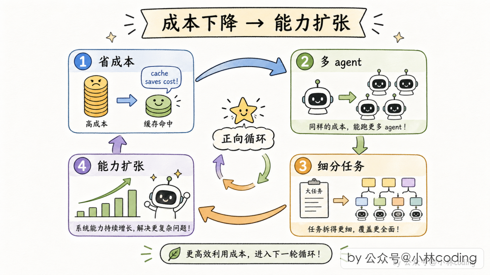

Fork 机制和 Coordinator 模式是互斥的——职责重叠，只留一个。

<div class="section-divider">
  <span class="line"></span>
  <span class="dot"></span>
  <span class="dot"></span>
  <span class="dot"></span>
  <span class="line"></span>
</div>

## 五、Coordinator 模式：真正的多 Agent 并行

前面讲的 Subagent 本质是父子结构。但如果要并行调研 10 个模块，就需要更强大的机制。Claude Code 的 **Coordinator 模式** 就是为此设计的。

### 核心设计：主 Agent 退化成"纯协调者"

需要编译开关 + 环境变量 `CLAUDE_CODE_COORDINATOR_MODE=1` 启。

开启后，**主 Agent 不干实际工作了**，只做三件事：派 Worker、收结果、合成答案。这个角色转换通过 system prompt 强制约束：

```
You are a coordinator. Your job is to:
- Direct workers to research, implement and verify code changes
- Synthesize results and communicate with the user
```

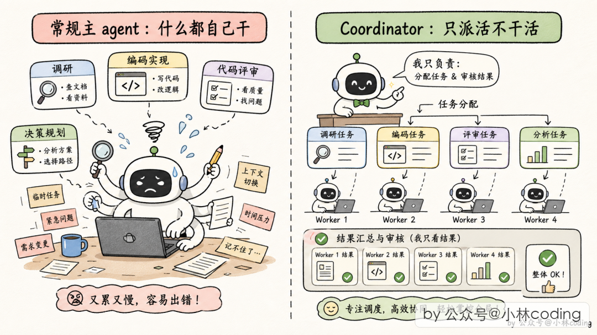

### 五大内部工具

Coordinator 模式下，主 Agent 多了一套"团队管理"工具箱：

| 工具 | 作用 |
|------|------|
| 派 Worker | 派一个新 Worker 出去干活，派完立刻返回 ID |
| 创建/解散团队 | 批量管理 Worker 组 |
| 发消息 | 给已派出的 Worker 发后续指令 |
| 合成输出 | 协调者把最终回复交给用户 |
| 停止 Worker | 跑错方向时停掉省 token |

### 并行是超能力

Coordinator 的 prompt 里有一句金句：**"Parallelism is your superpower."**

派 Worker 的工具调用可以在同一条 assistant 消息里出现多次，底层一起并发执行：

- **串行**：派 Worker1 → 等 → 结果 → 派 Worker2 → 等 → 结果 → 用户等十分钟
- **并行**：同时派三个 Worker → 三份结果陆续到 → 用户等三分钟多一点

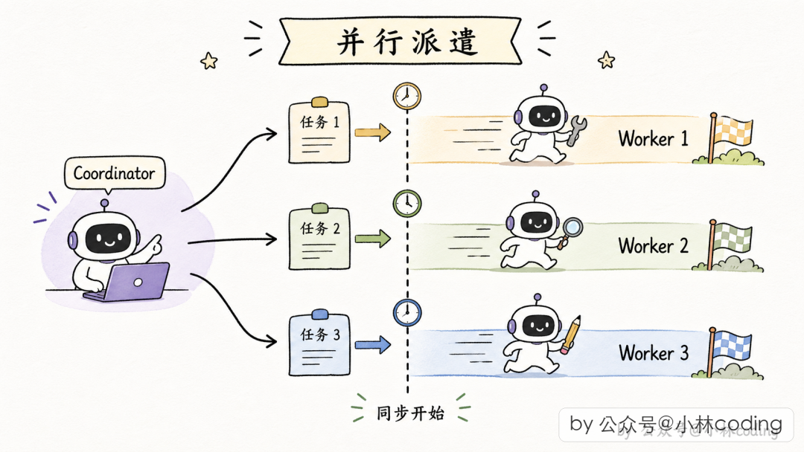

### 任务流水线

| 阶段 | 执行者 | 目的 |
|------|--------|------|
| 调研 | Workers（并行） | 调查代码、找文件、理解问题 |
| 合成 | **协调者本人** | 读 findings、写实现规格 |
| 实现 | Workers | 按规格做具体修改 |
| 验证 | Workers（新 Worker） | 测试改动是否工作 |

中间的"合成"阶段是协调者亲自做——**协调者必须"理解"而不能"转发"**。这是多 Agent 系统里最容易踩坑的一点。

### 与常规 Subagent 对比

| 维度 | 常规 Subagent | Coordinator 模式 |
|------|--------------|-----------------|
| 主 Agent 角色 | 全能选手 | 纯协调者 |
| 执行方式 | 同步（2 分钟转后台） | 默认异步 |
| 并发程度 | 偶尔并发 | 最大化并发 |
| 适合场景 | 单个任务 + 临时帮手 | 大任务 + 高并发拆解 |
| 系统形态 | 父子树 | 协调者 + Worker 扁平层 |

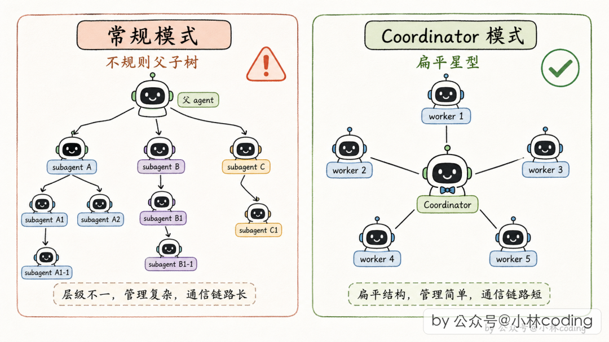

<div class="section-divider">
  <span class="line"></span>
  <span class="dot"></span>
  <span class="dot"></span>
  <span class="dot"></span>
  <span class="line"></span>
</div>

## 六、五条 Multi-Agent 设计原则

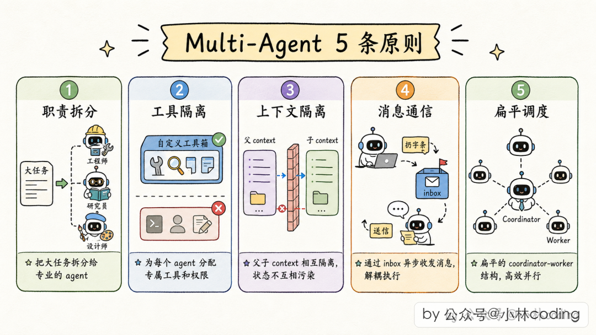

### 原则 1：上下文隔离要按字段粒度做

不要一刀切地"全隔离"或"不隔离"。**对着父 Agent 的每项状态问一句"子 Agent 拿这个状态干啥？会不会影响父？"**，就能避开大部分坑。

### 原则 2：通信走消息，不走函数调用

父 → 子写消息队列，子 → 父用 XML 伪装用户消息。天然异步、天然支持并发、天然兼容 agentic loop。

### 原则 3：工具权限要分级管控

全局黑名单 → 类型黑名单 → 异步白名单。每种 Agent 按自己的场景配工具。

### 原则 4：缓存友好是一种架构能力

设计 Subagent 时考虑它的 prompt 前缀能否复用父 Agent 的缓存。严格的"字节级相同"原则和"复用父 Agent 已渲染字节"的思路，是这方面的教科书式实现。

### 原则 5：并行优先 + 协调者合成

通过异步消息做基础，通过协调者做合成。协调者要亲自合成，不能当传话筒。通过工具权限把层级限制在两层，避免失控的递归嵌套。

<div class="outro-box">
<strong>写在最后</strong><br><br>
Claude Code 的 Multi-Agent 系统不是一个简单的"主 Agent 嵌几个 Subagent"，它在架构、通信、并发、成本、隔离每一个维度都做了精致的设计。每一块拆开看都不是复杂技术，但组合在一起，就成了支撑 Anthropic 级别产品的工业级多 Agent 系统。<br><br>
如果你在自建 Agent 系统，建议把这 5 条原则拿去做对照，每次看到 Multi-Agent 相关设计时都拿它们去衡量——会迅速看出对方系统的深浅。
</div>
