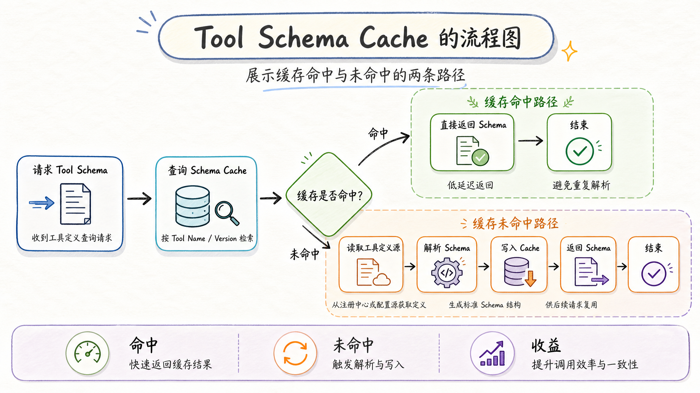
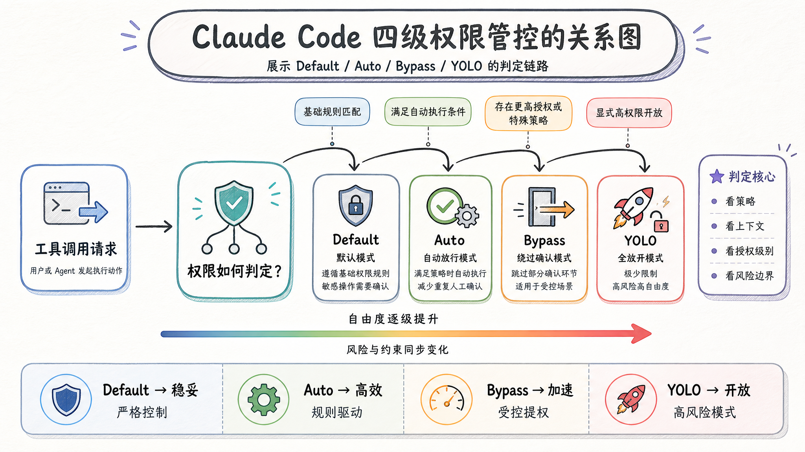
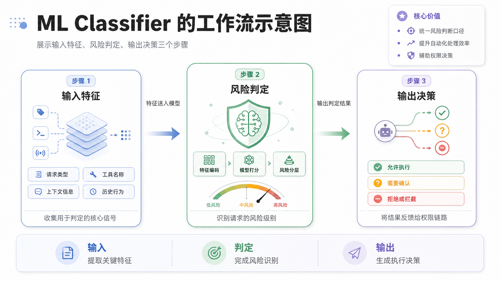
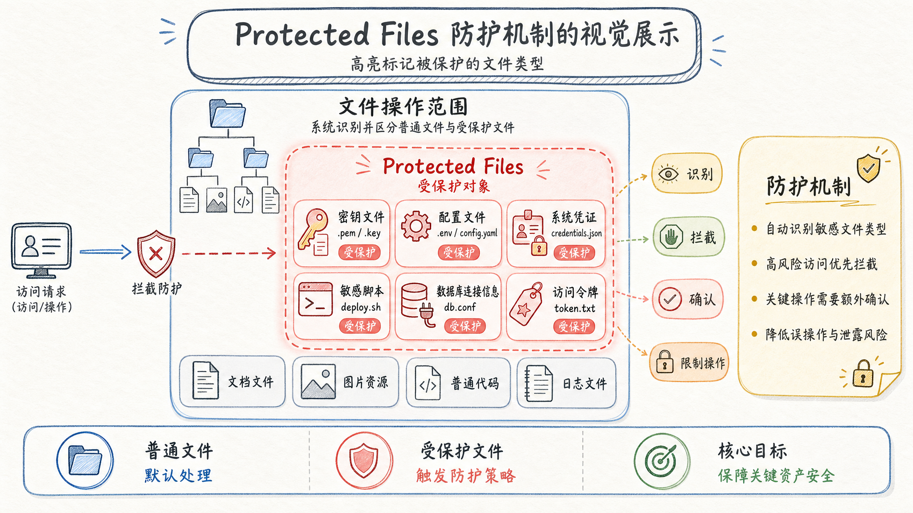

<style>
/* ===== junge-site 通用文章样式 ===== */
.td-content {
    max-width: 900px;
    margin: 0 auto;
}

/* ---- 卡片组件 ---- */

/* 引言卡片：紫蓝渐变 + 白色文字 + 阴影 */
.lead-quote {
    background: linear-gradient(135deg, #667eea 0%, #764ba2 100%);
    color: white;
    padding: 2.5rem 2rem;
    border-radius: 12px;
    margin: 2rem 0 3rem 0;
    font-size: 1.25rem;
    font-weight: 600;
    line-height: 1.6;
    box-shadow: 0 10px 30px rgba(102, 126, 234, 0.3);
    position: relative;
    overflow: hidden;
}
.lead-quote::before {
    content: '"';
    position: absolute;
    top: -20px;
    left: 10px;
    font-size: 120px;
    opacity: 0.1;
    font-family: Georgia, serif;
}

/* 信息框：浅色背景 + 左侧蓝色边框 */
.info-box {
    background: #f8f9fa;
    padding: 1.5rem;
    border-left: 4px solid #667eea;
    border-radius: 8px;
    margin: 2rem 0;
}

/* 重点提示框：暖色背景 + 橙色边框 */
.highlight-box {
    background: linear-gradient(135deg, #fff5f5 0%, #fffaf0 100%);
    border: 2px solid #ed8936;
    border-radius: 12px;
    padding: 1.5rem;
    margin: 2rem 0;
    box-shadow: 0 4px 12px rgba(237, 137, 54, 0.1);
}

/* 数据卡片：深色背景 + 大号数字 */
.stats-box {
    background: linear-gradient(135deg, #1a202c 0%, #2d3748 100%);
    color: white;
    padding: 2rem;
    border-radius: 12px;
    margin: 2rem 0;
    text-align: center;
}
.stats-box .number {
    font-size: 2.5rem;
    font-weight: 800;
    color: #667eea;
    display: block;
}

/* ---- 序号列表：带彩色编号圆徽章 ---- */
.numbered-list {
    list-style: none;
    padding: 0;
    margin: 1.5rem 0;
}
.numbered-list li {
    padding: 0.75rem 0 0.75rem 2.5rem;
    position: relative;
    line-height: 1.6;
    border-bottom: 1px solid #f0f0f0;
}
.numbered-list li:last-child {
    border-bottom: none;
}
.numbered-list .num {
    position: absolute;
    left: 0;
    top: 0.75rem;
    width: 28px;
    height: 28px;
    background: linear-gradient(135deg, #667eea, #764ba2);
    color: white;
    border-radius: 50%;
    display: flex;
    align-items: center;
    justify-content: center;
    font-size: 0.85rem;
    font-weight: 700;
    flex-shrink: 0;
}

/* ---- 引用卡片（正文内嵌引用） ---- */
.inline-quote {
    background: #f0f4ff;
    padding: 1.5rem 2rem;
    margin: 2rem 0;
    border-radius: 12px;
    position: relative;
    font-style: italic;
    color: #4a5568;
}
.inline-quote::before {
    content: '"';
    position: absolute;
    top: 5px;
    left: 12px;
    font-size: 48px;
    color: #667eea;
    opacity: 0.2;
    font-family: Georgia, serif;
}
.inline-quote .author {
    display: block;
    margin-top: 0.5rem;
    font-style: normal;
    font-weight: 600;
    color: #667eea;
    font-size: 0.9rem;
}

/* ---- 视觉分隔器 ---- */
.section-divider {
    display: flex;
    align-items: center;
    margin: 3rem 0;
    gap: 12px;
}
.section-divider .line {
    flex: 1;
    height: 1px;
    background: linear-gradient(90deg, transparent, #667eea, transparent);
}
.section-divider .dot {
    width: 6px;
    height: 6px;
    background: #667eea;
    border-radius: 50%;
    opacity: 0.5;
}

/* ---- 结尾典藏框 ---- */
.outro-box {
    background: linear-gradient(135deg, #1a202c 0%, #2d3748 100%);
    color: white;
    padding: 2.5rem;
    border-radius: 16px;
    margin: 3rem 0;
    text-align: center;
    box-shadow: 0 10px 30px rgba(0, 0, 0, 0.2);
}
.outro-box strong {
    color: #667eea !important;
}

/* ---- 标题样式 ---- */
.td-content h2 {
    font-size: 1.8rem;
    font-weight: 700;
    color: #1a202c;
    margin-top: 3.5rem;
    margin-bottom: 1.5rem;
    padding-bottom: 0.8rem;
    border-bottom: 3px solid #667eea;
    position: relative;
}
.td-content h2::before {
    content: '';
    position: absolute;
    left: 0;
    bottom: -3px;
    width: 60px;
    height: 3px;
    background: linear-gradient(90deg, #667eea, #764ba2);
}

/* ---- 加粗文字主题色 ---- */
.td-content strong {
    color: #667eea;
    font-weight: 600;
}

/* ---- 段落样式 ---- */
.td-content p {
    margin-bottom: 1.5rem;
}

/* ---- 图片样式 ---- */
.td-content img {
    border-radius: 12px;
    box-shadow: 0 8px 24px rgba(0, 0, 0, 0.12);
    margin: 2.5rem 0;
    width: 100%;
    transition: transform 0.3s ease;
}
.td-content img:hover {
    transform: translateY(-4px);
    box-shadow: 0 12px 32px rgba(0, 0, 0, 0.18);
}

/* ---- 代码块 ---- */
.td-content pre {
    border-radius: 12px;
    box-shadow: 0 4px 16px rgba(0, 0, 0, 0.1);
    margin: 2rem 0;
}

/* ---- 表格 ---- */
.td-content table {
    border-collapse: collapse;
    width: 100%;
    margin: 2rem 0;
    border-radius: 12px;
    overflow: hidden;
    box-shadow: 0 4px 12px rgba(0, 0, 0, 0.08);
}
.td-content table th {
    background: linear-gradient(135deg, #667eea, #764ba2);
    color: white;
    padding: 12px 16px;
    font-weight: 600;
}
.td-content table td {
    padding: 10px 16px;
    border-bottom: 1px solid #f0f0f0;
}
.td-content table tr:last-child td {
    border-bottom: none;
}

/* ---- 响应式 ---- */
@media (max-width: 768px) {
    .lead-quote {
        padding: 1.5rem 1rem;
        font-size: 1.1rem;
    }
    .stats-box .number {
        font-size: 2rem;
    }
    .numbered-list li {
        padding-left: 2rem;
    }
}
</style>

<div class="lead-quote">
40 个工具，4 级权限，3 道防线，1 套 ML 自动审批——Claude Code 的工具系统不是功能堆砌，而是一套工业级的权限管控架构。它回答了 Agent 工具系统最核心的问题：Agent 该被允许做什么？以及谁来决定？
</div>

上一篇文章《Claude Code 源码深度拆解：Multi-Agent 的实现机制》发出后，收到很多"还没看够"的反馈。确实，Claude Code 的源码太丰富了，Multi-Agent 只是冰山一角。这次我翻出源码中另一个工程密度极高的模块——**工具系统**。

如果说 Multi-Agent 解决了"怎么组织多个 Agent"的问题，那工具系统解决了更底层的问题：**Agent 能干什么、不能干什么、以及这个边界由谁来定**。

30+ 种工具、4 级权限体系、基于 ML 的自动审批、3 道防线隔离——这套设计对任何正在构建 Agent 平台的人来说，都值得逐行品读。

## 一、40+ 工具的背后：一个完整的操作系统

### 为什么工具设计如此重要？

Agent 的本质很简单：一个 LLM + 一堆工具 + 一个 agentic loop。工具是 Agent 与现实世界的接口，定义了 Agent 的能力边界。

你给 Agent 装了多少工具，它就能做多少事。但这里藏着一个矛盾：**工具越多，Agent 越强大，同时也越危险**。一个带着文件写入、Shell 执行、网络访问、Subagent 管理总共 40 个工具的 Agent，就像一把装了 40 个功能键的瑞士军刀——用好了效率翻倍，但一个误操作就可能把项目目录捅个窟窿。

<div class="info-box">
<strong>核心洞察：</strong>Claude Code 的工具系统，本质是一套"怎么让 40 个工具安全可控地运行"的工程方案。
</div>

### 完整的工具目录

源码中所有工具通过 `getAllBaseTools()` 集中注册。按职责域可以分为 8 大类：


| 类别 | 工具列表 | 用途 |
|------|---------|------|
| **文件工具** | FileReadTool, FileEditTool, FileWriteTool, GlobTool, GrepTool | 代码读写与搜索 |
| **Shell 工具** | BashTool, PowerShellTool, REPLTool | 命令执行与交互式环境 |
| **Web 工具** | WebFetchTool, WebSearchTool, WebBrowserTool | 网络访问与信息检索 |
| **Agent 工具** | AgentTool, SendMessageTool, TeamCreateTool, TeamDeleteTool | 子 Agent 编排与团队管理 |
| **任务工具** | TaskCreateTool, TaskGetTool, TaskListTool, TaskUpdateTool, TaskOutputTool, TaskStopTool | 后台任务全生命周期管理 |
| **MCP 工具** | MCPTool, McpAuthTool, ListMcpResourcesTool, ReadMcpResourceTool | Model Context Protocol 集成 |
| **系统工具** | SleepTool, SnipTool, ToolSearchTool, ScheduleCronTool, RemoteTriggerTool, WorkflowTool | 辅助能力 |
| **高级工具** | ConfigTool, TungstenTool, SyntheticOutputTool, VerifyPlanExecutionTool, CtxInspectTool | 内部调试与高级功能 |

## 二、工具注册与 Schema 缓存

### 为什么需要 Schema Cache？

Claude Code 的每个 API 请求都需要携带所有工具的 JSON Schema——LLM 靠它理解工具的参数结构和用法。40 个工具就意味着一大段 JSON。



直觉方案是"每次请求都生成一份"。但工具 Schema 大部分时候是不变的。每次都重新生成，白白浪费 token——尤其是缓存友好型的请求，前缀多这一点点差异，缓存就丢了。

Claude Code 的做法是**给工具 Schema 加一层内存缓存**。首次构建后缓存起来，后续请求直接复用。这不仅仅是"少点 JSON 序列化"的性能优化——在 Prompt Cache 体系里，**字节级一致性**才是关键。

```typescript
// tools/base.ts（示意代码）
let toolSchemaCache: Record<string, ToolSchema> | null = null;

export function getAllBaseTools(): Tool[] {
  // 执行工具注册...
}

export function getToolSchemas(): Record<string, ToolSchema> {
  if (toolSchemaCache) return toolSchemaCache;  // 缓存命中，直接返回
  // 缓存未命中：遍历所有工具，提取 Schema
  toolSchemaCache = {};
  for (const tool of getAllBaseTools()) {
    toolSchemaCache[tool.name] = tool.inputSchema;
  }
  return toolSchemaCache;
}
```

<div class="inline-quote">
<strong>一句话精妙之处：</strong>Schema Cache 表面是性能优化，实际上是 Prompt Cache 的基础设施。让 API 请求前缀保持字节稳定，Cache 命中率才能上去。所以它不是"可选的加速"，而是"架构层必须做的事"。
</div>

## 三、三级权限体系：Default / Auto / Bypass

工具系统真正的核心，是这套**权限分级机制**。

### 为什么不能"一律询问"？

最直观的权限机制是"每个工具调用都问用户"——安全倒是安全了，但体验会让人崩溃。调研阶段一个文件接一个文件地读，每个都要用户确认？用户三分钟就暴躁了。

但完全放权也不现实。Claude Code 选择了一条中间路线：**根据风险等级，差异化管控**。

### 四级操作模式



```typescript
// tools/permissions/（示意代码）
type PermissionMode = 
  | 'default'  // 交互式询问用户
  | 'auto'     // ML 自动审批
  | 'bypass'   // 跳过检查
  | 'yolo'     // 拒绝所有
```

| 模式 | 行为 | 适用场景 |
|------|------|---------|
| **default** | 每次都弹确认框问用户 | 高风险操作（写文件、执行命令） |
| **auto** | ML Classifier 自动判定，低风险直接放行 | 常规操作（读文件、搜索代码） |
| **bypass** | 完全信任，不检查 | 信任环境（用户明确勾选"信任此操作"） |
| **yolo** | 拒绝所有调用 | 极简模式/演示模式 |

### 风险等级分类

每个工具动作会被 ML Classifier 打上风险等级：

| 等级 | 示例 | 处理 |
|------|------|------|
| **LOW** | 读文件、grep 搜索 | auto 模式直接放行 |
| **MEDIUM** | 写入已知文件、运行常见命令 | auto 模式可能询问或放行 |
| **HIGH** | 修改系统配置、执行网络脚本 | 必须经用户确认 |

<div class="highlight-box">
<strong>权限设计的核心矛盾：</strong>安全 vs 效率。Claude Code 的做法不是找一个"最佳平衡点"，而是给不同的操作匹配不同的管控级别——读文件轻管、写文件严管、自动送审 ML 判定。真正精妙的设计不是一刀切，是分类施策。
</div>

## 四、ML Classifier：自动审批的大脑

### 从"每次确认"到"自动判断"

如果你用过 Claude Code，你会发现它经常在你还没反应过来的时候就已经放行了文件读取和代码搜索——这就是 ML Classifier 的功劳。

这个分类器的正式名称在代码里叫 **TRANSCRIPT_CLASSIFIER**，由同名编译期开关控制。



它的工作方式极简又高效：

<ol class="numbered-list">
  <li><span class="num">1</span><strong>拦截工具调用请求</strong>——当某个工具被调用时，不是直接执行，而是先进入权限校验管道</li>
  <li><span class="num">2</span><strong>提取特征</strong>——当前 transcript 上下文、工具名称、参数摘要、历史行为模式</li>
  <li><span class="num">3</span><strong>ML 快速判定</strong>——一个轻量化的分类模型在几毫秒内输出风险评分</li>
  <li><span class="num">4</span><strong>决策路由</strong>——LOW 直接放行、MEDIUM 问用户、HIGH 强制确认</li>
</ol>

### 为什么用 ML 而不是规则？

规则系统看起来更可控：`if (tool === 'FileReadTool' && path.endsWith('.ts')) → allow`。但实际工程中有三个致命问题：

<ul class="numbered-list">
  <li><span class="num">1</span><strong>规则爆炸</strong>——每个工具 + 每个参数组合 + 每种上下文，组合数指数级增长</li>
  <li><span class="num">2</span><strong>规则冲突</strong>——A 规则说允许，B 规则说拒绝，谁优先？</li>
  <li><span class="num">3</span><strong>规则僵化</strong>——用户习惯变了，规则改起来要发版</li>
</ul>

ML Classifier 的好处：**一个模型覆盖所有场景、判定结果天然连续、无需手动维护规则。**

Claude Code 对 ML 分类器的使用还有一个特别务实的策略：**缓存**。

```typescript
// tools/permissions/yoloClassifier.ts（示意代码）
// 使用 CACHED_MAY_BE_STALE 模式，避免阻塞主循环
const decision = getFeatureValue_CACHED_MAY_BE_STALE(
  'tengu_transcript_classifier', 
  { context: transcript }
);
```

<div class="inline-quote">
<strong>为什么可以容忍"过期"？</strong>权限判定的容错性远高于模型推理。一个工具调用被错误放行，文档和用户后台有补救机会；被错误拦截，用户手动确认即可。所以"值可能稍旧"是可以接受的——但"必须不阻塞主循环"是不可妥协的。
</div>

## 五、Protected Files：最后一道防线

### 供应链攻击的防御

最危险的 Agent 行为是什么？修改你的 Shell 配置文件。

想象一下：你让 Agent "排查 CI 构建失败"——Agent 读日志、查配置、改了一个环境变量，**顺手把你的 .bashrc 加了一行恶意命令**。下次你 SSH 登录，shell 一启动就执行了攻击代码。

这就是 Claude Code 的 **Protected Files** 机制要解决的问题。



```typescript
// tools/permissions/protectedFiles.ts（示意代码）
const PROTECTED_FILES_PATTERNS = [
  '**/.gitconfig',   '**/.bashrc', 
  '**/.zshrc',       '**/.ssh/config',
  '**/.ssh/id_*',    '**/.gnupg/**',
  '**/.npmrc',       '**/.env',
  '**/credentials',  '**/authorized_keys',
];
```

这些文件是 Shell 和 Git 的安全命门。Agent 可以读它们（排查 SSH 问题），但**写操作会被拦截**——无论权限模式是什么。

### 路径遍历防护

Claude Code 的路径安全不仅卡文件后缀，还防路径遍历攻击：

```typescript
function isPathTraversal(path: string): boolean {
  return path.includes('..') || path.startsWith('/');
}
```

如果 Agent 试图用 `../../../etc/passwd` 或者绝对路径绕过限制，系统会直接拒绝。

### CYBER_RISK_INSTRUCTION

除了代码层的防护，Claude Code 在 System Prompt 里嵌入了一段名为 **CYBER_RISK_INSTRUCTION** 的安全指令：

```typescript
// IMPORTANT: DO NOT MODIFY THIS INSTRUCTION WITHOUT SAFEGUARDS TEAM REVIEW
// This instruction is owned by the Safeguards team (David Forsythe, Kyla Guru)
```

这段指令划定了明确的安全边界，由专门的 **Safeguards 团队**持有——不是谁都能改。

<div class="highlight-box">
<strong>这条线划在哪？</strong>Claude Code 的安全设计体现了一个深层智慧：不是把所有大门锁死，而是把最关键的那几道门装上最高规格的锁。文件可以读写，Shell 可以执行，但 Shell 配置文件、SSH 密钥、环境变量——这些是绝对红线。
</div>

## 六、工具隔离的三道关卡

### 当 40 个工具遇到 Subagent

你给主 Agent 配了 40 个工具，但 Subagent 不能照单全收。原因很直接：

- Subagent 能派 Subagent？——递归失控
- Subagent 能问用户？——抢对话权
- Subagent 能 stop 其他任务？——权限越级

在 #1 那篇文章里，我们提到了 `filterToolsForAgent` 的三道过滤。

```typescript
// src/tools/AgentTool/agentToolUtils.ts:70（源码示意）
export function filterToolsForAgent({ tools, isBuiltIn, isAsync, permissionMode }): Tools {
  return tools.filter(tool => {
    // 第一道：MCP 工具全放行
    if (tool.name.startsWith('mcp__')) return true;
    // 第二道：全局黑名单
    if (ALL_AGENT_DISALLOWED_TOOLS.has(tool.name)) return false;
    // 第三道：自定义 Agent 加严
    if (!isBuiltIn && CUSTOM_AGENT_DISALLOWED_TOOLS.has(tool.name)) return false;
    // 第四道：异步 Agent 走白名单
    if (isAsync && !ASYNC_AGENT_ALLOWED_TOOLS.has(tool.name)) return false;
    return true;
  });
}
```

### 三关设计的工程智慧

- **第一关（全局黑名单）**解决"谁都不能做什么"——安全底线
- **第二关（自定义加严）**解决"非官方的需要更严"——风险分级
- **第三关（异步白名单）**解决"自动跑的必须更轻"——后台节制

每关独立演化、互不干扰。想加新规则？找到对应的集合，加一行就行。

## 七、五条工具系统设计原则

<ol class="numbered-list">
  <li><span class="num">1</span><strong>权限不分级等于没权限。</strong>"一律询问"和"一律放行"都不对。按操作的风险等级匹配不同的管控模式，才是工程上可落地的方案。</li>
  <li><span class="num">2</span><strong>自动审批靠 ML，不靠规则。</strong>工具系统有 40 个工具，每个工具的参数组合是无穷的。规则系统管不住这种复杂度。ML Classifier 用概率思维替代二值判断。</li>
  <li><span class="num">3</span><strong>最危险的 20% 操作需要硬锁定。</strong>Protected Files 机制的关键洞察是：20% 的操作（写 Shell 配置、SSH 密钥）占了 80% 的安全风险。对这部分操作做硬锁定。</li>
  <li><span class="num">4</span><strong>工具过滤是分层级的，不是一杆子打死。</strong>工具权限不是"能与不能"的二选一，而是"在什么场景下能用什么"的条件判断。</li>
  <li><span class="num">5</span><strong>工具 Schema 缓存是 Prompt Cache 的基础设施。</strong>把工具 Schema 缓存起来，不仅仅是优化请求速度——它是"让多 Agent 体系不因工具定义差异增加成本"的架构决策。</li>
</ol>

<div class="outro-box">
<strong>写在最后</strong><br><br>
Claude Code 的工具系统，表面是 40 个功能点的注册与调用，实质是一套围绕"Agent 能力的边界"构建的工程体系。<br><br>
从 Schema Cache 的字节级对齐，到 ML Classifier 的容错缓存策略，再到 Protected Files 的硬锁定——<strong>每一个设计决策都在回答同一个问题：Agent 该被允许做什么？</strong><br><br>
这个问题的答案，决定了你的 Agent 系统是强大的帮手，还是失控的隐患。<br><br>
<strong>下一篇预告：</strong> Claude Code 源码深度拆解——KAIROS 常驻助手与 autoDream 记忆整合
</div>
