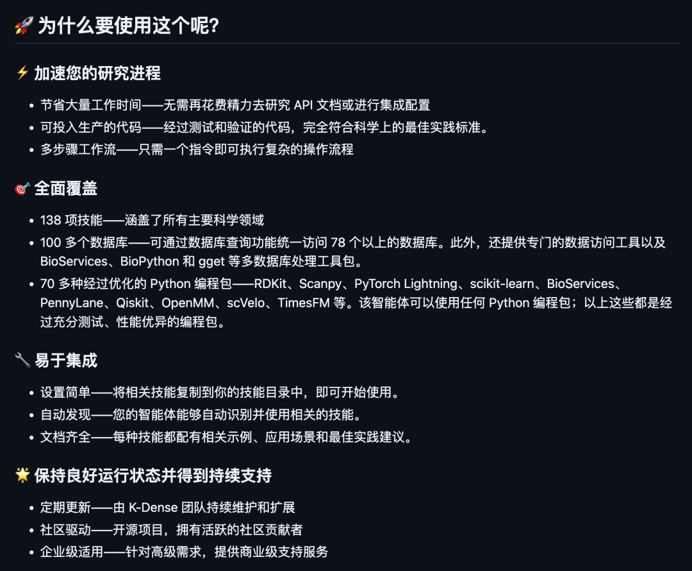
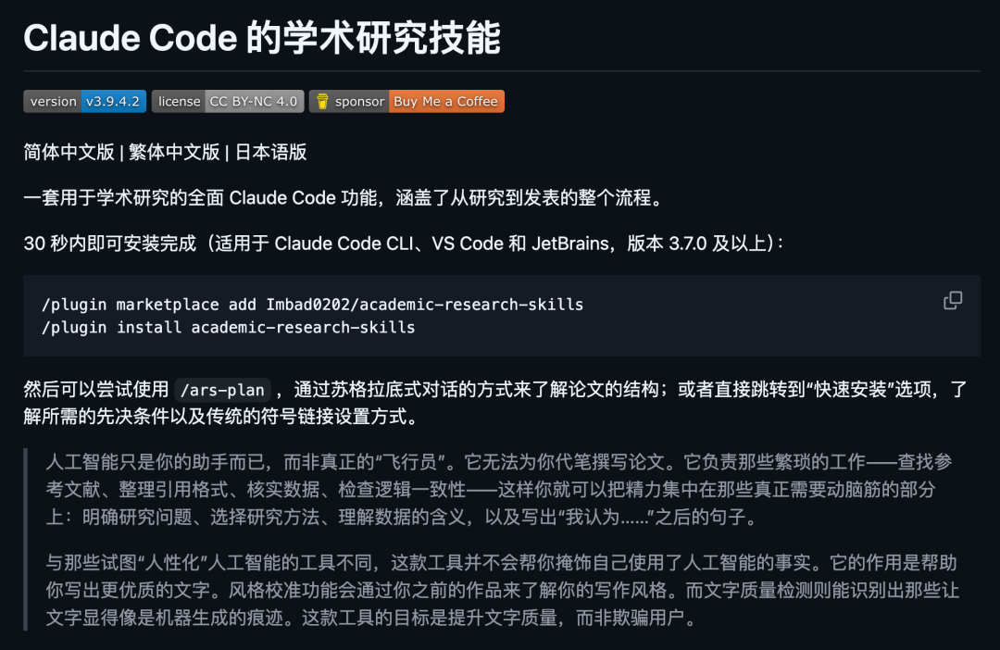
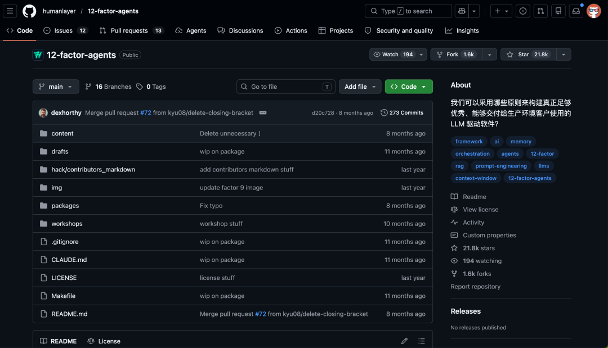
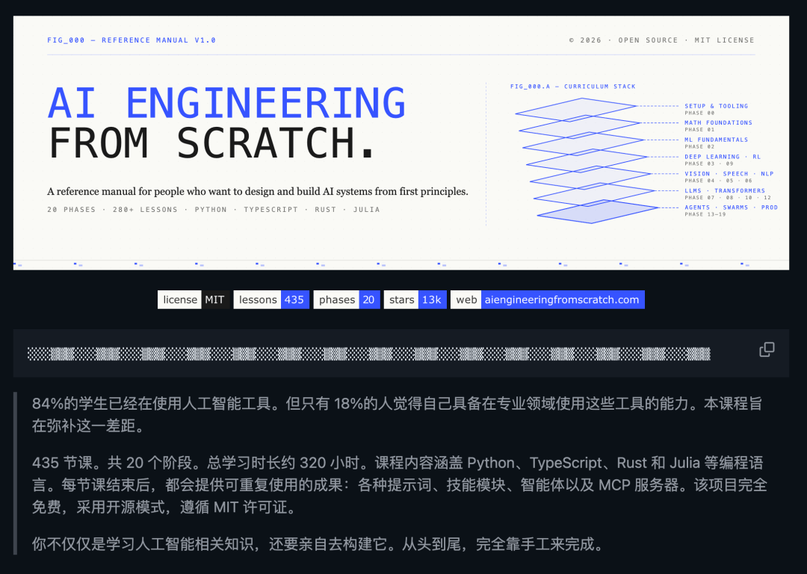

**这一周的 GitHub 开源榜单精彩纷呈，AI Agent 工具链、代码理解、端侧语音合成全面开花。** 从科研助手到论文流水线，从代码知识图谱到终端编程助手，从 Agent 开发原则到多 Agent 视频创作，本文带你逐一拆解这 10 个最值得关注的开源项目。

开源社区正在经历一场 AI 原生的工具革命。本周爆火的项目有一个共同特征：它们不再只是"让 AI 做事情"，而是在构建 AI 可以做事的工程化基础设施。从 Agent 技能包到代码图索引，从终端编辑精度到多智能体协作——这不是功能的堆叠，是工程思维的范式转移。

  
  
  
  
  

## AI Agent 工具链三连发

### 01 给 AI 装一套科研全家桶

**scientific-agent-skills** 本周突破 2.5 万 Star 且仍在上涨。这是一套开箱即用的 Agent 技能包，覆盖科研、科学计算、工程、数据分析、金融及写作六大领域。

以往让 Claude 或 Cursor 做正经研究，它们经常东一榔头西一棒子——思路跳脱、流程不可控。装上这套技能包后，AI 的"干活姿势"规范得多，知道该按什么流程来推进问题。

<strong>核心价值：</strong>不是提示词堆砌，而是结构化的 Agent 技能定义。每个技能包含完整的工具调用链路、上下文管理策略和输出规范，让 LLM 从"随机猜测"变成"按流程执行"。

- **开源地址：** [github.com/K-Dense-AI/scientific-agent-skills](https://github.com/K-Dense-AI/scientific-agent-skills)

### 02 写论文这事被做成了流水线

如果说 scientific-agent-skills 是科研全家桶，那 **academic-research-skills** 就是专门盯着写论文这一件事的特化版本。一周飙升一万多 Star，目前接近两万。

它专门为 Claude Code 定制了学术研究技能，把论文写作的全流程串成了一条自动化管线：

查资料 → 写初稿 → 同行评审 → 修改 → 定稿

一环扣一环自动往下走。流程设计明显是按真实学术写作节奏来的——不是随便拼几个 prompt，而是有结构化的质量控制环节。当然，它并非全自动，关键决策点仍需要人工介入。

- **开源地址：** [github.com/Imbad0202/academic-research-skills](https://github.com/Imbad0202/academic-research-skills)

  
  
  
  
  

## 代码理解的新范式

### 03 把陌生代码库变成一张地图

**Understand-Anything** 目前接近 2 万 Star。它能将任意代码库转换为可交互的知识图谱——你可以搜索、提问、可视化的方式探索代码结构。

读陌生项目之前，先让它给你画张地图，心里就有底了。它兼容多种 AI 工具，不挑食。如果你经常需要接手别人的代码，或者刚进新公司面对一堆历史遗留项目，这个工具能显著降低上手成本。

- **开源地址：** [github.com/Lum1104/Understand-Anything](https://github.com/Lum1104/Understand-Anything)

### 04 让 AI 一上来就懂你整个项目

本周黑马项目 **codegraph**，一周猛涨 1.4 万 Star，目前 1.8 万。痛点其实每个开发者都懂：每次让 AI 改代码，它都得先现啃一遍你的项目结构，又慢，还容易啃错地方。

codegraph 的思路很直接——**提前将整个代码库索引成一张代码知识图谱，然后喂给 AI**。它支持 Claude Code、Codex、Cursor、OpenCode 等主流工具。建好图之后，AI 一上来就对项目了如指掌，不需要每次重新摸索。

<strong>项目越大，收益越明显。</strong> 传统方式下，AI 每次都需要重新理解和定位代码。codegraph 把"热身"成本变成一次性投入——对于拥有数十万行代码的仓库，这能省下大量 token 消耗和等待时间。

- **开源地址：** [github.com/colbymchenry/codegraph](https://github.com/colbymchenry/codegraph)

  
  
  
  
  

## 终端编程的新高度

### 05 终端里冒出的 AI 编程新势力

终端 AI 编程助手赛道如今卷得飞起。**oh-my-pi** 是本周比较亮眼的一个，目前 6000 多 Star。它跑在终端里，主打一个改代码改得准。

它从 Pi 分支出来，做了大量增强。最亮眼的是 **Hashline 编辑系统**——使用内容哈希锚点定位代码，无需重新输入整行，解决了空白符不匹配导致编辑失败的历史难题，据说能减少 **61% 的 token 消耗**。

来看看它的硬核配置：

<ul class="numbered-list">
  <li>1内置 32 个工具，涵盖文件操作、搜索、AST 操作等</li>
  <li>2完整的 LSP 集成，支持 40+ 编程语言</li>
  <li>3DAP 调试支持，终端内即可断点调试</li>
  <li>4约 27,000 行 Rust 代码，将 ripgrep、glob、bash、AST 操作、语法高亮全部做进进程内</li>
  <li>5支持 40+ LLM 提供商，14 种 Web 搜索后端</li>
  <li>6可从 Claude Code、Cursor、Windsurf 等 8 个工具导入配置</li>
</ul>

天天泡在终端里写代码的，值得拿它跟手头的工具比一比。

- **开源地址：** [github.com/can1357/oh-my-pi](https://github.com/can1357/oh-my-pi)

  
  
  
  
  

## Agent 开发的工程化思考

### 06 Agent 开发的十二条军规

老程序员应该都听过经典的 **12-Factor App**——构建云原生应用的十二条原则。**12-factor-agents** 就把这套工程化思路搬到了 AI Agent 开发上，目前 2.1 万 Star。

这 12 条原则覆盖了从工具调用、提示词管理、上下文控制到错误处理的完整链路：

<strong>核心理念：</strong>把 LLM 当作自然语言到工具调用的转换引擎，把 Agent 做成无状态的规约器，用确定性代码控制流程，而不是让 Agent 自己瞎跑。

项目附带三个实战工作坊和脚手架工具，跑一条命令就能初始化一个符合这些原则的新项目。如果你在做 AI Agent 开发，建议认真读一读。

- **开源地址：** [github.com/humanlayer/12-factor-agents](https://github.com/humanlayer/12-factor-agents)

### 07 从零开始手搓 AI 工程

跟上面那个互补——一个讲原则，这个带实操。**ai-engineering-from-scratch** 目前 1.2 万 Star，口号挺提气：学会它、造出来、发出去。

项目规模相当扎实：

| 维度 | 数据 |
|------|------|
| 课程总数 | 428 节课 |
| 学习阶段 | 20 个阶段 |
| 预计时长 | 约 320 小时 |
| 覆盖范围 | 从线性代数到自主多智能体系统 |
| 实现语言 | Python、TypeScript、Rust、Julia 四种 |

每节课结构统一：先讲问题 → 再讲概念 → 从数学原理自行实现 → 用 PyTorch/sklearn 再实现一遍 → 最后做成可交付的 AI 工件（Prompt、Skill、Agent 或 MCP Server）。

还附带一个水平测试系统，自动告诉你该从哪个阶段开始。

- **开源地址：** [github.com/rohitg00/ai-engineering-from-scratch](https://github.com/rohitg00/ai-engineering-from-scratch)

  
  
  
  
  

## 端侧 AI 与多媒体创作

### 08 不联网也能说话的端侧 TTS

**Supertonic** 是一个端侧文本转语音系统，约 99M 参数，在 CPU 上就能跑出实时速度。基于 ONNX Runtime 运行，完全离线，不把文本传到云端。

v3 版本支持 31 种语言，新增 Expression Tags 功能——可以用标签精确控制语音的情感表达。最方便的是它提供 11 个平台的 SDK：C++、Node.js、Python、Rust……基本你想在哪个平台上集成都能直接用。

- **开源地址：** [github.com/supertone-inc/supertonic](https://github.com/supertone-inc/supertonic)

### 09 把拍视频拆成一个 AI 剧组

港大数据智能实验室（HKUDS）出品的 **ViMax** 脑洞很大——把视频制作拆成导演、编剧、制片、视频生成器几个 AI 角色，组成一个 Agent 剧组，从剧本协作到成片。

支持三种输入模式：

| 模式 | 场景 |
|------|------|
| **Idea2Video** | 给个灵感就开搞 |
| **Script2Video** | 提供完整剧本 |
| **Novel2Video** | 甚至能把小说改成视频 |

还有个 **AutoCameo** 功能——上传你的照片就能把你作为角色嵌入视频，保持外观一致。技术上采用六层流水线，从输入解析到视觉合成全自动化，还模拟多机位拍摄，保持角色位置和背景的一致性。

这就是多 Agent 协作比较性感的形态——不是一个 AI 单打独斗，而是一群 AI 分工协作。

- **开源地址：** [github.com/HKUDS/ViMax](https://github.com/HKUDS/ViMax)

  
  
  
  
  

<strong>写在最后</strong>  
这一轮 GitHub 热门项目的变化其实透露了一个信号：AI 工具正在从 <strong>"能不能做"</strong> 走向 <strong>"做得好不好"</strong>。科研全家桶、论文流水线、代码知识图谱、精密编辑终端——这些项目的共同特征是：<strong>都在解决 AI 输出质量控制的问题</strong>。  
未来几个月，值得密切关注这些项目的演进方向——它们很可能成为下一代开发工作流的基石组件。  
📌 本文所有项目均可在 GitHub 上找到，链接已附。

