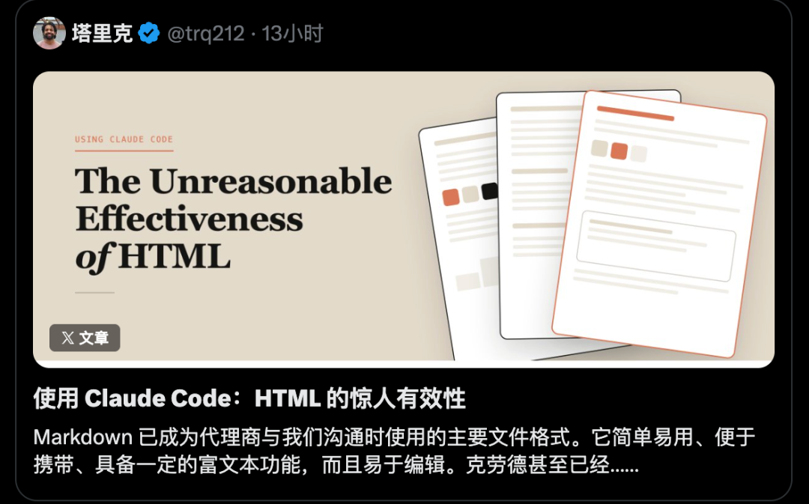
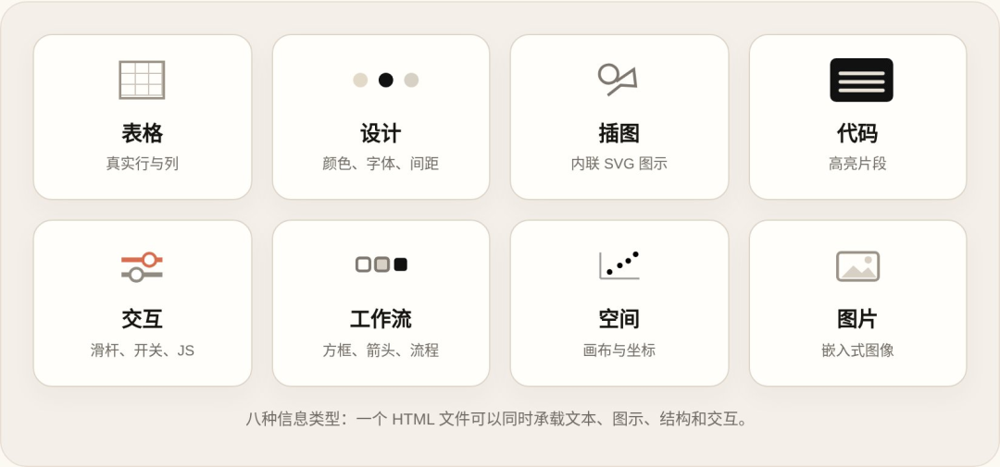
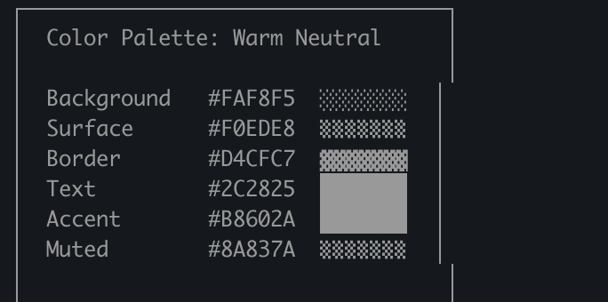

<style>
/* ===== junge-site 通用文章样式 ===== */
.td-content {
    max-width: 900px;
    margin: 0 auto;
}

/* ---- 卡片组件 ---- */

/* 引言卡片：紫蓝渐变 + 白色文字 + 阴影 */
.lead-quote {
    background: linear-gradient(135deg, #667eea 0%, #764ba2 100%);
    color: white;
    padding: 2.5rem 2rem;
    border-radius: 12px;
    margin: 2rem 0 3rem 0;
    font-size: 1.25rem;
    font-weight: 600;
    line-height: 1.6;
    box-shadow: 0 10px 30px rgba(102, 126, 234, 0.3);
    position: relative;
    overflow: hidden;
}
.lead-quote::before {
    content: '"';
    position: absolute;
    top: -20px;
    left: 10px;
    font-size: 120px;
    opacity: 0.1;
    font-family: Georgia, serif;
}

/* 信息框：浅色背景 + 左侧蓝色边框 */
.info-box {
    background: #f8f9fa;
    padding: 1.5rem;
    border-left: 4px solid #667eea;
    border-radius: 8px;
    margin: 2rem 0;
}

/* 重点提示框：暖色背景 + 橙色边框 */
.highlight-box {
    background: linear-gradient(135deg, #fff5f5 0%, #fffaf0 100%);
    border: 2px solid #ed8936;
    border-radius: 12px;
    padding: 1.5rem;
    margin: 2rem 0;
    box-shadow: 0 4px 12px rgba(237, 137, 54, 0.1);
}

/* 数据卡片：深色背景 + 大号数字 */
.stats-box {
    background: linear-gradient(135deg, #1a202c 0%, #2d3748 100%);
    color: white;
    padding: 2rem;
    border-radius: 12px;
    margin: 2rem 0;
    text-align: center;
}
.stats-box .number {
    font-size: 2.5rem;
    font-weight: 800;
    color: #667eea;
    display: block;
}

/* ---- 序号列表：带彩色编号圆徽章 ---- */
.numbered-list {
    list-style: none;
    padding: 0;
    margin: 1.5rem 0;
}
.numbered-list li {
    padding: 0.75rem 0 0.75rem 2.5rem;
    position: relative;
    line-height: 1.6;
    border-bottom: 1px solid #f0f0f0;
}
.numbered-list li:last-child {
    border-bottom: none;
}
.numbered-list .num {
    position: absolute;
    left: 0;
    top: 0.75rem;
    width: 28px;
    height: 28px;
    background: linear-gradient(135deg, #667eea, #764ba2);
    color: white;
    border-radius: 50%;
    display: flex;
    align-items: center;
    justify-content: center;
    font-size: 0.85rem;
    font-weight: 700;
    flex-shrink: 0;
}

/* ---- 引用卡片（正文内嵌引用） ---- */
.inline-quote {
    background: #f0f4ff;
    padding: 1.5rem 2rem;
    margin: 2rem 0;
    border-radius: 12px;
    position: relative;
    font-style: italic;
    color: #4a5568;
}
.inline-quote::before {
    content: '"';
    position: absolute;
    top: 5px;
    left: 12px;
    font-size: 48px;
    color: #667eea;
    opacity: 0.2;
    font-family: Georgia, serif;
}
.inline-quote .author {
    display: block;
    margin-top: 0.5rem;
    font-style: normal;
    font-weight: 600;
    color: #667eea;
    font-size: 0.9rem;
}

/* ---- 视觉分隔器 ---- */
.section-divider {
    display: flex;
    align-items: center;
    margin: 3rem 0;
    gap: 12px;
}
.section-divider .line {
    flex: 1;
    height: 1px;
    background: linear-gradient(90deg, transparent, #667eea, transparent);
}
.section-divider .dot {
    width: 6px;
    height: 6px;
    background: #667eea;
    border-radius: 50%;
    opacity: 0.5;
}

/* ---- 结尾典藏框 ---- */
.outro-box {
    background: linear-gradient(135deg, #1a202c 0%, #2d3748 100%);
    color: white;
    padding: 2.5rem;
    border-radius: 16px;
    margin: 3rem 0;
    text-align: center;
    box-shadow: 0 10px 30px rgba(0, 0, 0, 0.2);
}
.outro-box strong {
    color: #667eea !important;
}

/* ---- 标题样式 ---- */
.td-content h2 {
    font-size: 1.8rem;
    font-weight: 700;
    color: #1a202c;
    margin-top: 3.5rem;
    margin-bottom: 1.5rem;
    padding-bottom: 0.8rem;
    border-bottom: 3px solid #667eea;
    position: relative;
}
.td-content h2::before {
    content: '';
    position: absolute;
    left: 0;
    bottom: -3px;
    width: 60px;
    height: 3px;
    background: linear-gradient(90deg, #667eea, #764ba2);
}

/* ---- 加粗文字主题色 ---- */
.td-content strong {
    color: #667eea;
    font-weight: 600;
}

/* ---- 段落样式 ---- */
.td-content p {
    margin-bottom: 1.5rem;
}

/* ---- 图片样式 ---- */
.td-content img {
    border-radius: 12px;
    box-shadow: 0 8px 24px rgba(0, 0, 0, 0.12);
    margin: 2.5rem 0;
    width: 100%;
    transition: transform 0.3s ease;
}
.td-content img:hover {
    transform: translateY(-4px);
    box-shadow: 0 12px 32px rgba(0, 0, 0, 0.18);
}

/* ---- 代码块 ---- */
.td-content pre {
    border-radius: 12px;
    box-shadow: 0 4px 16px rgba(0, 0, 0, 0.1);
    margin: 2rem 0;
}

/* ---- 表格 ---- */
.td-content table {
    border-collapse: collapse;
    width: 100%;
    margin: 2rem 0;
    border-radius: 12px;
    overflow: hidden;
    box-shadow: 0 4px 12px rgba(0, 0, 0, 0.08);
}
.td-content table th {
    background: linear-gradient(135deg, #667eea, #764ba2);
    color: white;
    padding: 12px 16px;
    font-weight: 600;
}
.td-content table td {
    padding: 10px 16px;
    border-bottom: 1px solid #f0f0f0;
}
.td-content table tr:last-child td {
    border-bottom: none;
}

/* ---- 响应式 ---- */
@media (max-width: 768px) {
    .lead-quote {
        padding: 1.5rem 1rem;
        font-size: 1.1rem;
    }
    .stats-box .number {
        font-size: 2rem;
    }
    .numbered-list li {
        padding-left: 2rem;
    }
}
</style>

**过去几年，Markdown 几乎成了 AI Agent 的"标配"。不管是 ChatGPT、Claude、Cursor 还是 Copilot，默认输出格式都是 `#` 标题、`-` 列表、`` `代码` ``。**

但最近，Claude Code 团队的工程师 **Thariq Shihipar**（@trq212）发了一篇长文，提出了一个很有冲击力的观点：

> Markdown 已经越来越限制 Agent 的表达能力。HTML 才是 Agent 时代人与 AI 协作的更优格式。

他甚至说，Claude Code 团队的人**已经开始集体转向 HTML 了**。


这听起来有点反直觉。Markdown 用了这么多年，怎么说换就换？但仔细读下去，你会发现一个关键前提正在发生变化——而这个变化，可能会重新定义 AI 时代"文档"的含义。

<div class="section-divider">
  <span class="line"></span>
  <span class="dot"></span>
  <span class="line"></span>
</div>

## 一、Markdown 为什么突然"不够用了"

这不是 Markdown 变差了。**而是 Agent 变强了。**

过去的 AI 只能回答问题、写段文字、输出个表格——Markdown 足够。但现在的 Claude、GPT-5.5 已经开始：

<ul class="numbered-list">
  <li><span class="num">1</span> 读取整个代码库</li>
  <li><span class="num">2</span> 做系统设计</li>
  <li><span class="num">3</span> 写 PR Review</li>
  <li><span class="num">4</span> 生成架构图</li>
  <li><span class="num">5</span> 做产品方案</li>
  <li><span class="num">6</span> 生成交互原型</li>
  <li><span class="num">7</span> 分析 Git 历史</li>
  <li><span class="num">8</span> 理解 Slack / Linear / MCP</li>
</ul>

问题来了：这些复杂信息，最后却被塞进 Markdown 里——用 `## Architecture` 做标题，用 `User -> API -> Queue -> Worker` 做架构图，甚至用 `████░░░░░` 这种 ASCII 图来表达进度。

<div class="info-box">
<strong>一个让人哭笑不得的细节：</strong>Claude 已经开始用 Unicode 字符"模拟颜色"来表达信息，因为 Markdown 根本没有更好的表达方式。
</div>

这本质上其实就是：**AI 的表达能力，已经超过 Markdown 这个"容器"了。** 就像把一辆跑车塞进自行车道——不是车不行，是路太窄。

<div class="section-divider">
  <span class="line"></span>
  <span class="dot"></span>
  <span class="line"></span>
</div>

## 二、一个关键前提正在变化

Thariq 在文章里提到一句很关键的话：

<div class="lead-quote">
"我已经越来越少亲自编辑这些文件了。"
</div>

这是整个事情的**核心**。

过去：
- 人类写 Markdown
- 人类改 Markdown
- 人类维护 Markdown

所以"易编辑"是核心优势。

但现在：
- Claude 写
- Agent 改
- AI 维护
- **人类更多只是阅读和决策**

Markdown 最大的优势——**"易编辑"**——其实正在消失。

<div class="highlight-box">
<strong>核心洞察：</strong>当 Agent 成为主要生产者时，"机器可表达性"开始比"人类可编辑性"更重要。
</div>

<div class="section-divider">
  <span class="line"></span>
  <span class="dot"></span>
  <span class="line"></span>
</div>

## 三、HTML 真正强的，不是"网页"

很多人看到 HTML 会下意识想到：前端、浏览器、网页开发。但这次大家重新看待 HTML，其实是因为：**HTML 是目前最强的"信息表达协议"**。

它天然拥有：

| 能力 | 实现方式 |
|------|---------|
| **布局** | CSS Flexbox、Grid、绝对定位 |
| **颜色** | 真正的色值（`#FF5733`），不是 Unicode 模拟 |
| **动画** | CSS 动画、Transition |
| **矢量图** | SVG，矢量图表、流程图、架构图 |
| **画布** | Canvas 2D/3D 绘图，数据可视化 |
| **表格** | 真正的数据表格，不是 ASCII 画线 |
| **响应式** | 移动端自适应 |
| **交互** | JavaScript 交互、调参、实时预览 |
| **图片** | `` 标签直接嵌入 |

这意味着：**Agent 输出的，不再只是"文档"，而是一个轻量级应用（Mini App）。**



<div class="section-divider">
  <span class="line"></span>
  <span class="dot"></span>
  <span class="line"></span>
</div>

## 四、HTML 的六大核心优势

Thariq 把 HTML 的优势拆解得很清楚：



### 1. 信息密度爆炸

HTML 能承载表格、CSS、SVG、Canvas、JS 交互——几乎 Claude 能理解的任何信息都能高效呈现。不用再忍受 Unicode 模拟颜色或 ASCII 图的尴尬。

### 2. 可读性大幅提升

Thariq 的原话："**超过 100 行的 Markdown 我基本不看了。**"

但 HTML 可以：标签页切换、SVG 插图、可折叠模块、双栏布局、响应式适配——长文档也能轻松读完。

### 3. 分享极度方便

Markdown 只能当附件发，对方还要找工具打开。HTML 上传 S3 后直接发链接，浏览器原生打开。**"别人真正去阅读的概率会大幅提升。"**

### 4. 双向交互能力

Markdown 完全做不到：滑块调参、拖拽排序、实时预览、一键"Copy as Prompt"贴回 Claude Code。HTML 是**动态编辑界面**，真正实现人机闭环协作。

### 5. 数据摄入更强

Claude Code 能读取代码库、Slack、Linear、Git 历史等多源上下文，直接生成结构化 HTML 报告。

### 6. 愉悦感

"用 Claude 做 HTML 本身就是一件极其好玩的事。"更有参与感，更有创造感。

<div class="section-divider">
  <span class="line"></span>
  <span class="dot"></span>
  <span class="line"></span>
</div>

## 五、HTML 也有一堆问题

Thariq 没有一味吹捧，很诚实地列出了 HTML 路线的缺点：

| 问题 | 说明 | 现状 |
|------|------|------|
| **生成更慢** | HTML 可能是 Markdown 的 2-4 倍 | 作者认为值得等待 |
| **Token 更贵** | HTML + CSS + SVG + JS，整体更长 | 1M 上下文窗口下几乎可忽略 |
| **版本控制** | HTML diff 极其嘈杂 | **最大短板** |
| **审美风险** | 容易过度动画、UI 混乱、信息过载 | 需要 Design System |

关于版本控制，Thariq 说这是 "honestly one of the biggest downsides"。Markdown diff 一目了然（`+ add section`），HTML diff 却是 `+ <div class="flex gap-2 px-4">`，可读性差很多。

关于审美，他的解决方案是：**先让 Claude 扫描你的代码库，生成一个专属的 Design System HTML 文件**，之后把这个文件作为参考资料丢给 Claude，让它在生成其他 HTML 页面时"照猫画虎"，保持风格高度一致。



<div class="section-divider">
  <span class="line"></span>
  <span class="dot"></span>
  <span class="line"></span>
</div>

## 六、真正重要的变化：从"文档"到"界面"

很多人容易误解成 "HTML vs Markdown" 的格式之争。但其实不是。

**真正的变化是：AI 输出，正在从"文本"进化成"界面"。**

过去：
```text
Agent → 文档（Markdown）→ 人类
```

未来：
```text
Agent → 可交互 Artifact（HTML）→ 人类
```

这本质上是：**"软件界面生成"正在替代"文档生成"。**

而 HTML，刚好是今天最成熟、最通用、最低成本的运行时——**浏览器是全球最大的 Runtime**。

<div class="section-divider">
  <span class="line"></span>
  <span class="dot"></span>
  <span class="line"></span>
</div>

## 七、Markdown 不会死，但会退化成"源码层"

Thariq 说他"几乎完全不用 Markdown 了"，但这不代表 Markdown 会消失。更可能的未来是**分层**：

| 层级 | 格式 | 角色 |
|------|------|------|
| **AI 展示层** | **HTML** | 最终阅读/交互界面 |
| **AI 交互层** | **HTML + JS** | 调参、编辑、预览 |
| **数据层** | **JSON / YAML** | 结构化数据 |
| **存储层** | **Markdown / Plain Text** | 中间格式、Git 友好 |

Markdown 会越来越像 `.md`、`.txt`、`.yaml`——**中间数据格式，而不是最终阅读格式。**

就像 JSX 不再是最终 UI、AST 不再给人看、SQL 不是最终产品——Markdown 可能也会变成 Agent 内部通信格式。

**真正给人看的：会越来越 HTML 化。**

<div class="outro-box">
<strong>写在最后</strong><br><br>
这篇讨论的不是 HTML 和 Markdown 谁更好，而是 AI 时代"输出"的定义正在被重写。<br><br>
当 Agent 生成的不再是文本，而是<span style="color: #667eea;">界面</span>时，<br>我们需要一个能承载这个新定义的格式。<br><br>
而 HTML，恰好就是那个已经跑在每一个设备上的运行时。<br><br>
<strong style="color: #8899ee !important;">参考链接</strong><br><br>
<a href="https://x.com/trq212/status/2052809885763747935" style="color: #8899ee;">Thariq 原文</a> · 
<a href="https://thariqs.github.io/html-effectiveness/" style="color: #8899ee;">20 个 HTML 示例集合</a> · 
<a href="https://simonwillison.net/2026/May/8/unreasonable-effectiveness-of-html/" style="color: #8899ee;">Simon Willison 转载</a>
</div>
