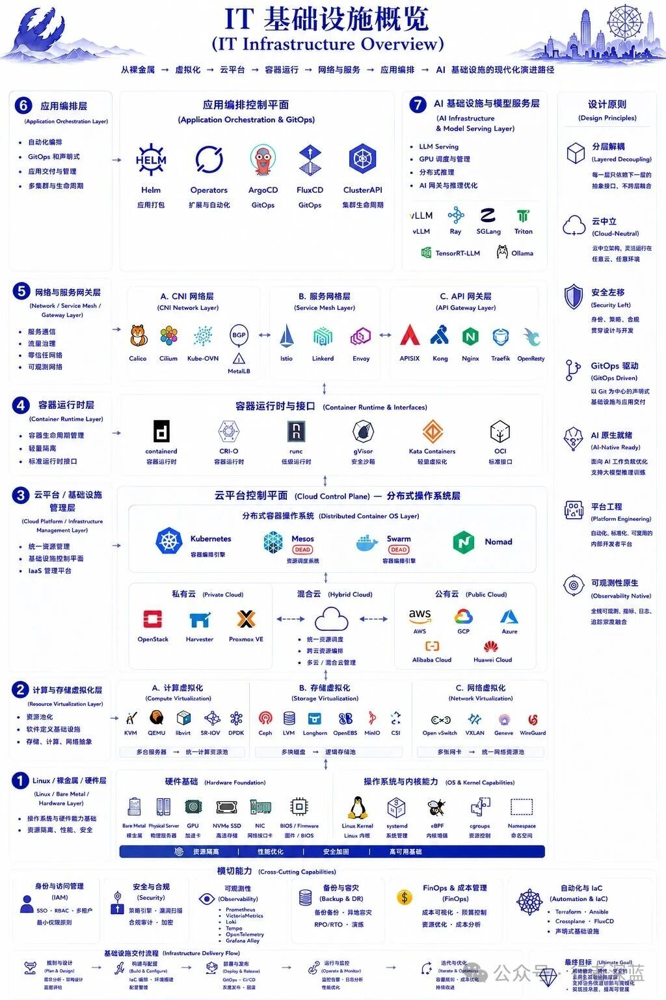

**把过去十几年的基础设施演进串起来看，Kubernetes 更像一个时代的「中间层」，而不是最终答案。**

现代基础设施的演进路径越来越清晰：

> Hardware → Virtualization → Cloud Control Plane → Runtime → Network → Orchestration → AI Infra

这不是一条随机的技术堆叠，而是每一层都在解决上一层留下的问题，同时为下一层铺路。

  
  
  

## 一、底层依然是硬件

不管上面的软件栈怎么演进，最底层永远是硬件。GPU、NVMe、RDMA、高速网络、Linux Kernel、eBPF、cgroups——这些东西决定了资源边界和性能上限。

有趣的是，AI 时代反而让硬件重新变得重要。因为大模型训练和推理最终拼的是显存、带宽、通信、IO 和调度能力。软件可以优化效率，但物理资源的天花板是硬件定义的。

## 二、资源虚拟化

再往上走一层，是资源虚拟化。但今天的虚拟化早已不只是 KVM/QEMU 这类计算虚拟化——而是计算、存储、网络的**统一资源池化**。

Ceph、Open vSwitch、SR-IOV、DPDK、CSI，这些技术的本质都一样：**把离散的硬件抽象成可调度的资源池**。

## 三、Cloud Control Plane

AWS、OpenStack、Harvester 这一层，问的不是「怎么虚拟化」，而是「怎么统一管理、调度和编排基础设施」。它们不是底层的虚拟化技术，而是**资源控制平面**。

## 四、Kubernetes：分布式容器操作系统

Kubernetes 的位置在哪里？它更像一种 **「分布式容器操作系统」** 。

Mesos、Docker Swarm 逐渐退场，不是因为它们的技术不好，而是它们没能形成完整生态和事实标准。如今真正还健在、并成为行业默认答案的，只剩 Kubernetes。

但 Kubernetes 的成功，也带来了一个副作用——<strong>「Kubernetes Everything」</strong> 的误区。数据库跑 K8s，AI 跑 K8s，边缘跑 K8s，虚拟机跑 K8s，存储也跑 K8s。最后很多企业发现，自己管理的不是业务，而是 Kubernetes 本身。

## 五、AI Infra 正在打破这个结构

传统 Web Infra 关注的是 HTTP 请求、副本、弹性和服务治理。AI Infra 完全不同——它更关心的是：

<ul class="numbered-list">
  <li>1<strong>GPU 调度</strong> — 不是 CPU，是 GPU</li>
  <li>2<strong>KV Cache</strong> — 不是内存，是显存</li>
  <li>3<strong>显存拓扑</strong> — 跨节点通信和亲和性</li>
  <li>4<strong>分布式推理</strong> — 不是微服务，是模型分片</li>
  <li>5<strong>模型路由 & Token 延迟</strong> — 不是网关，是推理网关</li>
  <li>6<strong>多模型网关</strong> — 不再是 API Gateway 能搞定的</li>
</ul>

所以 **vLLM、Ray、TensorRT-LLM、SGLang、Triton** 正在崛起。它们解决的问题，已经不是传统 Kubernetes 最擅长的问题。

  
  
  

## 六、Kubernetes 不会消失，但会「下沉」

未来 Kubernetes 不会消失，但它的位置会发生变化——它会逐渐**「下沉」**，像 Linux 一样成为基础设施底座，而不是继续往上堆叠更多控制层。

真正往上生长的，将是 AI Gateway、GPU Scheduler、Inference Fabric、Semantic Cache、Agent Runtime。

这些新组件解决的是 AI 负载独有的问题：
- 推理请求的路由和调度
- GPU 显存的分时复用
- 模型热加载和版本管理
- Token 级别的成本计量和配额控制
- Agent 生命周期管理

这些都不是 K8s 原生 CRD 能优雅表达的——需要全新的控制平面。

  
  
  

## 七、Cloud Native → AI Native

把整条演进线串起来看，每一层的兴起都有它的历史合理性：

| 时代 | 核心问题 | 代表技术 |
|------|---------|---------|
| 硬件时代 | 物理资源在哪里 | GPU, NVMe, RDMA |
| 虚拟化时代 | 如何池化资源 | KVM, Ceph, OVS, DPDK |
| 云控制面时代 | 如何管理资源 | AWS, OpenStack |
| 容器化时代 | 如何编排应用 | Kubernetes, Docker |
| AI 基础设施时代 | 如何调度模型 | vLLM, Ray, SGLang |

Kubernetes 在容器化时代完成了它的历史使命——把分布式系统的编排复杂度封装成一个事实标准。但它不是终点，只是一个关键的**中间层**。

<strong>Cloud Native 没有结束，它正在进入下一阶段：AI Native。</strong>  
如果你还停留在「所有东西都上 K8s」的思路，可能需要抬头看看——<strong>基础设施的增长点已经不在编排层了，而是在模型层、推理层和智能代理层。</strong>

