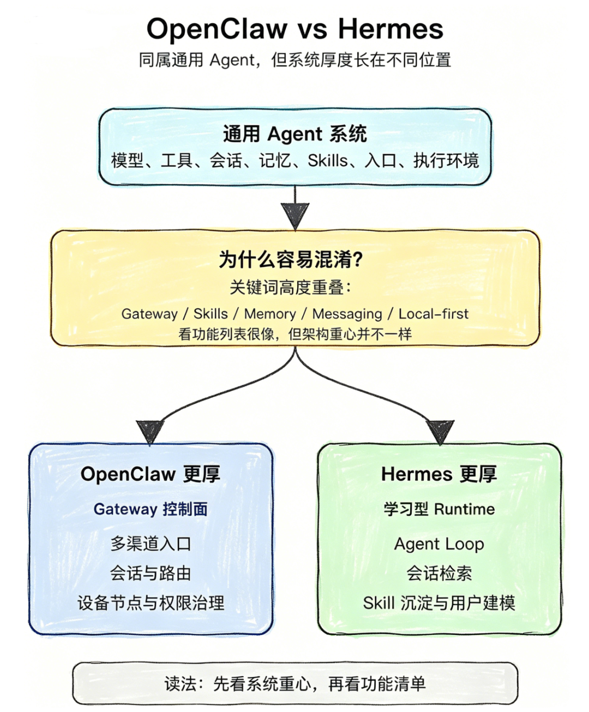
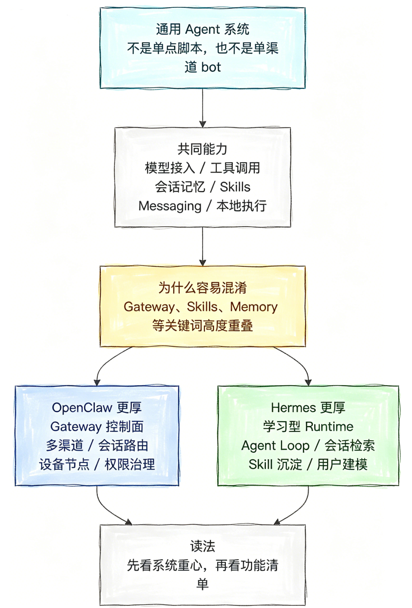
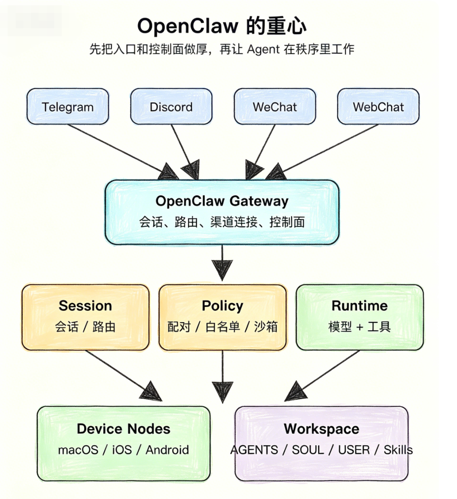
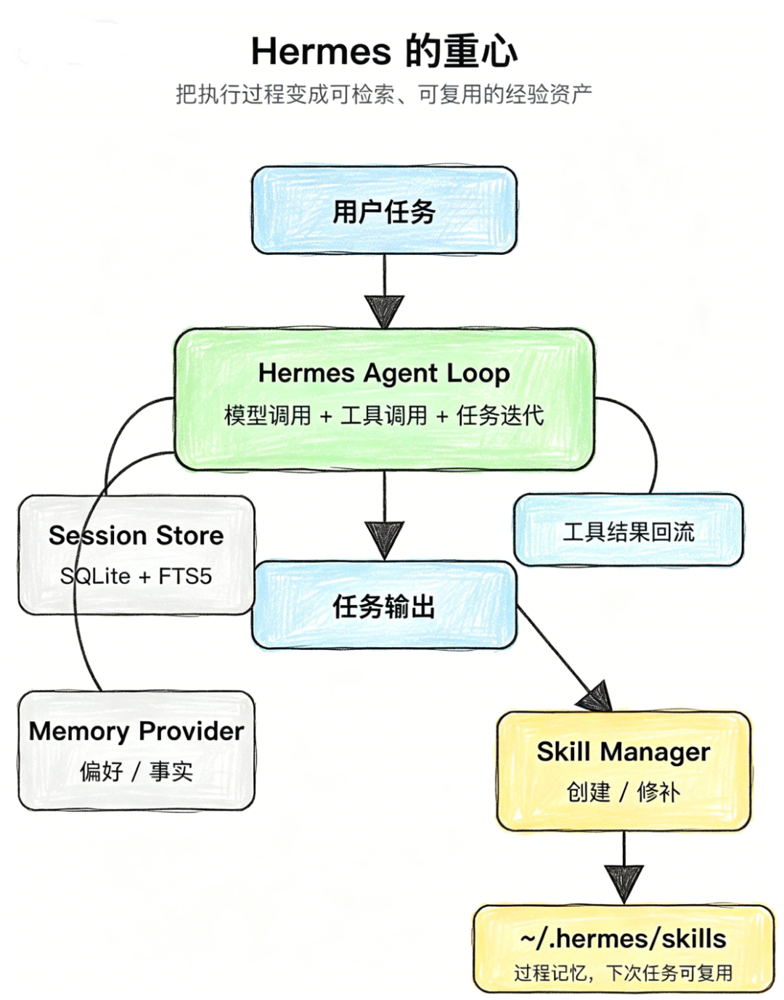
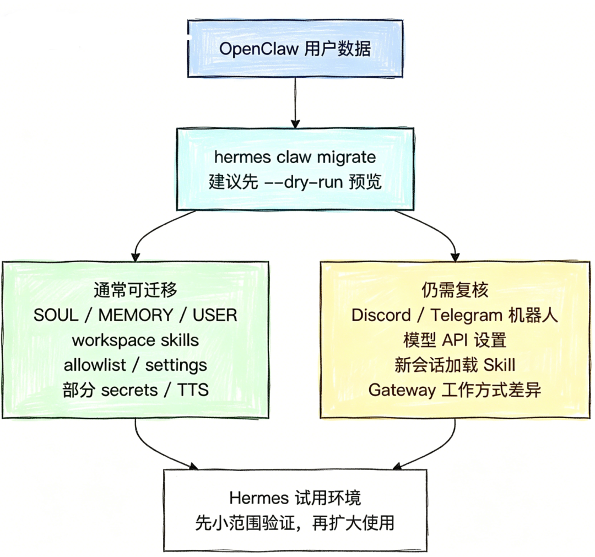

当前 AI Agent 已从单一工具调用转向系统化落地。OpenClaw 与 Hermes 看似功能相近，但工程重心截然不同——一个聚焦"接入管控"，一个聚焦"自我进化"。

**一句话说清楚：** OpenClaw 以本地优先为核心，构建多入口接入与权限管控的 Gateway 控制面；Hermes 以自我进化为核心，打造学习型执行循环，实现任务经验的沉淀与复用。二者不存在简单的替代关系，而是代表 Agent 系统的两大发展方向。

**当前 AI Agent 已从单一工具调用转向系统化落地应用**，不少开发者在搭建个人智能助理时，面临 OpenClaw 与 Hermes 的选型难题。尤其在 Reddit 等海外社区，"I ditched OpenClaw for Hermes" 的讨论持续发酵，国内开发者普遍困惑：二者是否属于同类产品？Hermes 能否完全替代 OpenClaw？

这篇文章从核心定位、架构设计、技能体系、记忆机制、安全策略、部署适配六个维度进行全面对比。

---

## 一、核心定位与共性认知

OpenClaw 与 Hermes 同属通用 Agent 系统，均突破传统模型包装器范畴，实现模型、工具、会话、记忆、技能、消息入口与运行环境的一体化整合。二者均支持技能体系、记忆存储、多渠道接入与工具调用，核心目标是为用户提供可长期运行的智能助理服务。

二者虽在 Gateway、Skills、Memory 等概念上存在表述重叠，但**工程设计重心截然不同**：

| 维度 | OpenClaw | Hermes |
|------|----------|--------|
| **核心定位** | 本地优先个人 AI 助手 | 自我进化型 AI Agent |
| **架构重心** | Gateway 控制面搭建 | 学习型执行循环构建 |
| **设计哲学** | 先接入、再治理 | 先执行、再演进 |

---

## 二、OpenClaw：多入口接入的控制中枢

OpenClaw 由独立开发者 Peter Steinberger 创建，该开发者于今年 2 月加入 OpenAI，目前项目已移交社区基金会维护。

其架构厚度集中于**入口层与控制面**，支持 25+ 聊天渠道，同时适配 macOS 菜单栏应用、iOS/Android 节点、语音唤醒、实时交互画布等多终端形态。

**核心解决：** 多渠道状态管理、会话隔离、群聊触发规则、消息分片处理、凭据存储、设备配对策略、WebSocket 控制面、可视化控制台等工程化落地难题。

**核心特征：** 具备鲜明的"作业系统"特征——用户看到的是聊天交互界面，系统底层运行的是完整的消息接入、路由、会话与记忆加载机制。

---

## 三、Hermes：自我进化的执行引擎

Hermes 由 Nous Research 研发，该团队也是 Hermes 3、Hermes 4 等系列大模型的缔造者，在模型训练与推理优化领域具备一手技术积累，产品上线两个月内社区增长迅速。

其架构厚度集中于**执行循环与经验层**，内置闭环学习机制，核心解决 Agent 重复试错、经验无法留存的行业痛点，让智能体在完成复杂任务后实现能力迭代。

**核心模块：**
<ul class="numbered-list">
<li>1run/agent.py — 执行循环</li>
<li>2model/tools.py — 工具分发</li>
<li>3skill manager/tool.py — 技能管理</li>
<li>4hermes/state.py — 状态存储</li>
</ul>

同时支持本地、Docker、SSH、Daytona、Singularity、Modal 六种执行后端，**5 美元/月的 VPS 即可稳定运行**。

---

## 四、技能体系设计差异

两大框架均采用 Skill 技能设计，但核心逻辑与应用形态完全不同。

**OpenClaw：工程化治理路线**

遵循 AgentSkills 标准，内置 50+ 预置技能，按系统捆绑技能、托管/本地技能、个人智能体技能、项目智能体技能、工作区技能**分层管理**。通过加载优先级与权限管控实现技能治理，本质是标准化的标准操作流程库（SOP），可控性与可审计性极强。

**Hermes：过程记忆路线**

将技能定义为**过程记忆（procedural memory）**，核心记录"如何完成某类具体任务"的方法路径。支持 Agent 在完成复杂任务后自动创建、修补、更新技能。内置 26 个技能分类，兼容 agentskills.io 开放标准。

**社区反馈：** Hermes 的自动技能迭代机制可使重复性研究任务效率提升约 40%，但需定期复核修剪，避免错误经验固化形成执行惯性。

---

## 五、记忆机制与存储设计

| 维度 | OpenClaw | Hermes |
|------|----------|--------|
| **模式** | 文件即记忆 | 三级系统化记忆 |
| **文件** | SOUL.md / USER.md / MEMORY.md | MEMORY.md + USER.md + SQLite |
| **检索** | 语义检索 | SQLite+FTS5 全文检索 |
| **特点** | 笔记本式，易人工编辑 | 搜索引擎式，精准召回 |

OpenClaw 采用**"文件即记忆"**模式，核心记忆载体为 markdown 文件，通过语义检索工具实现记忆调用，在上下文压缩前执行静默记忆写入，防止关键信息丢失。

Hermes 构建**三级记忆体系**：

<ul class="numbered-list">
<li>1<strong>会话记忆</strong>：仅维持当前对话上下文</li>
<li>2<strong>持久记忆</strong>：跨会话留存用户事实信息</li>
<li>3<strong>技能记忆</strong>：沉淀可复用的任务解决方案</li>
</ul>

---

## 六、安全策略对比

| 维度 | OpenClaw | Hermes |
|------|----------|--------|
| **模型** | 信任模型 + 配置审计 | 纵深防御 + 容器隔离 |
| **核心机制** | 白名单 + 沙箱 + 安全审计 | 人工审批 + 注入扫描 |
| **风险点** | 渠道多 → 攻击面大 | 暂未大规模生态验证 |
| **补救** | 定期 audit，严控第三方技能 | 默认开启人工审批隔离 |

---

## 七、能力维度全面对比

| 维度 | OpenClaw | Hermes |
|------|----------|--------|
| **入口接入** | 极强，25+ 渠道 | 主流平台 + 邮件 |
| **技能体系** | 分层治理，50+ 内置 | 自动迭代，26 类 |
| **记忆方案** | 文件化，笔记本式 | 三级体系，SQLite+FTS5 |
| **安全管控** | 信任模型 + 沙箱 | 纵深防御 + 容器隔离 |
| **技术栈** | Node.js / TypeScript | Python 3.11 |
| **模型支持** | 多厂商兼容 | 200+ 模型一键切换 |
| **迁移支持** | 自身跨机器迁移 | 支持从 OpenClaw 完整迁移 |
| **适用场景** | 多渠道助理、权限治理 | 重复任务、研发工作流 |

---

## 八、迁移方案

Hermes 为 OpenClaw 用户提供专属迁移能力：

- `hermes claw migrate` — 交互式完整迁移
- `hermes claw migrate --dry-run` — 预演迁移，不执行实际操作
- `hermes claw migrate --preset user-data` — 仅迁移用户数据，排除密钥

可迁移内容包含 SOUL.md 智能体人设、MEMORY.md 与 USER.md 记忆文件、用户自定义技能、部分消息渠道配置等核心数据。

**注意：** 迁移仅为低成本试用入口，并非完整架构替换。WhatsApp 等二维码配对渠道需重新绑定，导入技能需重启服务生效，迁移后需重新配置模型提供商与 API 密钥。

---

## 写在最后

OpenClaw 与 Hermes 作为通用 Agent 领域的代表性框架，**不存在绝对的优劣之分**，也并非简单的替代关系，而是代表了 Agent 系统的两大发展方向：

- **OpenClaw**：让智能体接入真实世界——多入口、多设备、多权限的工程化管控
- **Hermes**：让智能体沉淀实践经验——重复试错、能力无法迭代的行业痛点

未来成熟的通用 Agent 体系，必然会兼顾多入口接入能力与自我迭代能力。开发者可根据自身使用场景灵活选型，也可通过迁移机制实现双框架试用对比。

---

## 参考资料

### 相关文章

- [OpenClaw 配置手册：openclaw.json 完全指南](https://docs.openclaw.ai)
- [Hermes Agent 官方文档](https://github.com/NousResearch/hermes-agent)
- [Claude Code 最佳实践：一套可以每天照着走的默认工作流](https://docs.anthropic.com)

---

博客地址：https://jungelife.me/zh/
