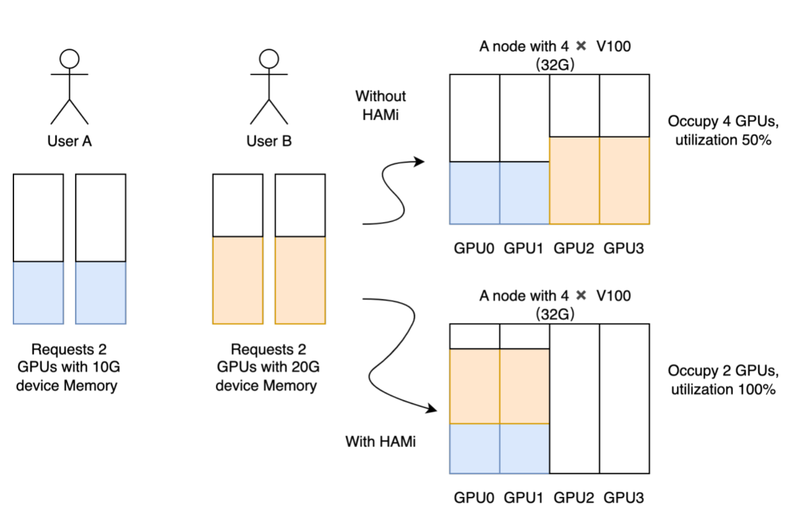

## 1. vLLM Docker镜像与Kubernetes部署价值

vLLM是一个专为大语言模型推理设计的高性能服务框架，其核心优势在于创新的PagedAttention技术，能够显著提升GPU内存利用率和推理吞吐量。通过Docker容器化封装，vLLM实现了环境标准化和依赖隔离，而Kubernetes部署则进一步带来了：

- **弹性伸缩**：根据负载自动调整副本数量
- **资源隔离**：GPU资源的精细化管理和隔离
- **高可用性**：自动故障恢复和负载均衡
- **简化运维**：统一的部署、监控和管理界面

vLLM官方Docker镜像提供了开箱即用的模型服务环境，结合Kubernetes的编排能力，为生产级AI服务提供了坚实基础。

## 2. Qwen3-235B-A22B-Instruct-2507模型部署实践

### 2.1 从ModelScope下载模型

Qwen3-235B-A22B-Instruct-2507作为千问系列的最新大模型，首先需要从ModelSpace获取模型权重：

```python
# 使用modelscope库下载模型
from modelscope import snapshot_download
model_dir = snapshot_download(
    'Qwen/Qwen3-235B-A22B-Instruct-2507',
    cache_dir='/workspace/models',
    revision='v1.0.0'
)
```

对于Kubernetes环境，推荐使用初始化容器进行模型下载，确保模型文件在Pod启动前准备就绪。

## 3. vLLM服务配置与Kubernetes部署

### 3.1 vLLM启动参数优化

针对Qwen3-235B大模型，vLLM需要特定配置以充分发挥性能：

```bash
vllm serve Qwen/Qwen3-235B-A22B-Instruct-2507 \
    --tensor-parallel-size 8 \
    --gpu-memory-utilization 0.85 \
    --max-model-len 131072 \
    --served-model-name qwen3-235b \
    --port 9997 \
    --host 0.0.0.0 \
    --trust-remote-code \
    --dtype auto \
    --enable-prefix-caching \
    --enable-chunked-prefill \
    --api-key sk-xxxxxxxxx \
    --tool-call-parser hermes \
    --enable-auto-tool-choice \
    --swap-space 16 \
    --disable-log-requests
```

关键参数说明：

- tensor-parallel-size 8：8路张量并行，充分利用多GPU资源
- gpu-memory-utilization 0.85：适中的GPU内存利用率，预留缓冲空间
- max-model-len 131072：支持128K上下文长度
- enable-prefix-caching：启用前缀缓存，提升推理效率
- enable-chunked-prefill：分块预填充，优化长文本处理
- swap-space 16：16GB交换空间，处理内存溢出

### 3.2 Kubernetes Deployment配置

```yaml
apiVersion: apps/v1
kind: StatefulSet
metadata:
  labels:
    app: vllm-qwen3-235b
    nvidia.com/app: vllm-qwen3-235b
    nvidia.com/framework: python
    nvidia.com/unit: application
  name: vllm-qwen3-235b
  namespace: ai-serving
spec:
  podManagementPolicy: OrderedReady
  replicas: 1
  revisionHistoryLimit: 10
  selector:
    matchLabels:
      app: vllm-qwen3-235b
  serviceName: vllm-qwen3-235b
  template:
    metadata:
      annotations:
        nvidia.com/use-gputype: A100,A800,H100,H800
        nvidia.com/globalid: AIP_MDIS_QWEN3_235B
        nvidia.com/gpu: "8"
        nvidia.com/gpumem: "638976"  # 8 * 79872
        nvidia.com/model-uid: Qwen3-235B-A22B-Instruct-2507
      labels:
        app: vllm-qwen3-235b
        type: llm
        model-size: 235b
        nvidia.com/app: vllm-qwen3-235b
        nvidia.com/framework: python
        nvidia.com/unit: application
        nvidia.com/4pd-scheduler: "true"
    spec:
      affinity:
        nodeAffinity:
          requiredDuringSchedulingIgnoredDuringExecution:
            nodeSelectorTerms:
            - matchExpressions:
              - key: accelerator
                operator: In
                values: ["nvidia-a100-80gb", "nvidia-a800-80gb", "nvidia-h100-80gb"]
              - key: topology.kubernetes.io/zone
                operator: In
                values: ["zone-gpu-high"]
      initContainers:
      - name: download-model
        image: download-model:latest
        imagePullPolicy: IfNotPresent
        command: ["sh", "-c"]
        args:
        - |
          echo "开始下载Qwen3-235B模型..."
          model_download /opt/app/models/ || {
            echo "模型下载失败，尝试从备用源下载..."
            exit 1
          }
          echo "模型下载完成，验证模型文件..."
          ls -la /opt/app/models/
          if [ ! -f "/opt/app/models/config.json" ]; then
            echo "模型文件验证失败"
            exit 1
          fi
          echo "模型文件验证成功"
        env:
        - name: S3_URL
          valueFrom:
            secretKeyRef:
              key: S3_URL
              name: vllm-qwen3-235b
        - name: S3_AK
          valueFrom:
            secretKeyRef:
              key: S3_AK
              name: vllm-qwen3-235b
        - name: S3_SK
          valueFrom:
            secretKeyRef:
              key: S3_SK
              name: vllm-qwen3-235b
        - name: S3_BUCKET
          valueFrom:
            secretKeyRef:
              key: S3_BUCKET
              name: vllm-qwen3-235b
        - name: USERNAME
          value: "ai-platform"
        - name: MODEL_NAME
          value: "qwen3-235b"
        - name: VERSION
          value: "Qwen3-235B-A22B-Instruct-2507"
        resources:
          requests:
            cpu: "2"
            memory: "4Gi"
          limits:
            cpu: "4"
            memory: "8Gi"
        volumeMounts:
        - mountPath: /opt/app/models
          name: share-volume
      containers:
      - name: vllm-qwen3-235b
        image: vllm/vllm-openai:v0.12.0
        imagePullPolicy: IfNotPresent
        command: ["/bin/bash"]
        args:
        - -c
        - |
          set -e
          
          # 环境变量设置
          export NCCL_SHM_DISABLE=1
          export VLLM_ALLOW_LONG_MAX_MODEL_LEN=1
          export CUDA_VISIBLE_DEVICES=0,1,2,3,4,5,6,7
          export NCCL_IB_DISABLE=0
          export NCCL_NET_GDR_LEVEL=2
          
          # 创建日志目录
          mkdir -p /log/logs
          
          # 等待模型文件就绪
          while [ ! -f "/opt/app/models/config.json" ]; do
            echo "等待模型文件就绪..."
            sleep 10
          done
          
          echo "启动vLLM服务..."
          exec python3 -m vllm.entrypoints.openai.api_server \
            --model=/opt/app/models \
            --served-model-name=Qwen3-235B-A22B-Instruct-2507 \
            --port=9997 \
            --host=0.0.0.0 \
            --trust-remote-code \
            --dtype=auto \
            --enable-prefix-caching \
            --enable-chunked-prefill \
            --tensor-parallel-size=8 \
            --gpu-memory-utilization=0.85 \
            --api-key=${API_KEY} \
            --max-model-len=131072 \
            --tool-call-parser=hermes \
            --enable-auto-tool-choice \
            --swap-space=16 \
            --disable-log-requests \
            --max-num-seqs=128 \
            --max-paddings=256 \
            > /log/logs/vllm-qwen3-235b.log 2>&1
        env:
        - name: ACTIVE_OOM_KILLER
          value: "0"
        - name: LIBCUDA_LOG_LEVEL
          value: "0"
        - name: GPU_CORE_UTILIZATION_POLICY
          value: "disable"
        - name: VLLM_WORKER_MULTIPROC_METHOD
          value: "spawn"
        - name: VLLM_LOGGING_LEVEL
          value: "INFO"
        - name: MODEL_UID
          value: "Qwen3-235B-A22B-Instruct-2507"
        - name: MODEL_TYPE
          value: "chat"
        - name: API_KEY
          valueFrom:
            secretKeyRef:
              key: api-key
              name: vllm-qwen3-235b
        - name: NODE_NAME
          valueFrom:
            fieldRef:
              fieldPath: spec.nodeName
        - name: POD_NAME
          valueFrom:
            fieldRef:
              fieldPath: metadata.name
        - name: POD_NAMESPACE
          valueFrom:
            fieldRef:
              fieldPath: metadata.namespace
        - name: POD_IP
          valueFrom:
            fieldRef:
              fieldPath: status.podIP
        lifecycle:
          preStop:
            exec:
              command:
              - /bin/bash
              - -c
              - |
                echo "正在优雅关闭vLLM服务..."
                kill -TERM $(pgrep -f "vllm.entrypoints.openai.api_server") || true
                sleep 30
        ports:
        - containerPort: 9997
          name: api-port
          protocol: TCP
        livenessProbe:
          httpGet:
            path: /health
            port: 9997
            scheme: HTTP
          failureThreshold: 3
          initialDelaySeconds: 600
          periodSeconds: 60
          successThreshold: 1
          timeoutSeconds: 30
        readinessProbe:
          httpGet:
            path: /health
            port: 9997
            scheme: HTTP
          failureThreshold: 3
          initialDelaySeconds: 300
          periodSeconds: 10
          successThreshold: 1
          timeoutSeconds: 10
        startupProbe:
          httpGet:
            path: /health
            port: 9997
            scheme: HTTP
          failureThreshold: 30
          initialDelaySeconds: 120
          periodSeconds: 30
          successThreshold: 1
          timeoutSeconds: 10
        resources:
          requests:
            cpu: "16"
            memory: "64Gi"
            nvidia.com/gpu: "8"
            nvidia.com/gpumem: "638976"
          limits:
            cpu: "64"
            memory: "256Gi"
            nvidia.com/gpu: "8"
            nvidia.com/gpumem: "638976"
        volumeMounts:
        - mountPath: /opt/app/models
          name: share-volume
          readOnly: true
        - mountPath: /dev/shm
          name: cache-volume
        - mountPath: /etc/localtime
          name: timezone-volume
          readOnly: true
        - mountPath: /log
          name: log-volume
        - mountPath: /tmp
          name: temp-volume
      restartPolicy: Always
      schedulerName: default-scheduler
      securityContext:
        runAsNonRoot: false
        fsGroup: 0
      terminationGracePeriodSeconds: 180
      tolerations:
      - effect: NoSchedule
        key: role
        operator: Equal
        value: bigdata
      - effect: NoSchedule
        key: gpurole
        operator: Equal
        value: gpu
      - effect: NoSchedule
        key: model-size
        operator: Equal
        value: large
      volumes:
      - name: share-volume
        persistentVolumeClaim:
          claimName: vllm-qwen3-235b-model-pvc
      - name: cache-volume
        emptyDir:
          medium: Memory
          sizeLimit: 256Gi
      - name: log-volume
        hostPath:
          path: /data/logs/vllm-qwen3-235b
          type: DirectoryOrCreate
      - name: temp-volume
        emptyDir:
          sizeLimit: 32Gi
      - name: timezone-volume
        hostPath:
          path: /usr/share/zoneinfo/Asia/Shanghai
          type: FileOrCreate
  updateStrategy:
    type: RollingUpdate
    rollingUpdate:
      partition: 0
  volumeClaimTemplates: []

---
apiVersion: v1
kind: PersistentVolumeClaim
metadata:
  name: vllm-qwen3-235b-model-pvc
  namespace: ai-serving
  labels:
    app: vllm-qwen3-235b
spec:
  accessModes:
  - ReadWriteMany
  resources:
    requests:
      storage: 1Ti
  storageClassName: nfs-client

---
apiVersion: v1
kind: Service
metadata:
  name: vllm-qwen3-235b
  namespace: ai-serving
  labels:
    app: vllm-qwen3-235b
spec:
  type: ClusterIP
  ports:
  - port: 9997
    targetPort: 9997
    protocol: TCP
    name: api-port
  selector:
    app: vllm-qwen3-235b

---
apiVersion: v1
kind: Secret
metadata:
  name: vllm-qwen3-235b
  namespace: ai-serving
type: Opaque
data:
  api-key: c2stdmxsbS1xd2VuMy0yMzViLWFwaS1rZXk=  # base64编码的API key
  S3_URL: <base64-encoded-s3-url>
  S3_AK: <base64-encoded-access-key>
  S3_SK: <base64-encoded-secret-key>
  S3_BUCKET: <base64-encoded-bucket-name>
---
apiVersion: v1
kind: PersistentVolumeClaim
metadata:
  name: vllm-qwen3-235b-model-pvc
  namespace: ai-serving
  labels:
    app: vllm-qwen3-235b
spec:
  accessModes:
  - ReadWriteMany
  resources:
    requests:
      storage: 1Ti
  storageClassName: nfs-client
```

### 3.3 存储与模型管理

通过PVC申请共享存储，确保模型文件持久化并可在多个Pod间共享。initContainer负责从S3对象存储下载模型到持久化存储，避免每次Pod重启重复下载。

## 4. Hami on K8S架构的GPU资源动态分配

### 4.1 HAMi简介与优势

**HAMi（Heterogeneous AI Computing Virtualization Middleware）** 是一个专为异构AI计算设备设计的虚拟化中间件，为Kubernetes集群提供强大的GPU资源管理能力。


#### 核心优势

- **🔄 设备虚拟化**：为多种异构设备提供虚拟化功能，支持设备共享和资源隔离
- **🚀 智能调度**：基于设备拓扑和调度策略实现Pod间的设备共享和优化调度
- **🎯 统一管理**：消除不同异构设备间的差异，提供统一管理接口
- **💡 零修改部署**：无需对现有应用程序进行任何修改


### 4.2 支持的异构设备

HAMi 2.7.1版本支持的设备类型如下：

| 设备厂商 | 设备类型 | 支持状态 | 备注 |
|---------|----------|----------|------|
| **NVIDIA** | GPU | ✅ 完整支持 | 需要驱动 >= 440 |
| **寒武纪** | MLU | ✅ 完整支持 | - |
| **海光** | DCU | ✅ 完整支持 | - |
| **天数智芯** | GPU | ✅ 完整支持 | - |
| **摩尔线程** | GPU | ✅ 完整支持 | - |
| **昇腾** | NPU | ✅ 完整支持 | - |
| **沐曦** | GPU | ✅ 完整支持 | - |

> 📈 **支持设备持续更新中**，最新支持列表请查看 [官方文档](https://github.com/Project-HAMi/HAMi#preparing-your-gpu-nodes)

### 4.3 HAMi安装部署

#### 4.3.1 前置条件检查

在安装HAMi之前，请确保满足以下系统要求：

| 组件类别 | 组件名称 | 版本要求 | 详细说明 |
|---------|----------|----------|----------|
| **GPU驱动** | NVIDIA驱动 | ≥ 440.x | • GPU计算节点必需安装<br>• 建议使用最新稳定版本<br>• 支持CUDA 11.0+ |
| **容器运行时** | nvidia-docker | ≥ 2.0 | • GPU容器化支持组件<br>• 必须配置为默认运行时<br>• 与Docker Engine配合使用 |
| **容器编排** | Kubernetes | ≥ 1.18 | • 集群管理平台<br>• 建议1.20+版本以获得更好的GPU调度支持<br>• 需启用GPU设备插件 |
| **容器引擎** | 容器运行时 | 兼容版本 | • 支持：containerd/docker/cri-o<br>• 必须配置nvidia为默认运行时<br>• 确保与K8s版本兼容 |
| **系统库** | glibc | ≥ 2.17 且 < 2.30 | • GNU C标准库<br>• 版本范围严格限制<br>• 影响CUDA库兼容性 |
| **操作系统** | Linux内核 | ≥ 3.10 | • 最低内核版本要求<br>• 建议使用4.x+内核<br>• 确保驱动兼容性 |
| **包管理** | Helm | ≥ 3.0 | • Kubernetes包管理工具<br>• 用于部署GPU Operator<br>• 建议使用最新稳定版 |

> ⚠️ **重要**：确保容器运行时的默认运行时配置为nvidia

#### 4.3.2 安装步骤

**Step 1: 标记GPU节点**

为需要GPU调度的节点添加标签：

```bash
kubectl label nodes {nodeid} gpu=on
```

> 💡 **提示**：只有带有 `gpu=on` 标签的节点才能被HAMi调度器管理

**Step 2: 添加Helm仓库**

```bash
helm repo add hami-charts https://project-hami.github.io/HAMi/
helm repo update
```

**Step 3: 部署HAMi**

```bash
helm install hami hami-charts/hami -n kube-system
```

**Step 4: 验证安装**

```bash
kubectl get pods -n kube-system | grep vgpu
```

期望输出：
```
vgpu-device-plugin-xxx    1/1     Running   0          2m
vgpu-scheduler-xxx        1/1     Running   0          2m
```

> ✅ 如果 `vgpu-device-plugin` 和 `vgpu-scheduler` Pod都处于Running状态，则安装成功


### 4.4 自定义配置

HAMi支持通过修改 `values.yaml` 文件进行个性化配置。

#### 4.4.1 资源名称自定义

```yaml
# NVIDIA GPU 参数配置
resourceName: "nvidia.com/gpu"                    # GPU设备资源名
resourceMem: "nvidia.com/gpumem"                  # GPU内存资源名
resourceMemPercentage: "nvidia.com/gpumem-percentage"  # GPU内存百分比
resourceCores: "nvidia.com/gpucores"              # GPU核心数
resourcePriority: "nvidia.com/priority"           # GPU优先级
```

#### 4.4.2 企业级自定义示例

```yaml
# 自定义为公司标识
resourceName: "company.com/gpu"
resourceMem: "company.com/gpumem"
resourceMemPercentage: "company.com/gpumem-percentage"
resourceCores: "company.com/gpucores"
```

> 📚 **更多配置选项**：详细配置参数请参考 [官方配置文档](https://github.com/Project-HAMi/HAMi/blob/master/docs/config.md)

### 4.5 使用注意事项

在使用HAMi过程中，请注意以下重要事项：

| ⚠️ **重要提醒** |
|-----------------|
| **设备暴露风险**：如果使用NVIDIA镜像的设备插件时不请求虚拟GPU，机器上的所有GPU可能会在容器内暴露 |
| **A100 MIG限制**：目前A100 MIG仅支持 "none" 和 "mixed" 模式 |
| **调度约束**：带有 "nodeName" 字段的任务目前无法调度，请使用 "nodeSelector" 代替 |
| **版本一致性**：确保Kubernetes scheduler版本与hami-scheduler版本一致 |

### 4.6 最佳实践建议

1. **📋 部署前检查**
   - 验证所有前置条件
   - 确认GPU节点标签正确
   - 检查版本兼容性

2. **🔧 配置优化**
   - 根据企业需求自定义资源名称
   - 合理配置资源限制
   - 监控资源使用情况

3. **🛡️ 安全考虑**
   - 避免不必要的GPU设备暴露
   - 合理设置资源配额
   - 定期更新组件版本


## 5. 服务访问与可扩展性演示

### 5.1 服务暴露与访问

通过Service和Ingress暴露vLLM服务：

```yaml
apiVersion: v1
kind: Service
metadata:
  name: vllm-service
  namespace: ai-serving
spec:
  selector:
    app: vllm-qwen3-235b
  ports:
  - port: 9997
    targetPort: 9997
  type: ClusterIP

---
apiVersion: networking.k8s.io/v1
kind: Ingress
metadata:
  name: vllm-ingress
  namespace: ai-serving
  annotations:
    nginx.ingress.kubernetes.io/rewrite-target: /
spec:
  rules:
  - host: vllm.ai-serving.company.com
    http:
      paths:
      - path: /
        pathType: Prefix
        backend:
          service:
            name: vllm-service
            port:
              number: 9997
```

### 5.2 API调用示例
cURL 请求示例
非流式响应示例: 
```
curl -X POST "http://vllm.ai-serving.company.com/v1/chat/completions" \
  -H "Content-Type: application/json" \
  -H "Authorization: Bearer token-abc123" \
  -d '{
    "model": "qwen3-235b",
    "messages": [
      {
        "role": "user", 
        "content": "解释机器学习的基本概念"
      }
    ],
    "max_tokens": 1000,
    "temperature": 0.7,
    "stream": false,
    "enable_reasoning": true
  }'

```
流式响应示例: 

``` 
curl -X POST "http://vllm.ai-serving.company.com/v1/chat/completions" \
  -H "Content-Type: application/json" \
  -H "Authorization: Bearer token-abc123" \
  -d '{
    "model": "qwen3-235b",
    "messages": [
      {
        "role": "user", 
        "content": "解释机器学习的基本概念"
      }
    ],
    "max_tokens": 1000,
    "temperature": 0.7,
    "stream": true,
    "enable_reasoning": false
  }' \
  --no-buffer
```
### 5.3 可扩展性演示

**水平扩缩容演示：**

```bash
# 手动扩展副本数应对流量高峰
kubectl scale sts vllm-qwen3-235b --replicas=2 -n ai-serving
```

**监控与指标：**

- GPU利用率监控自动触发扩容
- 请求延迟超过阈值时增加副本
- 基于Prometheus指标的自定义扩缩容策略

## 总结

Kubernetes上部署vLLM为大规模语言模型服务提供了生产级的解决方案。通过容器化封装、资源动态调度、存储持久化和自动扩缩容等特性，实现了高效、可靠且可扩展的AI模型服务架构。Qwen3-235B等大模型在该架构下能够充分发挥性能优势，为企业级AI应用提供强有力的支撑。

这种架构不仅适用于当前的大模型服务，也为未来更大规模的模型和服务需求提供了可扩展的基础设施保障，是构建现代化AI服务平台的最佳实践。
