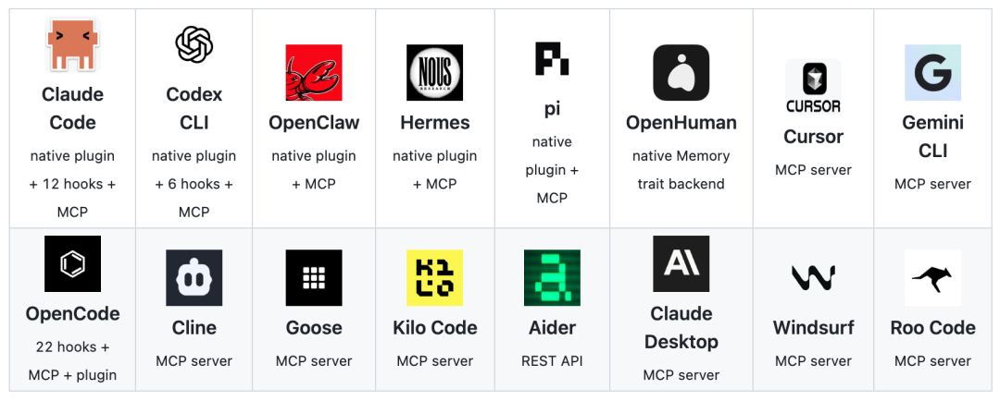
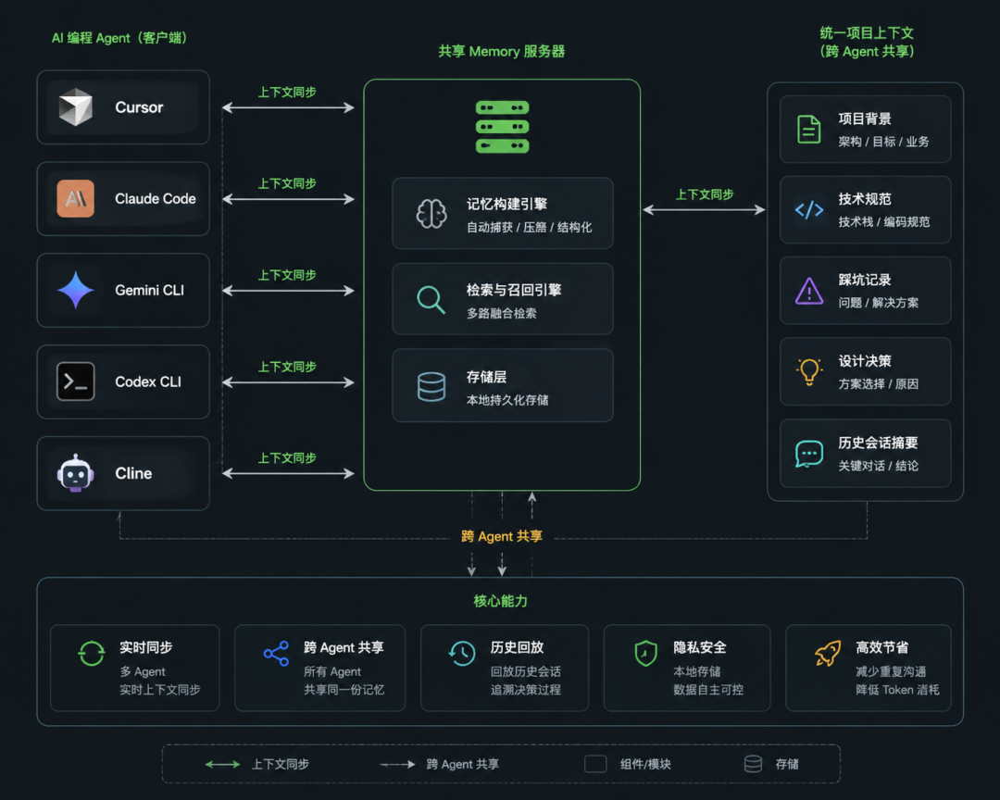
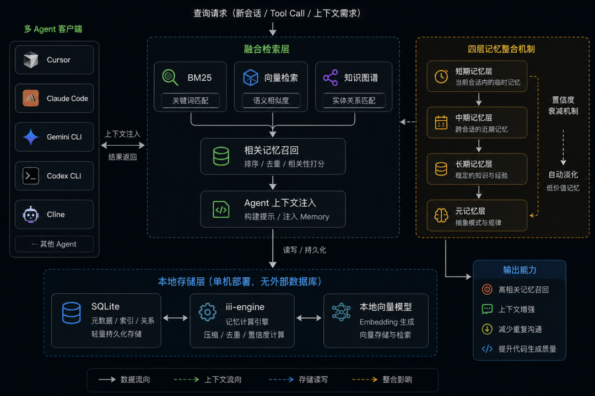
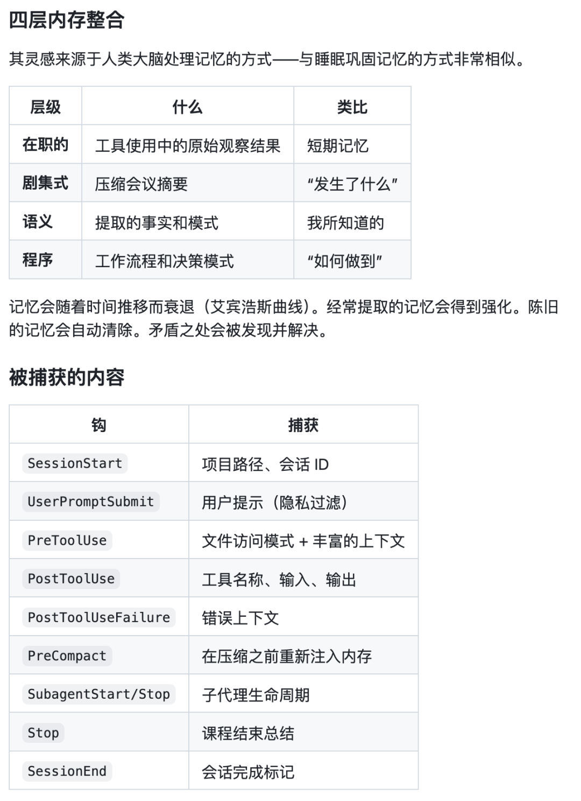

<style>
/* ===== junge-site 通用文章样式 ===== */
.td-content {
    max-width: 900px;
    margin: 0 auto;
}

/* ---- 卡片组件 ---- */

/* 引言卡片：紫蓝渐变 + 白色文字 + 阴影 */
.lead-quote {
    background: linear-gradient(135deg, #667eea 0%, #764ba2 100%);
    color: white;
    padding: 2.5rem 2rem;
    border-radius: 12px;
    margin: 2rem 0 3rem 0;
    font-size: 1.25rem;
    font-weight: 600;
    line-height: 1.6;
    box-shadow: 0 10px 30px rgba(102, 126, 234, 0.3);
    position: relative;
    overflow: hidden;
}
.lead-quote::before {
    content: '"';
    position: absolute;
    top: -20px;
    left: 10px;
    font-size: 120px;
    opacity: 0.1;
    font-family: Georgia, serif;
}

/* 信息框：浅色背景 + 左侧蓝色边框 */
.info-box {
    background: #f8f9fa;
    padding: 1.5rem;
    border-left: 4px solid #667eea;
    border-radius: 8px;
    margin: 2rem 0;
}

/* 重点提示框：暖色背景 + 橙色边框 */
.highlight-box {
    background: linear-gradient(135deg, #fff5f5 0%, #fffaf0 100%);
    border: 2px solid #ed8936;
    border-radius: 12px;
    padding: 1.5rem;
    margin: 2rem 0;
    box-shadow: 0 4px 12px rgba(237, 137, 54, 0.1);
}

/* 数据卡片：深色背景 + 大号数字 */
.stats-box {
    background: linear-gradient(135deg, #1a202c 0%, #2d3748 100%);
    color: white;
    padding: 2rem;
    border-radius: 12px;
    margin: 2rem 0;
    text-align: center;
}
.stats-box .number {
    font-size: 2.5rem;
    font-weight: 800;
    color: #667eea;
    display: block;
}

/* ---- 序号列表：带彩色编号圆徽章 ---- */
.numbered-list {
    list-style: none;
    padding: 0;
    margin: 1.5rem 0;
}
.numbered-list li {
    padding: 0.75rem 0 0.75rem 2.5rem;
    position: relative;
    line-height: 1.6;
    border-bottom: 1px solid #f0f0f0;
}
.numbered-list li:last-child {
    border-bottom: none;
}
.numbered-list .num {
    position: absolute;
    left: 0;
    top: 0.75rem;
    width: 28px;
    height: 28px;
    background: linear-gradient(135deg, #667eea, #764ba2);
    color: white;
    border-radius: 50%;
    display: flex;
    align-items: center;
    justify-content: center;
    font-size: 0.85rem;
    font-weight: 700;
    flex-shrink: 0;
}

/* ---- 引用卡片（正文内嵌引用） ---- */
.inline-quote {
    background: #f0f4ff;
    padding: 1.5rem 2rem;
    margin: 2rem 0;
    border-radius: 12px;
    position: relative;
    font-style: italic;
    color: #4a5568;
}
.inline-quote::before {
    content: '"';
    position: absolute;
    top: 5px;
    left: 12px;
    font-size: 48px;
    color: #667eea;
    opacity: 0.2;
    font-family: Georgia, serif;
}
.inline-quote .author {
    display: block;
    margin-top: 0.5rem;
    font-style: normal;
    font-weight: 600;
    color: #667eea;
    font-size: 0.9rem;
}

/* ---- 视觉分隔器 ---- */
.section-divider {
    display: flex;
    align-items: center;
    margin: 3rem 0;
    gap: 12px;
}
.section-divider .line {
    flex: 1;
    height: 1px;
    background: linear-gradient(90deg, transparent, #667eea, transparent);
}
.section-divider .dot {
    width: 6px;
    height: 6px;
    background: #667eea;
    border-radius: 50%;
    opacity: 0.5;
}

/* ---- 结尾典藏框 ---- */
.outro-box {
    background: linear-gradient(135deg, #1a202c 0%, #2d3748 100%);
    color: white;
    padding: 2.5rem;
    border-radius: 16px;
    margin: 3rem 0;
    text-align: center;
    box-shadow: 0 10px 30px rgba(0, 0, 0, 0.2);
}
.outro-box strong {
    color: #667eea !important;
}

/* ---- 标题样式 ---- */
.td-content h2 {
    font-size: 1.8rem;
    font-weight: 700;
    color: #1a202c;
    margin-top: 3.5rem;
    margin-bottom: 1.5rem;
    padding-bottom: 0.8rem;
    border-bottom: 3px solid #667eea;
    position: relative;
}
.td-content h2::before {
    content: '';
    position: absolute;
    left: 0;
    bottom: -3px;
    width: 60px;
    height: 3px;
    background: linear-gradient(90deg, #667eea, #764ba2);
}

/* ---- 加粗文字主题色 ---- */
.td-content strong {
    color: #667eea;
    font-weight: 600;
}

/* ---- 段落样式 ---- */
.td-content p {
    margin-bottom: 1.5rem;
}

/* ---- 图片样式 ---- */
.td-content img {
    border-radius: 12px;
    box-shadow: 0 8px 24px rgba(0, 0, 0, 0.12);
    margin: 2.5rem 0;
    width: 100%;
    transition: transform 0.3s ease;
}
.td-content img:hover {
    transform: translateY(-4px);
    box-shadow: 0 12px 32px rgba(0, 0, 0, 0.18);
}

/* ---- 代码块 ---- */
.td-content pre {
    border-radius: 12px;
    box-shadow: 0 4px 16px rgba(0, 0, 0, 0.1);
    margin: 2rem 0;
}

/* ---- 表格 ---- */
.td-content table {
    border-collapse: collapse;
    width: 100%;
    margin: 2rem 0;
    border-radius: 12px;
    overflow: hidden;
    box-shadow: 0 4px 12px rgba(0, 0, 0, 0.08);
}
.td-content table th {
    background: linear-gradient(135deg, #667eea, #764ba2);
    color: white;
    padding: 12px 16px;
    font-weight: 600;
}
.td-content table td {
    padding: 10px 16px;
    border-bottom: 1px solid #f0f0f0;
}
.td-content table tr:last-child td {
    border-bottom: none;
}

/* ---- 响应式 ---- */
@media (max-width: 768px) {
    .lead-quote {
        padding: 1.5rem 1rem;
        font-size: 1.1rem;
    }
    .stats-box .number {
        font-size: 2rem;
    }
    .numbered-list li {
        padding-left: 2rem;
    }
}
</style>

**每天都跟 Claude Code、Cursor 这些 AI 编程 Agent 打交道的人，大概率都遇到过同一个问题：每次开新会话，都得把项目背景重新交代一遍。** 架构选型、目录结构、代码风格、踩过的坑——AI 什么都会，就是不会"记住"你。

最近 GitHub 上冒出一个叫 **agentmemory** 的开源项目，1.4 万+ Star，口号很直白：给你的 AI 编程 Agent 装上持久化大脑。它在 ICLR 2025 的 LongMemEval 基准测试中，R@5 命中率达到 **95.2%**，远超同类工具。

<div class="lead-quote">
一个共享内存服务器，让 Cursor、Claude Code、Codex CLI、Gemini CLI、Cline 等所有 AI 编程 Agent 共享同一份"记忆"——你在 Claude Code 里定下的技术规范，Cursor 那边直接就能知道。
</div>



<div class="section-divider">
  <span class="dot"></span>
  <span class="line"></span>
  <span class="dot"></span>
  <span class="line"></span>
  <span class="dot"></span>
</div>

## 一、AI 编程的"失忆症"问题

用过 Claude Code 或 Cursor 的人都知道，每次开始新会话，Agent 对你的项目一无所知。常见的"上下文传递"方案有几种，但各有局限：

<ul class="numbered-list">
  <li><span class="num">1</span><strong>CLAUDE.md / .cursorrules</strong> — 手动维护项目说明文件，但最多 200 行，容易过时，且每个 Agent 各写各的</li>
  <li><span class="num">2</span><strong>手动粘贴上下文</strong> — 每次把架构文档、技术选型复制到对话中，token 消耗巨大，年成本可达 $500+</li>
  <li><span class="num">3</span><strong>LLM 压缩摘要</strong> — 让模型自己总结上下文，仍然需要手动触发，且压缩质量不稳定</li>
  <li><span class="num">4</span><strong>全量加载到提示词</strong> — 超过上下文窗口直接崩溃，不现实</li>
</ul>

这些方案的本质问题是一样的：**上下文传递依赖人工，而 AI 的"失忆"是每会话一清零的硬伤。**

<div class="info-box">
<strong>agentmemory 的核心思路：</strong>自动捕获每次会话中 Agent 的所作所为，压缩为可检索的记忆片段，下次开新会话时自动注入最相关的上下文——全程零手动操作。
</div>

## 二、三路融合检索：不止是关键词匹配

agentmemory 的检索系统不是简单的关键词匹配，而是走了一套成熟的混合检索方案：



- **BM25** — 传统关键词检索，速度快，适合精确匹配
- **向量检索** — 基于 all-MiniLM-L6-v2 本地嵌入模型，语义理解，无需 API Key
- **知识图谱** — 实体关系建模，理解代码之间的关联

三路结果通过 **RRF（Reciprocal Rank Fusion）** 排序融合，最终的检索质量远超单一方案。

<div class="stats-box">
  <span class="number">95.2%</span>
  R@5 命中率（LongMemEval-S，ICLR 2025）
</div>

对比数据来自 GitHub 官方 benchmark：

| 系统 | R@5 | R@10 | 备注 |
|------|-----|------|------|
| **agentmemory** | **95.2%** | **98.6%** | BM25 + 向量 + 知识图谱三路融合 |
| BM25-only (fallback) | 86.2% | 94.6% | 仅关键词匹配 |
| mem0 (53K ⭐) | 68.5% | - | 被动记忆提取，需手动调用 |
| Letta / MemGPT (22K ⭐) | 83.2% | - | 需要 Postgres + 向量数据库 |



差距很明显。agentmemory 的优势不仅体现在准确率上，还在于它完全不需要外部基础设施。

## 三、架构设计：极简部署，零外部依赖

agentmemory 的底层架构非常克制，也是它能做到"一条命令启动"的关键原因。

```
npm install -g @agentmemory/agentmemory   # 全局安装
agentmemory                                # 启动记忆服务器，默认 :3111
agentmemory connect claude-code            # 接入 Claude Code
agentmemory connect cursor                 # 接入 Cursor
```

<div class="highlight-box">
<strong>⚠️ 技术亮点：</strong>底层依赖仅为 <strong>SQLite + iii-engine + 本地向量模型</strong>（all-MiniLM-L6-v2），不需要 Qdrant、pgvector、Pinecone 等任何外部数据库。一台机器，装个 Node.js 就能跑。
</div>



**四层记忆整合机制** 是它区别于其他工具的关键设计：

<ul class="numbered-list">
  <li><span class="num">1</span><strong>短期记忆</strong> — 当前会话的实时交互记录</li>
  <li><span class="num">2</span><strong>工作记忆</strong> — 跨会话保留的重要上下文</li>
  <li><span class="num">3</span><strong>长期记忆</strong> — 项目层面的技术规范、架构决策</li>
  <li><span class="num">4</span><strong>全局记忆</strong> — 跨项目的通用模式与偏好</li>
</ul>

每层记忆带**置信度衰减**机制——久了没用的记忆会逐渐淡化，不会越堆越乱。这个设计很像人类的记忆模式：常被回忆的内容永远新鲜，早已遗忘的事情自然淡出。

## 四、实时可视化与回放

启动 agentmemory 之后，打开浏览器访问 **http://localhost:3113**，能看到实时记忆构建的仪表盘：


最有意思的功能是 **会话回放（Replay）**——每一次 Agent 交互都被记录下来，可以通过时间轴逐帧回放：提示词、工具调用、执行结果、模型回复，全部可查。支持 0.5×~4× 变速播放，排查问题极为方便。

如果你之前有过 Claude Code 的 JSONL 转录文件，也可以直接导入：

```bash
# 导入所有 ~/.claude/projects 下的历史会话
npx @agentmemory/agentmemory import-jsonl

# 导入单个文件
npx @agentmemory/agentmemory import-jsonl ~/.claude/projects/my-project/abc123.jsonl
```

## 五、Agent 生态覆盖

agentmemory 支持的 Agent 类型覆盖了当前主流的 AI 编程工具生态：

| Agent | 接入方式 | 说明 |
|-------|---------|------|
| **Claude Code** | 原生插件 + 12 个 Hook + MCP | 支持最完善 |
| **Codex CLI** | 原生插件 + 6 个 Hook + MCP | OpenAI 官方 |
| **Cursor** | MCP 服务器 | 主流 IDE 集成 |
| **Gemini CLI** | MCP 服务器 | Google 出品 |
| **Cline** | MCP 服务器 | VS Code 插件 |
| **OpenClaw** | 原生插件 + MCP | 支持完整 |
| **Aider** | REST API | 终端工具 |
| **Windsurf** | MCP 服务器 | 新一代 IDE |

所有 Agent 共享同一个记忆服务器，**上下文完全打通**。

## 六、成本与效率

这是最让人意外的地方——agentmemory 的 token 开销极低。

| 方式 | 年 Token 量 | 年成本 |
|------|-----------|-------|
| 每次手动粘贴全量上下文 | 1950 万+ | 超出上下文窗口 |
| LLM 自动摘要 | ~65 万 | ~$500 |
| **agentmemory（默认）** | **~17 万** | **~$10** |
| **agentmemory + 本地向量** | **~17 万** | **$0** |

<div class="info-box">
<strong>关键差异：</strong>agentmemory 不是把整段记忆塞进提示词，而是检索后只注入最相关的片段（约 1,900 token/会话）。本地向量模型 all-MiniLM-L6-v2 完全免费，连 API Key 都不需要。
</div>

## 七、快速上手

```bash
# 安装
npm install -g @agentmemory/agentmemory

# 启动记忆服务器
agentmemory

# 接入 Agent
agentmemory connect claude-code
agentmemory connect cursor

# 启动演示（3 条会话 + 召回验证）
agentmemory demo

# 打开仪表盘
# → http://localhost:3113
```

安装完成后，`agentmemory demo` 会注入 3 个真实的会话样本（JWT 认证配置、N+1 SQL 优化、限流策略实现），然后你可以用语义搜索来验证召回效果——比如搜"数据库性能优化"，它会把 N+1 查询修复的上下文找出来，纯关键词匹配做不到这一点。

<div class="section-divider">
  <span class="dot"></span>
  <span class="line"></span>
  <span class="dot"></span>
  <span class="line"></span>
  <span class="dot"></span>
</div>

## 写在最后

对于每天跟 AI 结对编程的人来说，agentmemory 解决了一个长期被忽视的基础设施问题——**Agent 的上下文持久化**。它不需要你改变工作流程，不需要引入外部数据库，一条命令装好就能用。

当你经历这样一个时刻：新开一个会话，Agent 自动知道你的项目用 jose 而不是 jsonwebtoken、知道你的测试覆盖了哪些边界情况、知道上周刚修复的那个 bug 的根因——你就再也回不去了。

<div class="outro-box">
<strong>项目地址：</strong><br>
GitHub：<a href="https://github.com/rohitg00/agentmemory" style="color: #667eea;">github.com/rohitg00/agentmemory</a><br>
官网：<a href="https://agent-memory.dev" style="color: #667eea;">agent-memory.dev</a><br>
npm：<a href="https://www.npmjs.com/package/@agentmemory/agentmemory" style="color: #667eea;">@agentmemory/agentmemory</a><br><br>
<strong>装上试试，让 Agent 有记忆是什么体验，用了就回不去了。</strong>
</div>
