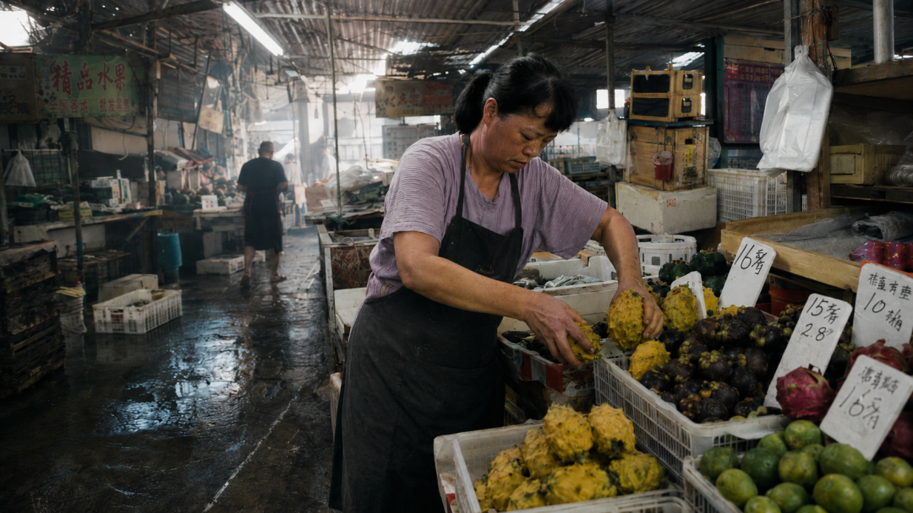
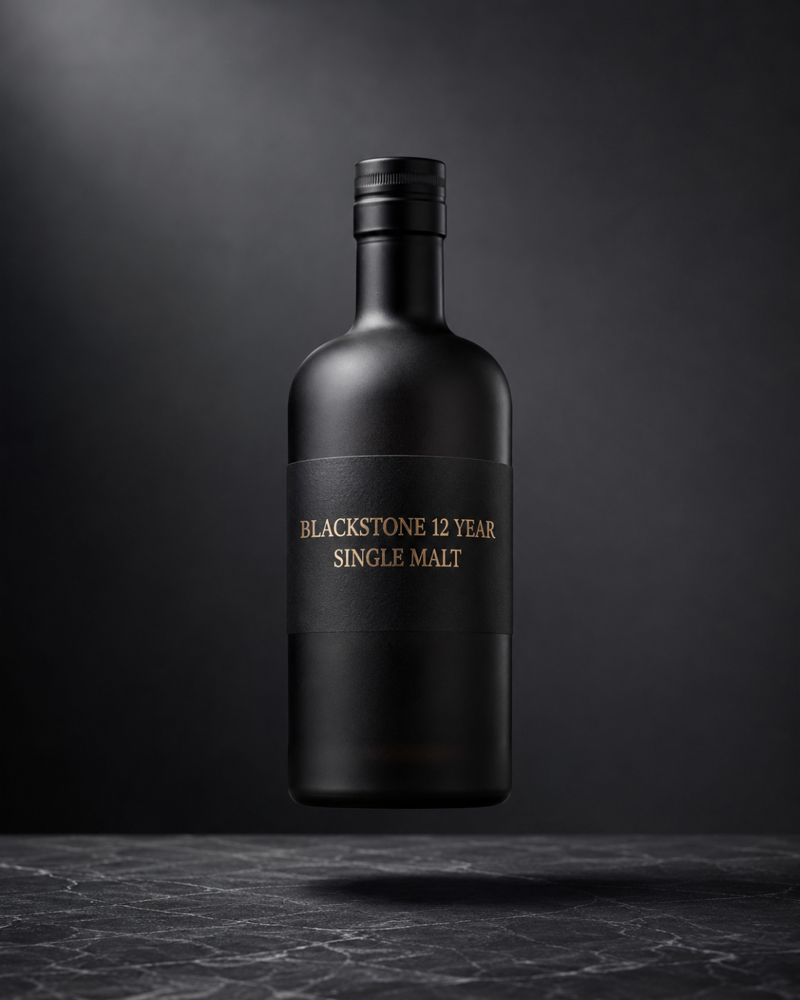
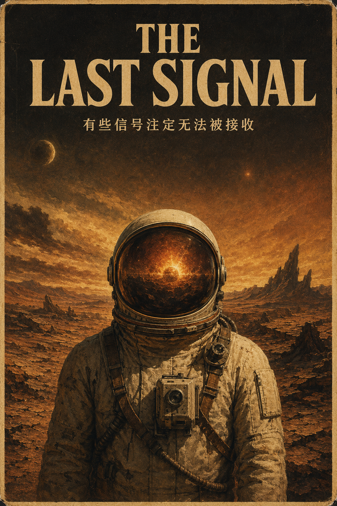
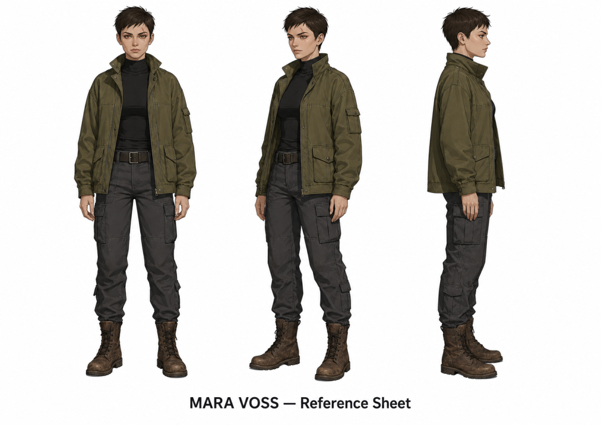

<style>
/* ===== junge-site 通用文章样式 ===== */
.td-content {
    max-width: 900px;
    margin: 0 auto;
}

/* ---- 卡片组件 ---- */
.lead-quote {
    background: linear-gradient(135deg, #667eea 0%, #764ba2 100%);
    color: white;
    padding: 2.5rem 2rem;
    border-radius: 12px;
    margin: 2rem 0 3rem 0;
    font-size: 1.25rem;
    font-weight: 600;
    line-height: 1.6;
    box-shadow: 0 10px 30px rgba(102, 126, 234, 0.3);
    position: relative;
    overflow: hidden;
}
.lead-quote::before {
    content: '"';
    position: absolute;
    top: -20px;
    left: 10px;
    font-size: 120px;
    opacity: 0.1;
    font-family: Georgia, serif;
}

.info-box {
    background: #f8f9fa;
    padding: 1.5rem;
    border-left: 4px solid #667eea;
    border-radius: 8px;
    margin: 2rem 0;
}

.highlight-box {
    background: linear-gradient(135deg, #fff5f5 0%, #fffaf0 100%);
    border: 2px solid #ed8936;
    border-radius: 12px;
    padding: 1.5rem;
    margin: 2rem 0;
    box-shadow: 0 4px 12px rgba(237, 137, 54, 0.1);
}

.stats-box {
    background: linear-gradient(135deg, #1a202c 0%, #2d3748 100%);
    color: white;
    padding: 2rem;
    border-radius: 12px;
    margin: 2rem 0;
    text-align: center;
}
.stats-box .number {
    font-size: 2.5rem;
    font-weight: 800;
    color: #667eea;
    display: block;
}

.numbered-list {
    list-style: none;
    padding: 0;
    margin: 1.5rem 0;
}
.numbered-list li {
    padding: 0.75rem 0 0.75rem 2.5rem;
    position: relative;
    line-height: 1.6;
    border-bottom: 1px solid #f0f0f0;
}
.numbered-list li:last-child {
    border-bottom: none;
}
.numbered-list .num {
    position: absolute;
    left: 0;
    top: 0.75rem;
    width: 28px;
    height: 28px;
    background: linear-gradient(135deg, #667eea, #764ba2);
    color: white;
    border-radius: 50%;
    display: flex;
    align-items: center;
    justify-content: center;
    font-size: 0.85rem;
    font-weight: 700;
    flex-shrink: 0;
}

.inline-quote {
    background: #f0f4ff;
    padding: 1.5rem 2rem;
    margin: 2rem 0;
    border-radius: 12px;
    position: relative;
    font-style: italic;
    color: #4a5568;
}
.inline-quote::before {
    content: '"';
    position: absolute;
    top: 5px;
    left: 12px;
    font-size: 48px;
    color: #667eea;
    opacity: 0.2;
    font-family: Georgia, serif;
}
.inline-quote .author {
    display: block;
    margin-top: 0.5rem;
    font-style: normal;
    font-weight: 600;
    color: #667eea;
    font-size: 0.9rem;
}

.section-divider {
    display: flex;
    align-items: center;
    margin: 3rem 0;
    gap: 12px;
}
.section-divider .line {
    flex: 1;
    height: 1px;
    background: linear-gradient(90deg, transparent, #667eea, transparent);
}
.section-divider .dot {
    width: 6px;
    height: 6px;
    background: #667eea;
    border-radius: 50%;
    opacity: 0.5;
}

.outro-box {
    background: linear-gradient(135deg, #1a202c 0%, #2d3748 100%);
    color: white;
    padding: 2.5rem;
    border-radius: 16px;
    margin: 3rem 0;
    text-align: center;
    box-shadow: 0 10px 30px rgba(0, 0, 0, 0.2);
}
.outro-box strong {
    color: #667eea !important;
}

.td-content h2 {
    font-size: 1.8rem;
    font-weight: 700;
    color: #1a202c;
    margin-top: 3.5rem;
    margin-bottom: 1.5rem;
    padding-bottom: 0.8rem;
    border-bottom: 3px solid #667eea;
    position: relative;
}
.td-content h2::before {
    content: '';
    position: absolute;
    left: 0;
    bottom: -3px;
    width: 60px;
    height: 3px;
    background: linear-gradient(90deg, #667eea, #764ba2);
}

.td-content strong {
    color: #667eea;
    font-weight: 600;
}

.td-content p {
    margin-bottom: 1.5rem;
}

.td-content img {
    border-radius: 12px;
    box-shadow: 0 8px 24px rgba(0, 0, 0, 0.12);
    margin: 2.5rem 0;
    width: 100%;
    transition: transform 0.3s ease;
}
.td-content img:hover {
    transform: translateY(-4px);
    box-shadow: 0 12px 32px rgba(0, 0, 0, 0.18);
}

.td-content pre {
    border-radius: 12px;
    box-shadow: 0 4px 16px rgba(0, 0, 0, 0.1);
    margin: 2rem 0;
}

.td-content table {
    border-collapse: collapse;
    width: 100%;
    margin: 2rem 0;
    border-radius: 12px;
    overflow: hidden;
    box-shadow: 0 4px 12px rgba(0, 0, 0, 0.08);
}
.td-content table th {
    background: linear-gradient(135deg, #667eea, #764ba2);
    color: white;
    padding: 12px 16px;
    font-weight: 600;
}
.td-content table td {
    padding: 10px 16px;
    border-bottom: 1px solid #f0f0f0;
}
.td-content table tr:last-child td {
    border-bottom: none;
}

/* ---- 模板卡片样式 ---- */
.template-card {
    background: #f8fafc;
    border: 1px solid #e2e8f0;
    border-radius: 12px;
    padding: 1.5rem;
    margin: 2rem 0;
    position: relative;
}
.template-card .template-label {
    display: inline-block;
    background: linear-gradient(135deg, #667eea, #764ba2);
    color: white;
    padding: 0.2rem 0.6rem;
    border-radius: 4px;
    font-size: 0.75rem;
    font-weight: 600;
    margin-bottom: 0.75rem;
}
.template-card pre {
    margin: 0.5rem 0 0 0;
    background: #1e293b;
    color: #e2e8f0;
    padding: 1rem;
    border-radius: 8px;
    font-size: 0.85rem;
    overflow-x: auto;
}

.template-card .template-tip {
    margin-top: 0.75rem;
    padding-top: 0.75rem;
    border-top: 1px solid #e2e8f0;
    font-size: 0.85rem;
    color: #64748b;
}
</style>

**GPT Image 2 用的是另一种语言——不是关键词标签，是设计师和艺术总监互相交代任务时的"创意简报"语言。一旦理解这个转变，出图就不再靠抽卡碰运气。**

<div class="lead-quote">
很多人以为 AI 出图靠的是"词汇量"——提示词越多、越华丽，出来的图越好。于是拼命往里堆：电影感光影、超写实、8K、大师级构图……出来的还是那张塑料感的废图。问题不在词汇量，在于 GPT Image 2 听的根本不是这套语言。
</div>

<div class="info-box">
<strong>一句话的转变：</strong>从"关键词"转向"指令集"。Midjourney 理解 "cinematic lighting, octane render, --ar 16:9"；GPT Image 2 理解 "左上方射入温暖的定向光，脸部右侧留有柔和阴影，色温呈现黄金时刻的质感"。
</div>

如果你是 API 调用用户，之前的文章《[1.8k Star 的 GPT Image 2 提示词仓库，7 个能直接抄的 prompt](/zh/blog/2026/05/13/gpt-image-2-prompt-repo/)》介绍了社区提示词仓库；本文则从底层原理出发，给出更完整的模板体系和工程化方法。

<div class="section-divider">
  <span class="dot"></span>
  <span class="line"></span>
  <span class="dot"></span>
  <span class="line"></span>
  <span class="dot"></span>
</div>

## 一、万能公式：六要素

无论做什么类型的图，所有高水准的提示词都遵循同一套骨架：

| 要素 | 描述 | 示例 |
|------|------|------|
| **载体 (Artifact)** | 先给作品定性——是海报、产品实拍还是角色设定图 | "一张电影海报"、"影棚产品摄影" |
| **主体 (Subject)** | 画面里是谁或什么 | "一位 28 岁的女性爵士乐手" |
| **场景 (Scene)** | 时间、地点、正在发生什么 | "黄昏时分的纽约屋顶，吹奏萨克斯管" |
| **细节 (Detail)** | 纹理、材质、氛围、具体道具 | "磨损的帆布围裙，双手布满老茧" |
| **约束 (Constraint)** | 取景方式、构图要求、排除的元素 | "35mm 镜头，禁止平光，禁止卡通感" |
| **风格 (Style)** | 胶片型号、插画风格、时代感参考 | "Kodak Vision3 500T，浅景深" |

<div class="highlight-box">
<strong>最重要的规则：</strong>开头先定载体——"一张院线海报"和"一张照片"决定了模型对构图和取景的底层理解。这一条比其他任何指令都管用。
</div>

## 二、文字精准渲染的解法

GPT Image 2 是目前少数能精准渲染画面文字的图像模型。触发方式：

<ul class="numbered-list">
<li><span class="num">1</span>文案放在<strong>双引号或全大写</strong>中</li>
<li><span class="num">2</span>不常见的品牌名<strong>逐字母拼写</strong></li>
<li><span class="num">3</span>提示词末尾加上 <code>verbatim — no extra characters</code>（原样输出，不得有额外字符）</li>
</ul>

这三步组合，能解决 80% 的文字乱码问题。

<div class="section-divider">
  <span class="dot"></span>
  <span class="line"></span>
  <span class="dot"></span>
  <span class="line"></span>
  <span class="dot"></span>
</div>

## 三、12 套模板，覆盖主流场景

### 01 纪实摄影：消除 AI 感的终极解法

过度磨皮、光影过亮——AI 生成的照片为什么一眼看穿？因为缺少人性化细节。秘诀是加入一个具体的物理细节，让画面感觉是"被观察到的"而非生成的。

<div class="template-card">
<span class="template-label">模板</span>
<pre>一张彩色纪实摄影照片，描绘了【主体】在【具体地点和时间】正在【具体动作】。
【氛围细节：天气、水汽、灰尘或光影质感】。背景：【表面材质与纹理】。
细节：【一个人性化特征——磨损的靴子/手上的面粉/寒冷空气中呼出的白气】。
使用 35mm 镜头拍摄。仅限自然光。带有轻微胶片颗粒感。无后期加工痕迹。</pre>
<div class="template-tip">
💡 那个"人性化细节"是区分纪录片与商业素材的分水岭——磨损的靴子、沾满面粉的手、指甲缝里的油渍，正是这些让画面显得真实可信。
</div>
</div>



### 02 电影感人像：让图有"贵感"

适用于英雄特写、社论人像、活动大片，或任何需要"昂贵感"的场景。

<div class="template-card">
<span class="template-label">模板</span>
<pre>一张电影感高分辨率【人像/动作捕捉】，【主体】在【地点】【做动作】。
【灯光描述：色温、方向、质感】。焦点锐利，对准【脸部/核心元素】。
【胶片/风格参考】。反向约束：禁止卡通感，禁止平光，禁止廉价素材图既视感。</pre>
<div class="template-tip">
💡 结尾的"反向约束"至关重要。没有它，模型往往会滑向平庸的商业审美。写实类提示词必加。
</div>
</div>


### 03 产品英雄位实拍：电商广告直出

适用于电商、方案演示、通讯稿或广告。GPT Image 2 在能准确描述表面材质和灯光的情况下，不同轮次的生成高度一致。

<div class="template-card">
<span class="template-label">模板</span>
<pre>影棚产品摄影，【产品】悬浮在【表面】之上。影棚灯光：左上方柔和主光，右侧微妙补光，
干净的投影。背景：【白色/渐变/质感材质】。产品整体焦点清晰。
标签文字："【标签内容】" verbatim — no extra characters。商业摄影，专业精修。</pre>
<div class="template-tip">
💡 如果产品上有文字，每次迭代（哪怕只是改背景）都要重新声明一次 Label reads: "[精确文字]" verbatim。不做这种"锚定"，模型在后续编辑中很容易把文字改掉。
</div>
</div>



### 04 品牌视觉规范页

GPT Image 2 可以在单页内呈现一整套设计规范。只要结构描述清晰，它完全可以胜任。

<div class="template-card">
<span class="template-label">模板</span>
<pre>一份为【品牌名】设计的专业单页品牌视觉规范文档。顶部：主 Logo，带有清晰的留白区域。
中间：色板——【Hex 1】,【Hex 2】,【Hex 3】，下方标注 Hex 标签。
下方：字体示例，【标题字体】和【正文字体】。
底部：正确/错误的使用示例。品牌口号："【口号】" verbatim。
纯白背景。企业级设计审美。所有文字原样输出（verbatim）。</pre>
<div class="template-tip">
💡 颜色请用十六进制色值。深海军蓝可能有歧义，但 #1B2A4A 永远精准。
</div>
</div>

### 05 社交媒体广告：平台直出

适配 1:1、9:16、1.91:1 等各种比例。

<div class="template-card">
<span class="template-label">模板</span>
<pre>一份【1:1/9:16】的社交媒体广告，为【品牌/产品】设计。视觉部分：【英雄位图像描述】。
文字层级叠加：标题"【内容】"（大号粗体，颜色）；副标题"【内容】"（中等粗细）；
行动按钮"【文字】"（颜色，胶囊形）。品牌色：【Hex 1】,【Hex 2】。
氛围：【充满活力/简约/奢华/俏皮】。无素材图感。所有文字 verbatim。</pre>
<div class="template-tip">
💡 氛围用一个词描述即可。"minimal"效果好；"clean, minimal, sophisticated, understated"模型会混淆，出平庸结果。
</div>
</div>


### 06 电影/活动海报：戏剧感拉满

适用于产品发布、活动宣传、任何能从戏剧化框架中获益的场景。

<div class="template-card">
<span class="template-label">模板</span>
<pre>一张【时代感】风格的院线海报，片名为"【片名】"。【插画风格】。【调色板】。
【主体】位于前景，【背景细节】。标题："【片名】"——【字体描述】、【颜色】、【位置】。
口号："【内容】" verbatim。带有【纹理/做旧效果】。</pre>
<div class="template-tip">
💡 时代感设定了整个视觉语调。"1974 年意大利铅黄电影海报"给出的视觉信息远比"复古海报"丰富得多。
</div>
</div>



### 07 漫画/分镜页面

GPT Image 2 支持非拉丁文字精准渲染——可以制作带有准确日语、韩语、孟加拉语的真实漫画。

<div class="template-card">
<span class="template-label">模板要素</span>
<pre>- 【N】个分镜的单页漫画
- 布局：【网格描述，如 2x2】
- 每个分镜单独描述场景/动作/角度
- 艺术风格：【少年漫/青年漫/Webtoon/法式连环画】
- 对话框内容：分镜 N 气泡："【对话】" verbatim</pre>
<div class="template-tip">
💡 显式描述每个分镜的镜头角度——极端特写、全景、过肩镜头。不明确角度的话，每个分镜默认都会呈现相同的中景，页面失去节奏感。
</div>
</div>

### 08 分屏时光旅行：前后对比叙事

适用于历史对比内容、前后效果展示或跨时代叙事。

<div class="template-card">
<span class="template-label">模板</span>
<pre>一张由干净垂直线平分的分屏照片。左侧：【地点】在【年份】——【历史细节】。
右侧：同一视角的【年份】现状——【现代细节】。
双侧保持一致的透视和焦距。纪实摄影风格。</pre>
<div class="template-tip">
💡 "双侧保持一致的透视和焦距"是让这套提示词奏效的关键。没有它，两边看起来像是两次不同的拍摄。
</div>
</div>

### 09 360 度全景图

大多数人不知道这在 GPT Image 2 中是可能的。技巧是：必须填满所有六个方向的元素描述。

<div class="template-card">
<span class="template-label">模板</span>
<pre>一张关于【环境】的 360 度等距柱状全景图。
前方：【内容】；后方：【内容】；左右侧：【侧面元素】；
上方：【天空/天花板】；下方：【地面】。
【灯光与氛围】。高动态范围，全局锐利，无明显接缝。</pre>
<div class="template-tip">
💡 务必覆盖所有六个方向。漏掉一个，全景图的那一部分就会变成视觉噪点。
</div>
</div>

### 10 信息图表

文字密集的图像通常是图像模型的软肋。GPT Image 2 能处理，但前提是给出明确的结构。

<div class="template-card">
<span class="template-label">模板</span>
<pre>一张关于【话题】的干净单页信息图，标题为"【标题】"，包含【N】个板块。
【布局方式：垂直堆叠/两栏网格/环形流】。
颜色：【主色 Hex】装饰，纯白背景，【字色 Hex】文字。
所有文字原样输出：第一部分 "标题"——"正文"……verbatim。</pre>
<div class="template-tip">
💡 板块数量控制在 4-5 个。板块越多，文字越小，渲染出错概率越大。超过 6 个板块请分两次生成。
</div>
</div>

### 11 UI/App 原型图

适用于创始人、产品团队或任何需要可视化界面的场景。

<div class="template-card">
<span class="template-label">模板</span>
<pre>一张【App 类型】的高保真 UI 原型图——【屏幕名称】界面。设备：【具体机型】。
屏幕内容：顶部标题"【标题】" verbatim；
【描述卡片、按钮、导航等各 UI 元素】；主按钮"【文字】" verbatim。
色板：【主色 Hex】为主，纯白背景，【强调色 Hex】用于交互元素。
字体：干净无衬线。扁平化设计，像素级精确间距。</pre>
<div class="template-tip">
💡 按屏幕显示的顺序从上到下描述 UI 元素。模型从上到下渲染，乱序描述会导致布局偏移。
</div>
</div>

### 12 角色设定参考图

长线项目角色一致性的核武器——先生成设定图，后续每条提示词开头写上"使用角色参考图，严格保留所有特征"。

<div class="template-card">
<span class="template-label">模板</span>
<pre>为【角色名】设计的专业角色设计参考图。三视图并排：正面（左）、3/4 侧面（中）、正侧面（右）。
同一角色，同一套服装，比例完全一致。角色：【年龄、体态、特征】。
服装：【具体材质与颜色】。纯白背景。平整灯光。动画设定集审美。
标签文字："【角色名】— Reference Sheet" verbatim。</pre>
<div class="template-tip">
💡 拿到设定图后，后续每条提示词开头都写上"使用角色参考图，严格保留所有特征"。不加这句，角色一致性会迅速崩塌。
</div>
</div>



<div class="section-divider">
  <span class="dot"></span>
  <span class="line"></span>
  <span class="dot"></span>
  <span class="line"></span>
  <span class="dot"></span>
</div>

## 四、API 用户福利：JSON 格式

在生产流程中批量调用时，JSON 格式能提供更精准的控制：

```json
{
  "meta": {
    "image_quality": "Very High",
    "style": "photorealistic",
    "aspect_ratio": "16:9"
  },
  "scene": {
    "location": "凌晨五点上海市场",
    "time_of_day": "金黄时刻",
    "weather": "薄雾"
  },
  "subject": {
    "description": "整理水果的商贩",
    "position": "中左侧",
    "action": "弯腰整理木箱"
  },
  "lighting": "来自右侧的温暖定向光，柔和阴影",
  "constraints": "无文字，无水印，极高细节"
}
```

<div class="section-divider">
  <span class="dot"></span>
  <span class="line"></span>
  <span class="dot"></span>
  <span class="line"></span>
  <span class="dot"></span>
</div>

## 五、5 条通用金律

<ul class="numbered-list">
<li><span class="num">1</span><strong>载体先行</strong>——开头第一句就定调。"院线海报"还是"一张照片"直接决定模型的底层构图理解。</li>
<li><span class="num">2</span><strong>用事实说话，别谈感觉</strong>——"凌晨 5 点，浓雾笼罩鹅卵石街道"不需要模型猜。"忧郁、有氛围"才需要猜。</li>
<li><span class="num">3</span><strong>单点迭代</strong>——出图之后一次只改一个变量。先声明你要保留什么，再说改哪一点。贪心一次改三处，会丢掉前面已生效的部分。</li>
<li><span class="num">4</span><strong>明确取景角度</strong>——特写、中景、远景、俯拍、荷兰式斜角——你不说，模型默认居中中景。</li>
<li><span class="num">5</span><strong>文字必带"原样输出"</strong>——只要画面里有字，结尾务必加 <code>verbatim — no extra characters</code>。</li>
</ul>

<div class="outro-box">
<strong>GPT Image 2 提示词的核心转变只有一句话：</strong><br><br>
从"关键词"转向"指令集"。<br>
从告诉它"要什么风格"到告诉它"画面里有什么"、"光从哪里来"、"焦点在哪"。<br><br>
掌握这个转变，什么海报级画质、照片级写实、精准文字渲染，<br>几乎都能在一两次内搞定——不再靠抽卡碰运气。
</div>

---

*参考：由 GitHub 开源社区及 AI 设计社区整理的经验总结 | 博客地址：<https://jungelife.me/zh/blog/tools/gpt-image-2-prompt-engineering/>*
