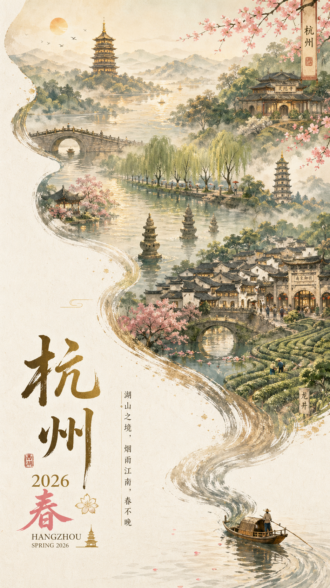
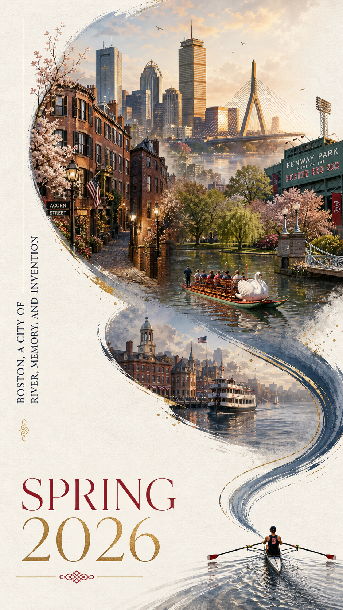
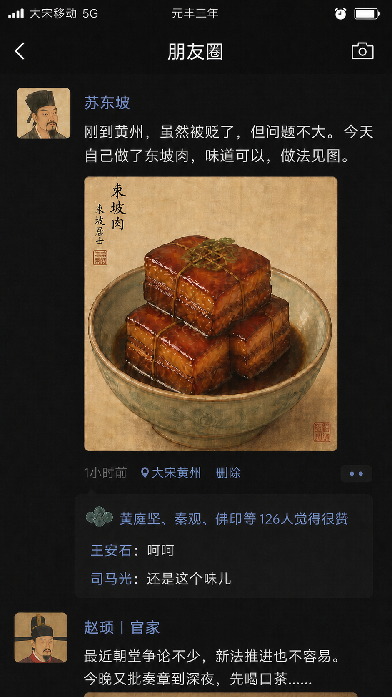
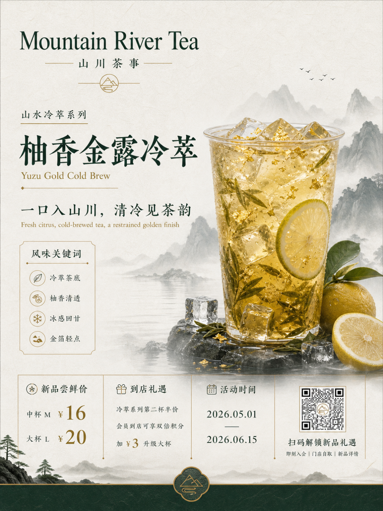
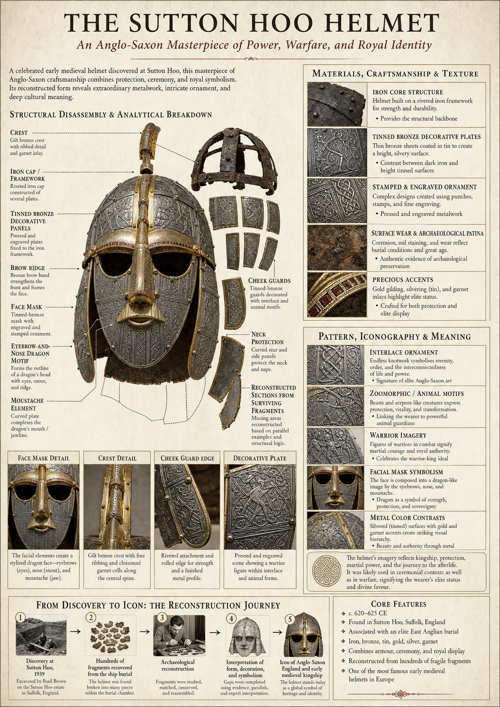
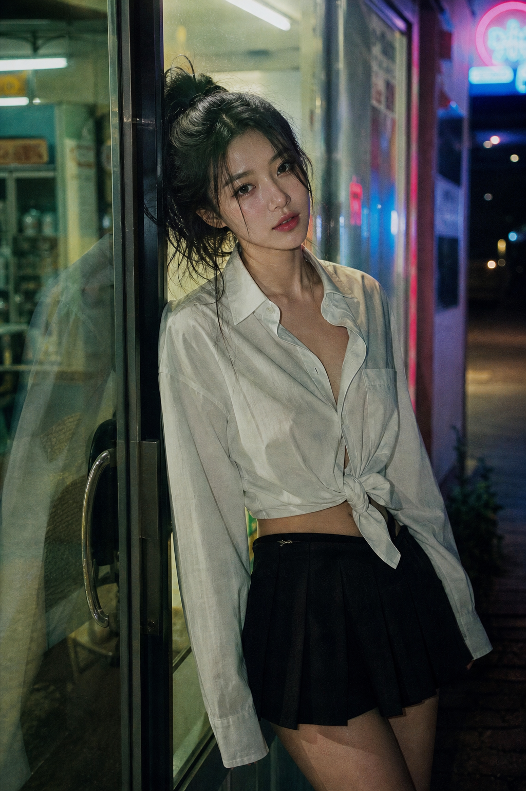
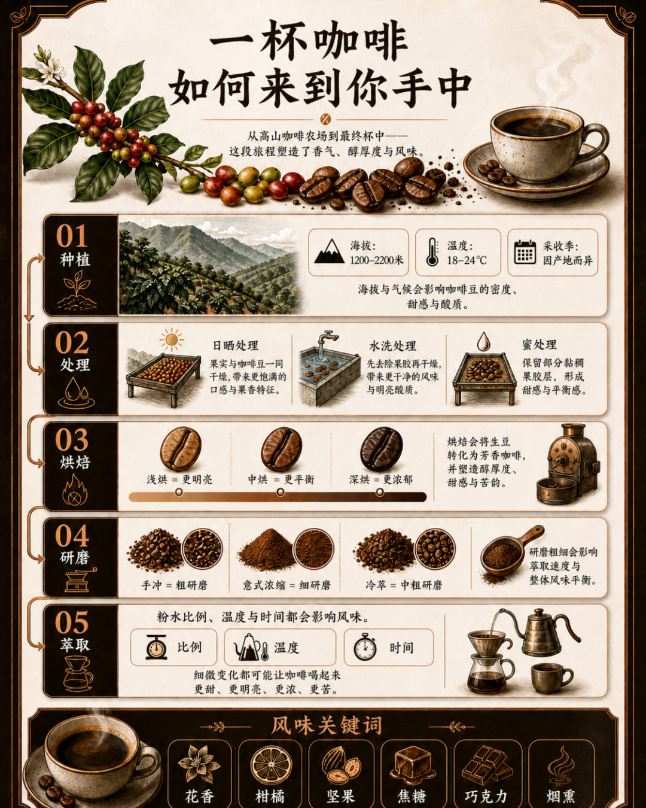
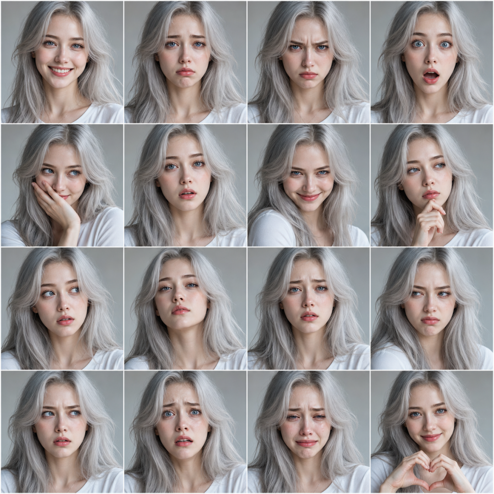

**GPT Image 2 发布十多天了，网上教程铺天盖地，但真正好用的东西往往藏在 GitHub 上。** 有人已经把精心打磨的提示词整理成公开仓库，全部免费，复制粘贴就能用。

我翻遍了 GitHub 上几个 Image 2 提示词仓库，最后留下的只有一个——[Awesome-GPT-Image-2-API-Prompts](https://github.com/Anil-matcha/Awesome-GPT-Image-2-API-Prompts)。

这个仓库的核心价值不在于让你照抄，而是提供了一套可改造的结构化模板。一条好 prompt 不是给你照搬的，是给你拆解学习的。

上面这张杭州春季海报，就是从仓库里的一条 prompt 改的。Charles River 换成西湖，Beacon Hill 换成雷峰塔，1 分钟出片，不用 Photoshop，不用找设计师。

  
  
  

## 一、这个仓库为什么值得推荐

仓库 1.8k Star——星数不是重点，重点是**它每条 prompt 都是「能直接交稿」的水平**。

仓库将 prompt 分为 **6 大类**：

<ul class="numbered-list">
  <li>1人像摄影</li>
  <li>2海报插画</li>
  <li>3游戏截图</li>
  <li>4UI/UX 设计</li>
  <li>5角色设计</li>
  <li>6信息图排版</li>
</ul>

每条 prompt 都是精心设计的结构化模板，你只需要替换关键元素——地标、品牌名、配色——就能产出自己的专业级图片。

  
  
  

## 二、7 个最值得收藏的 Prompt

### 1. 城市春季海报 — 结构化模板的典范

仓库里最让我惊艳的一条，是 **Boston Spring**。它的构图极其巧妙：左下角一艘小船划过水面，水流顺着画面向上走，把整个城市的标志性元素——天际线、街道、桥、地标——全部融进河流形状的构图里。

我把它改成了杭州春季。你可以完全套用这个模板改造你的城市：

- **上海** → 黄浦江 + 外滩 + 武康大楼
- **苏州** → 运河 + 园林 + 平江路
- **西安** → 护城河 + 兵马俑 + 钟楼

**这就是这个仓库的精髓：结构化模板可改造。** 一条好 prompt 不是给你照抄的，是给你拆解学习的。

### 2. 宋朝社交媒体 — 穿越梗自带传播

这条 prompt 超级有趣——让 AI 生成「**假如宋朝人有微信朋友圈**」。苏东坡的头像、贬到黄州后发自制东坡肉、王安石点了「呵呵」、司马光评论「还是那个味道」。

Prompt 结构很巧妙：把现代社交 App 的所有元素（头像、用户名、点赞、评论）都列出来了，但内容全部替换成宋朝语境。**套到唐朝、明朝、民国，都能复用。**

写历史科普类、文化类内容的人，这条必须收藏。

### 3. 山河茶饮海报 — 新中式国潮设计

新中式虽然卷成红海，但这条 prompt 真能跑出能用的图。

核心是 **文字层级的精确控制**。一张茶饮海报需要哪些信息？品牌名、产品名、系列名、上市标语、限时价格、活动期、二维码区——这条 prompt 全部列出，让模型按设计师的方式排版。

颜色用墨绿、米白、金色，强调宣纸质感、留白、山水点缀。适合茶饮、白酒、护肤品、文创产品的品牌方使用。品牌名、配色一换，就是你的物料。

### 4. 博物馆藏品信息图 — 教程类配图天花板

这是我用着最顺手的一条。Prompt 让 AI 生成「**博物馆解说牌风格**」的信息图——主体写实图、结构拆解图、材质工艺、纹样含义、色彩说明，全部图文结合排版。

风格不是海报，不是商品页，不是动漫——是**顶级博物馆展板级别**。prompt 里有个关键词 `automatically determine the most appropriate subject structure`，你只要给个主题，剩下的 AI 自己排版。

### 5. 35mm 便利店夜景人像 — 摄影级长 prompt

这条 prompt 长得离谱，但是它展示了 GPT Image 2 真正的强大之处。

摄影细节被精确控制到令人发指的程度：
- 35mm 胶片摄影
- 便利店冷白荧光灯混外面霓虹灯
- 玻璃门反光
- 真实皮肤质感，不要塑料感
- 真实微毛孔细节

这种 prompt 在 Midjourney 时代根本没法用——关键词堆叠永远做不到这种精度。**但 GPT Image 2 吃这一套，500 字它都能消化。** 仓库里这种超长写实 prompt 有四五条，每一条都是把 prompt 当一份摄影 brief 来写。

### 6. 咖啡溯源信息图 — 教程范本

如果你做内容、写公众号，这条 prompt 必须收藏。

它把「一杯咖啡是怎么来的」拆成 5 步：种植 → 处理 → 烘焙 → 研磨 → 萃取，每步都有具体数据。出来的图是一张完整的信息长图，路径箭头、数据框、图标、模块卡，一应俱全。

  30秒
  vs
  半天
   
  AI 出图时间 vs 自己用 Figma 拉图

把咖啡换成奶茶、葡萄酒、巧克力、面包、寿司，**同一条 prompt 模板，能产出十几张不同主题的科普长图。**

### 7. 16 面板表情网格 — 角色设计省 80% 时间

最后这条给做 IP 的人。

一张图生成同一个角色的 **16 种不同表情**——开心、悲伤、愤怒、惊讶、害羞、无语、坏笑、思考、好奇、骄傲、委屈、不屑、困惑、害怕、哭泣、爱心。

关键是 **面部、发型、服装在 16 个面板里必须保持高度一致**。这是 GPT Image 2 的角色一致性能力，扩散模型时代根本做不到。适合做漫画、IP 形象设计、表情包系列的人——一次生成等于一周工作量。

  
  
  

## 三、3 步抄出专业级图片

仓库介绍完，用法简单得离谱：

<ul class="numbered-list">
  <li>1<strong>去仓库找一条接近你需求的 prompt 复制下来</strong></li>
  <li>2<strong>替换具体内容</strong>——地标、品牌名、标语、配色。比如杭州海报模板里的 Charles River 改成西湖，crimson and gold 改成你的品牌色</li>
  <li>3<strong>扔给 ChatGPT 或 Codex 出图</strong></li>
</ul>

整个流程不到 10 分钟，比从零写 prompt 快 10 倍，效果还更好。

  
  
  

## 四、写在最后

可能有人会觉得这有点「投机取巧」。但我恰恰认为，**AI 时代最稀缺的能力不是「从零创造」，而是「会站在巨人的肩膀上」**。

以前一个普通人想做一张专业海报，要不就花三千块请设计师，要不就自己学三个月 Photoshop。现在你只需要会复制粘贴、会替换关键词。门槛塌方式下降，但能跨过这个门槛的人依然不多。

<strong>多数人的本能反应还是「我要自己学怎么写 prompt」「我要从头摸索」</strong>——这是上一代图像模型留下来的肌肉记忆。网上一堆人花了大量时间精心写出来的 prompt，公开放在那里，随便用。你只要愿意去抄、去改、去玩。  
<strong>会抄的人，不丢人。懂得用别人的肩膀，反而是这个时代最稀缺的清醒。</strong>

**仓库地址：** [Awesome-GPT-Image-2-API-Prompts](https://github.com/Anil-matcha/Awesome-GPT-Image-2-API-Prompts)
