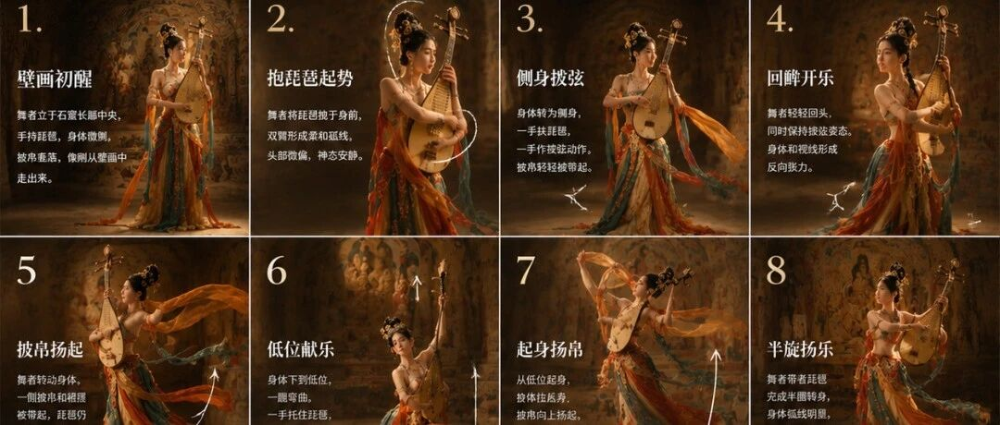
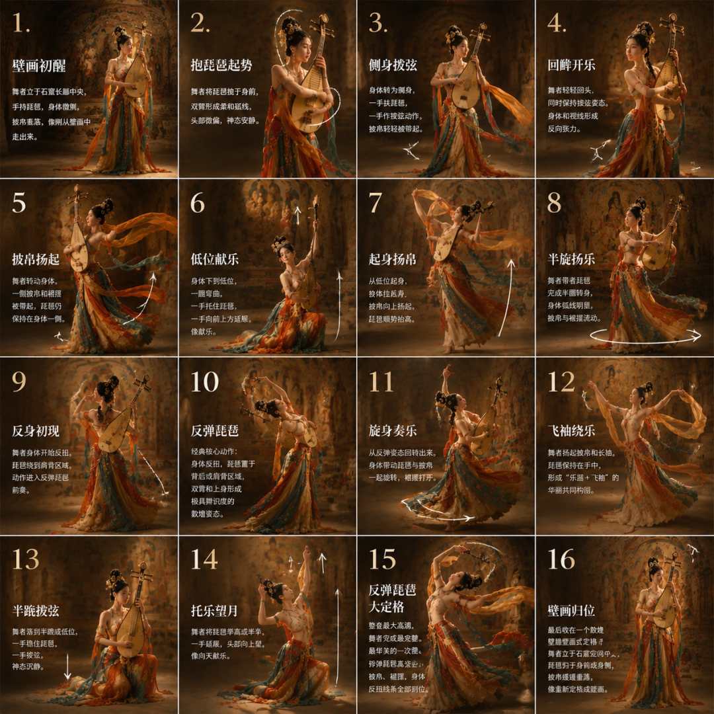
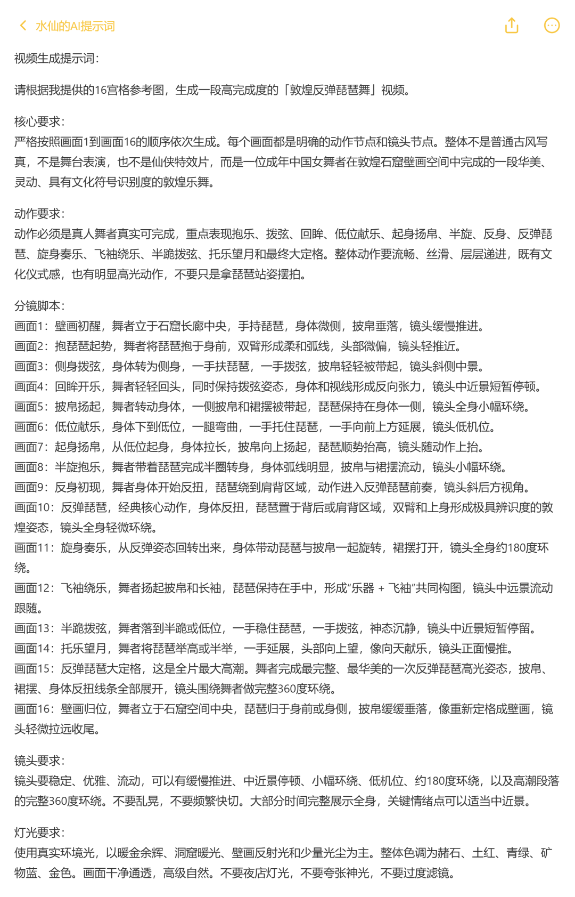
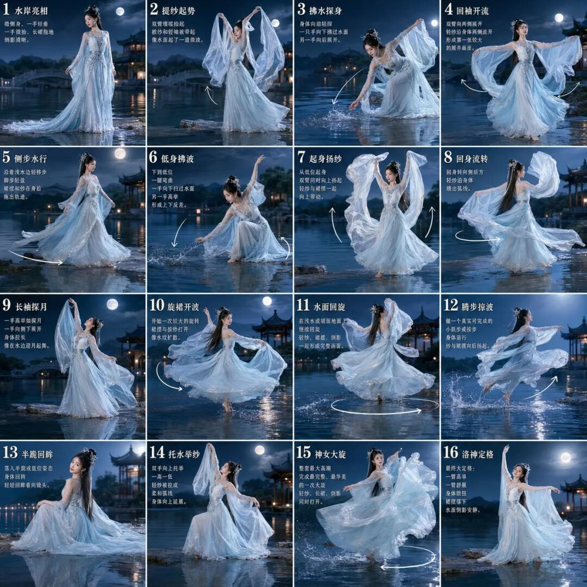
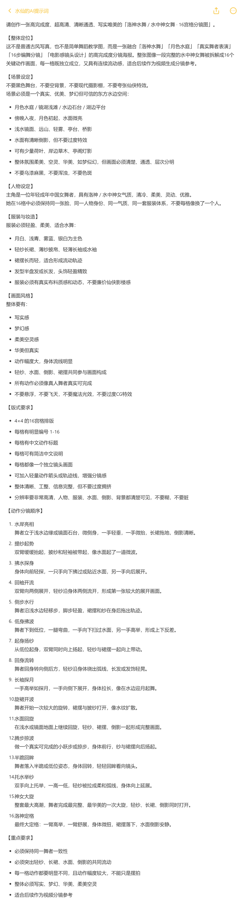
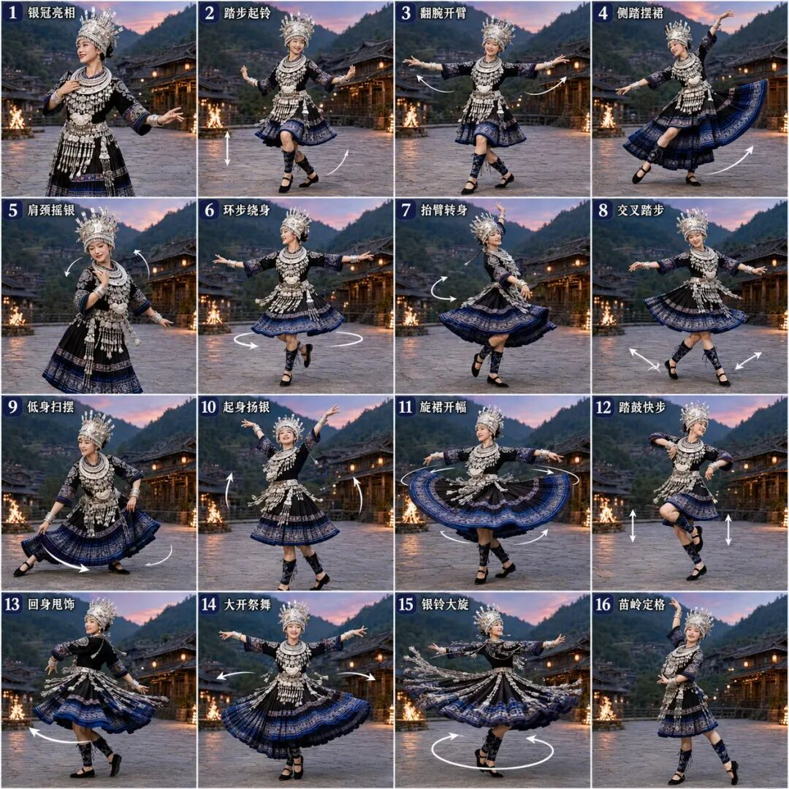

<style>
/* ===== junge-site 通用文章样式 ===== */
.td-content {
    max-width: 900px;
    margin: 0 auto;
}

/* ---- 卡片组件 ---- */

/* 引言卡片：紫蓝渐变 + 白色文字 + 阴影 */
.lead-quote {
    background: linear-gradient(135deg, #667eea 0%, #764ba2 100%);
    color: white;
    padding: 2.5rem 2rem;
    border-radius: 12px;
    margin: 2rem 0 3rem 0;
    font-size: 1.25rem;
    font-weight: 600;
    line-height: 1.6;
    box-shadow: 0 10px 30px rgba(102, 126, 234, 0.3);
    position: relative;
    overflow: hidden;
}
.lead-quote::before {
    content: '"';
    position: absolute;
    top: -20px;
    left: 10px;
    font-size: 120px;
    opacity: 0.1;
    font-family: Georgia, serif;
}

/* 信息框：浅色背景 + 左侧蓝色边框 */
.info-box {
    background: #f8f9fa;
    padding: 1.5rem;
    border-left: 4px solid #667eea;
    border-radius: 8px;
    margin: 2rem 0;
}

/* 重点提示框：暖色背景 + 橙色边框 */
.highlight-box {
    background: linear-gradient(135deg, #fff5f5 0%, #fffaf0 100%);
    border: 2px solid #ed8936;
    border-radius: 12px;
    padding: 1.5rem;
    margin: 2rem 0;
    box-shadow: 0 4px 12px rgba(237, 137, 54, 0.1);
}

/* 数据卡片：深色背景 + 大号数字 */
.stats-box {
    background: linear-gradient(135deg, #1a202c 0%, #2d3748 100%);
    color: white;
    padding: 2rem;
    border-radius: 12px;
    margin: 2rem 0;
    text-align: center;
}
.stats-box .number {
    font-size: 2.5rem;
    font-weight: 800;
    color: #667eea;
    display: block;
}

/* ---- 序号列表：带彩色编号圆徽章 ---- */
.numbered-list {
    list-style: none;
    padding: 0;
    margin: 1.5rem 0;
}
.numbered-list li {
    padding: 0.75rem 0 0.75rem 2.5rem;
    position: relative;
    line-height: 1.6;
    border-bottom: 1px solid #f0f0f0;
}
.numbered-list li:last-child {
    border-bottom: none;
}
.numbered-list .num {
    position: absolute;
    left: 0;
    top: 0.75rem;
    width: 28px;
    height: 28px;
    background: linear-gradient(135deg, #667eea, #764ba2);
    color: white;
    border-radius: 50%;
    display: flex;
    align-items: center;
    justify-content: center;
    font-size: 0.85rem;
    font-weight: 700;
    flex-shrink: 0;
}

/* ---- 引用卡片（正文内嵌引用） ---- */
.inline-quote {
    background: #f0f4ff;
    padding: 1.5rem 2rem;
    margin: 2rem 0;
    border-radius: 12px;
    position: relative;
    font-style: italic;
    color: #4a5568;
}
.inline-quote::before {
    content: '"';
    position: absolute;
    top: 5px;
    left: 12px;
    font-size: 48px;
    color: #667eea;
    opacity: 0.2;
    font-family: Georgia, serif;
}
.inline-quote .author {
    display: block;
    margin-top: 0.5rem;
    font-style: normal;
    font-weight: 600;
    color: #667eea;
    font-size: 0.9rem;
}

/* ---- 视觉分隔器 ---- */
.section-divider {
    display: flex;
    align-items: center;
    margin: 3rem 0;
    gap: 12px;
}
.section-divider .line {
    flex: 1;
    height: 1px;
    background: linear-gradient(90deg, transparent, #667eea, transparent);
}
.section-divider .dot {
    width: 6px;
    height: 6px;
    background: #667eea;
    border-radius: 50%;
    opacity: 0.5;
}

/* ---- 结尾典藏框 ---- */
.outro-box {
    background: linear-gradient(135deg, #1a202c 0%, #2d3748 100%);
    color: white;
    padding: 2.5rem;
    border-radius: 16px;
    margin: 3rem 0;
    text-align: center;
    box-shadow: 0 10px 30px rgba(0, 0, 0, 0.2);
}
.outro-box strong {
    color: #667eea !important;
}

/* ---- 标题样式 ---- */
.td-content h2 {
    font-size: 1.8rem;
    font-weight: 700;
    color: #1a202c;
    margin-top: 3.5rem;
    margin-bottom: 1.5rem;
    padding-bottom: 0.8rem;
    border-bottom: 3px solid #667eea;
    position: relative;
}
.td-content h2::before {
    content: '';
    position: absolute;
    left: 0;
    bottom: -3px;
    width: 60px;
    height: 3px;
    background: linear-gradient(90deg, #667eea, #764ba2);
}

/* ---- 加粗文字主题色 ---- */
.td-content strong {
    color: #667eea;
    font-weight: 600;
}

/* ---- 段落样式 ---- */
.td-content p {
    margin-bottom: 1.5rem;
}

/* ---- 图片样式 ---- */
.td-content img {
    border-radius: 12px;
    box-shadow: 0 8px 24px rgba(0, 0, 0, 0.12);
    margin: 2.5rem 0;
    width: 100%;
    transition: transform 0.3s ease;
}
.td-content img:hover {
    transform: translateY(-4px);
    box-shadow: 0 12px 32px rgba(0, 0, 0, 0.18);
}

/* ---- 代码块 ---- */
.td-content pre {
    border-radius: 12px;
    box-shadow: 0 4px 16px rgba(0, 0, 0, 0.1);
    margin: 2rem 0;
}

/* ---- 表格 ---- */
.td-content table {
    border-collapse: collapse;
    width: 100%;
    margin: 2rem 0;
    border-radius: 12px;
    overflow: hidden;
    box-shadow: 0 4px 12px rgba(0, 0, 0, 0.08);
}
.td-content table th {
    background: linear-gradient(135deg, #667eea, #764ba2);
    color: white;
    padding: 12px 16px;
    font-weight: 600;
}
.td-content table td {
    padding: 10px 16px;
    border-bottom: 1px solid #f0f0f0;
}
.td-content table tr:last-child td {
    border-bottom: none;
}

/* ---- 响应式 ---- */
@media (max-width: 768px) {
    .lead-quote {
        padding: 1.5rem 1rem;
        font-size: 1.1rem;
    }
    .stats-box .number {
        font-size: 2rem;
    }
    .numbered-list li {
        padding-left: 2rem;
    }
}
</style>

**AI 图像生成已经不只是"画一张图"了。用 GPT Image 2，你可以在一个画面中生成长达 16 帧的舞蹈分镜，每帧动作连贯、人物一致、场景统一，直接可作为视频生成的分镜参考。**

这篇文章整理了 **3 套完整可复用的 GPT Image 2 舞蹈分镜提示词**——敦煌反弹琵琶舞、洛神水舞、苗族银饰舞——每套都包含完整的场景设定、人物设定、服装妆造和 16 帧动作分镜。直接复制即可使用。



<div class="lead-quote">
AI 不再是静态画手，它已经懂得"编舞"了。
</div>

## 一、GPT Image 2 的舞蹈生成能力

GPT Image 2 在处理复杂构图方面相比前代有了质的飞跃。它不仅能理解"一个人跳舞"这种笼统描述，更能精确解析：

- **16 宫格分镜排版** —— 4×4 网格，每格独立画面但保持整体一致性
- **同一人物一致性** —— 多帧画面中保持相同的面孔、服装、气质
- **连续动作逻辑** —— 从起势到高潮再到收尾，动作序列有明确的递进关系
- **文化符号识别** —— 敦煌壁画、苗族银饰、洛神赋等文化元素精准还原

<div class="info-box">
<strong>核心技巧：</strong>成功的舞蹈分镜提示词需要同时描述 <strong>场景环境 + 人物一致性 + 服装细节 + 分镜版式 + 16 步具体动作</strong>，缺一不可。
</div>

<div class="section-divider">
  <span class="line"></span>
  <span class="dot"></span>
  <span class="line"></span>
</div>

## 二、案例一：敦煌反弹琵琶舞

<div class="stats-box">
<span class="number">16</span> 帧连续分镜<br>
敦煌石窟场景 · 反弹琵琶经典动作 · 电影感灯光
</div>

这套提示词重现了敦煌壁画中最具辨识度的"反弹琵琶"舞姿，场景设定在敦煌石窟壁画长廊中，暖金余晖 + 洞窟暖光，色彩以赭石、土红、青绿、矿物蓝、金色为主。



### 完整提示词

```text
请创作一张高完成度、超高清、清晰通透、写实且富有电影感的「敦煌反弹琵琶舞·16宫格分镜图」。

【整体定位】
这不是普通古风写真，也不是简单舞蹈教学图，而是一张融合「敦煌乐舞」「反弹琵琶经典动作」「石窟壁画空间」「16步编舞分镜」「电影感镜头设计」的高完成度分镜海报。
整张图像一段完整的敦煌反弹琵琶舞被拆解成16个关键动作画面，每一格既独立成立，又具有连续流动感、文化识别度和明显动作层次，适合后续作为视频生成分镜参考。

【场景设定】
不要现代舞台，不要空背景，不要摄影棚，不要普通古风室内。
场景必须是一个真实、优美、具有敦煌壁画气质的空间：
* 敦煌石窟前殿 / 壁画长廊 / 佛龛光影空间
* 墙面可见壁画纹样、拱门、佛龛、石窟肌理
* 整体有暖金余辉、洞窟暖光、轻微光尘
* 主色调为赭石、土红、青绿、矿物蓝、金色
* 空间有前景、中景、后景，层次清晰，具有纵深感
* 整体氛围神圣、华美、沉静、带壁画复活感

【人物设定】
主角是一位年轻成年中国女舞者，气质端庄、灵动、神圣、优雅，像敦煌乐舞天女。
在16格中保持同一张脸、同一人物、同一气质、同一套服装体系。

【服装与妆造】
服装为敦煌风乐舞服：高腰长裙、飘逸披帛、敦煌风大袖或轻纱袖，配色以赭石、敦煌红、青绿、金色、少量孔雀蓝为主。一把琵琶是核心道具，必须清晰可见。披帛、裙摆、袖摆都要有真实动态。

【版式要求】
* 4×4 的16宫格排版，每格有编号 1-16
* 每格有中文动作标题
* 干净、清晰、信息完整但不过度拥挤
* 分辨率极其高清

【动作分镜顺序】
1. 壁画初醒：舞者立于石窟长廊中央，手持琵琶，身体微侧，披帛垂落
2. 抱琵琶起势：将琵琶抱于身前，双臂柔和弧线，头部微偏
3. 侧身拨弦：侧身，一手扶琵琶一手拨弦，披帛被带起
4. 回眸开乐：回头的瞬间，身体和视线形成反向张力
5. 披帛扬起：转动身体，披帛和裙摆被带起
6. 低位献乐：下到低位，一手托琵琶一手向上延展
7. 起身扬帛：从低位起身，披帛向上扬起，琵琶顺势抬高
8. 半旋抱乐：半圈转身，披帛与裙摆流动
9. 反身初现：身体开始反扭，进入反弹琵琶前奏
10. 反弹琵琶：经典核心动作，琵琶置于背后，极具辨识度的敦煌姿态
11. 旋身奏乐：从反弹姿态回转，带动琵琶与披帛一起旋转
12. 飞袖绕乐：扬起披帛和长袖，乐器+飞袖的华丽共同构图
13. 半跪拨弦：半跪低位，神态沉静
14. 托乐望月：琵琶举高，头部向上望，如向天献乐
15. 反弹琵琶大定格：整套最高潮的反弹琵琶高光姿态
16. 壁画归位：最终收于壁画式定格，像重新定格成壁画

【重点要求】
* 保持同一舞者一致性
* 突出琵琶、披帛、反身、回旋、献乐、定格等核心元素
* 每格动作都要明显不同
* 写实、华美、敦煌感强、文化识别度高
```


### 视频生成提示词

同样的分镜还可以直接用来生成 **视频**。以下是与上述分镜配套的视频生成提示词：

```text
请根据16宫格参考图，生成一段高完成度的「敦煌反弹琵琶舞」视频。

核心要求：严格按照画面1到画面16的顺序依次生成。整体不是普通古风写真，不是舞台表演，而是一位女舞者在敦煌石窟空间中完成的一段华美敦煌乐舞。

动作：真人舞者真实可完成，重点表现抱乐、拨弦、回眸、低位献乐、反弹琵琶、大定格等。动作流畅丝滑、层层递进。

镜头：稳定优雅流动。有缓慢推进、中近景停顿、小幅环绕、低机位、180度环绕，高潮段有完整360度环绕。大部分时间展示全身，情绪点适当中近景。

灯光：暖金余晖、洞窟暖光、壁画反射光和少量光尘。整体色调赭石、土红、青绿、矿物蓝、金色。干净通透，高级自然。
```



<div class="section-divider">
  <span class="line"></span>
  <span class="dot"></span>
  <span class="line"></span>
</div>

## 三、案例二：洛神水舞

<div class="stats-box">
<span class="number">16</span> 帧 · 水岸月夜<br>
洛神赋意境 · 镜面倒影 · 水墨东方美学
</div>

以曹植《洛神赋》为灵感，将洛神凌波微步、翩若惊鸿的姿态转化为 16 帧分镜。场景设定在月夜水岸，镜面浅水、远山薄雾、亭台石阶，倒影与实景相互映照。



### 完整提示词

```text
请创作一张高完成度、超高清的「洛神水舞 · 16宫格分镜图 / Luo Shen Water Dance 16-Step Storyboard」。

【整体定位】
融合「洛神赋意境」「月夜水岸」「水袖长纱」「16步编舞」「电影感构图」的高完成度分镜海报。
像一段洛神水舞被拆解成16个关键动作画面，适合后续视频生成分镜参考。

【场景设定】
不要黑色舞台，不要摄影棚，不要现代室内。
场景必须是优美、有东方水墨气质的月夜水岸空间：
* 镜面浅水 / 水岸石台
* 远景可见远山、薄雾、亭台
* 月光洒落水面，有倒影
* 主色调为月白、浅蓝、青灰、水绿、暖灯
* 有前景、中景、后景，层次清晰
* 整体氛围优美、梦幻、有诗意

【人物设定】
主角是一位年轻成年中国女舞者，气质典雅、仙气、轻盈。
保持同一张脸、同一人物身份、同一气质、同一套服装体系。

【服装与妆造】
服装为洛神赋风格水袖长纱舞服：
* 月白色和浅蓝色渐变长裙
* 薄纱披帛和轻纱长袖
* 发饰为半挽发或飘逸长发 + 精致头饰
* 可带少量珍珠或水纹元素配饰
* 裙摆适合水面拖曳和旋转

【版式要求】
* 4×4的16宫格分镜排版
* 每格有编号 1-16 和中文动作标题
* 干净、清晰、信息完整但不过度拥挤

【动作分镜顺序】
1. 水岸亮相：舞者立于浅水边缘，微侧身，一手轻垂，一手微抬，倒影清晰
2. 提纱起势：双臂缓缓抬起，披纱和轻袖被带起，像水面微波
3. 拂水探身：身体向前轻探，一只手向下拂过水面，另一手向后展开
4. 回袖开流：双臂向两侧展开，轻纱沿身体两侧流开
5. 侧步水行：沿浅水边轻移步，裙摆和纱拖出轨迹
6. 低身拂波：下到低位，一手向下扫过水面，一手高举
7. 起身扬纱：从低位起身，双臂向上扬起，轻纱与裙摆一起带动
8. 回身流转：回身转向侧后方，轻纱绕出弧线
9. 长袖探月：一手高举如探月，一手展开，身体拉长
10. 旋裙开波：一次较大的旋转，裙摆与披纱像水纹扩散
11. 水面回旋：在浅水继续回旋，倒影一起形成完整画面
12. 腾步掠波：小跃步或掠步，纱与裙摆向后扬起
13. 半跪回眸：落入半跪姿态，轻轻回眸
14. 托水举纱：双手向上托举，纱被拉成柔和弧线
15. 神女大旋：整套最高潮，最完整华美的大旋
16. 洛神定格：一臂高举，一臂舒展，身体微扭，裙摆落下，倒影安静

【重点要求】
* 保持同一舞者一致性
* 突出水、纱、倒影、旋转、拂水等核心元素
* 每格动作明显不同
* 写实与梦幻相结合，东方美学风格
* 所有动作真人可完成
```



<div class="section-divider">
  <span class="line"></span>
  <span class="dot"></span>
  <span class="line"></span>
</div>

## 四、案例三：苗族银饰舞

<div class="stats-box">
<span class="number">16</span> 帧 · 苗寨月夜<br>
银饰动态 · 民族盛装 · 脚步节奏
</div>

苗族银饰舞的特点是**银饰的动态感**——银冠、项圈、胸牌、腰链随着舞者的脚步、肩颈律动产生清脆的撞击声和摆动轨迹。这套提示词将这种特色完整还原到 16 帧分镜中。



### 完整提示词

```text
请创作一张高完成度、超高清、清晰通透的「苗族银饰舞 · 16宫格分镜图 / Miao Silver Dance 16-Step Storyboard」。

【整体定位】
这不是普通民族写真，而是一张融合「苗族银饰舞」「真实苗寨场景」「16步编舞分镜」「电影感构图」的高完成度分镜海报。每一格连成一条流畅、节奏感强、银饰动态明显的舞蹈轨迹。

【场景设定】
不要黑色舞台，不要现代摄影棚。
傍晚苗寨木楼前广场 / 石板地
* 吊脚楼、木栏杆、远山和山雾
* 暖色灯火或火塘光
* 背景层次清楚（前景、中景、后景）
* 整体氛围优美有真实感

【人物设定】
年轻成年中国女舞者，苗族银饰舞者气质，灵动、优雅、有力量感。
保持同一张脸、同一人物、同一套服装体系。

【服装与妆造】
苗族银饰舞风格盛装：
* 银冠头饰明显夸张精致
* 银项圈、银胸牌、银链、耳饰、手饰丰富
* 深蓝/靛蓝/黑蓝色调的民族刺绣裙装
* 裙摆层次丰富，适合旋转摆动
* 银饰、裙摆必须随动作产生真实动态

【画面风格】
* 真实民族舞表演感，银饰动态明显
* 脚步、肩颈、手臂、裙摆节奏清楚
* 电影分镜感、舞蹈编排感
* 所有动作像真人舞者真实可完成

【版式要求】
* 4×4的16宫格分镜排版，每格编号 1-16
* 每格有中文动作标题
* 干净清晰，不过度拥挤

【动作分镜顺序】
1. 银冠亮相：舞者站在苗寨木楼前，一手轻扶银饰胸牌，一手自然打开
2. 踏步起铃：脚下轻踏两拍，肩颈带动银饰轻晃，双手缓缓抬起
3. 翻腕开臂：双手翻腕从胸前向两侧展开，身体微微侧摆
4. 侧踏摆裙：向侧方大步踏出，裙摆被带起，一手高扬一手展开
5. 肩颈摇银：肩膀连续轻抖，银冠、项圈、胸饰一起晃动
6. 环步绕身：脚下走环步，身体绕半圈，双臂展开
7. 抬臂转身：一手高举一手低开，优雅转身，银饰和裙摆甩出动态
8. 交叉踏步：双脚交叉切换，双手随节奏摆动，身体有弹性
9. 低身扫摆：下到半蹲低位，一手向下扫过裙摆
10. 起身扬银：从低位起身，胸饰和银链随动作明显上扬
11. 旋裙开幅：大旋转，裙摆完整打开，所有银饰动态明显
12. 踏鼓快步：连续快速踏步，身体微前倾，节奏感强
13. 回身甩饰：回身，银饰与头饰流苏被甩出
14. 大开祭舞：双臂大幅打开，身体向上拉长
15. 银铃大旋：最终大旋转，所有银饰形成最强动势——整套高潮
16. 苗岭定格：一手高举，一手横于胸前，裙摆落下，银饰轻晃

【重点要求】
* 突出银饰动态、裙摆动态、脚步节奏、肩颈律动
* 保持同一舞者一致性
* 每格动作明显不同
* 场景有民族氛围但不喧宾夺主
* 所有动作真人可完成
```


<div class="section-divider">
  <span class="line"></span>
  <span class="dot"></span>
  <span class="line"></span>
</div>

## 五、使用技巧与最佳实践

<div class="highlight-box">
<strong>💡 实战经验：</strong>提示词越长不代表质量越好——关键是结构清晰、逻辑合理。三套提示词都遵循了相同的"整体定位→场景→人物→服装→版式→分镜顺序→重点要求"结构，只是动作内容不同。
</div>

### 制作高质量舞蹈分镜的要点

- **元设定先行**：先明确这张图的"定位"——是什么、不是什么。告诉模型"这不是普通古风写真，不是舞台表演"，能有效减少偏差
- **人物一致性写清楚**：明确要求"保持同一张脸、同一人物身份、同一气质、同一服装体系"，避免每格像换了一个人
- **动作序列要有叙事弧**：从亮相→起势→展开→高潮→回落→收尾，16 帧其实是一个微型故事
- **细节要具体**："一手轻扶银饰胸牌"比"在跳舞"有效一万倍
- **不要的也说清楚**："不要仙侠特效，不要悬浮，不要魔法光效"等负面提示有时候比正面提示更重要

### 从图片到视频

这套分镜图的核心价值在于：**它不仅仅是 16 张图，而是一个视频分镜脚本**。三套提示词都参考了视频生成，你可以：

1. **用 GPT Image 2** 生成 16 宫格分镜图
2. **用配套视频提示词**（如敦煌案例中的视频生成提示词）生成完整舞段
3. 分镜图中的 **编号 + 动作标题** 直接对应视频中的镜头顺序

<div class="outro-box">
<strong>写在最后</strong><br><br>
AI 图像生成正在经历从"画得好看"到"理解编排"的跃迁。这套舞蹈分镜提示词展示了 GPT Image 2 在<br><strong>连续动作理解、人物一致性保持、文化符号还原</strong>三个维度上的能力边界。<br><br>
三套提示词可以直接复制使用，也可以在<span style="color: #667eea;">文末评论</span>分享你的生成结果。<br>
更多 AI 绘画技巧，欢迎收藏关注。
</div>
