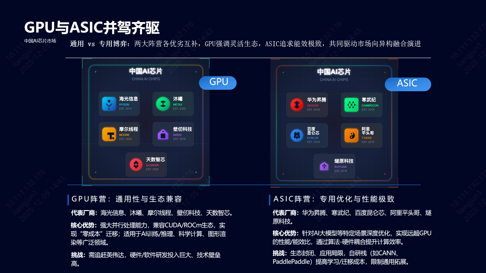
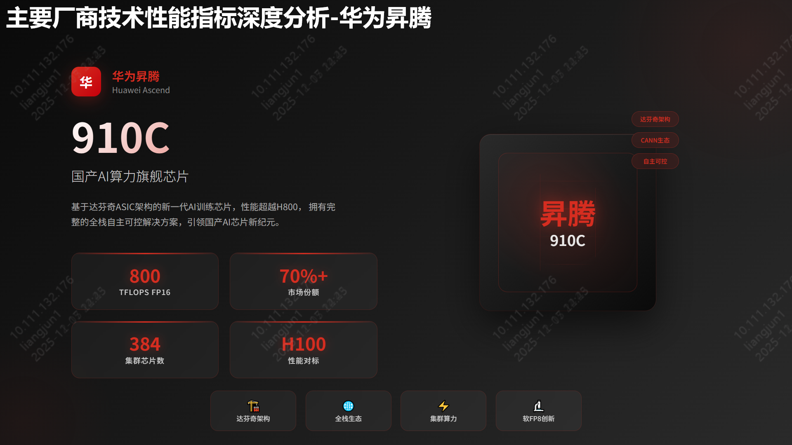
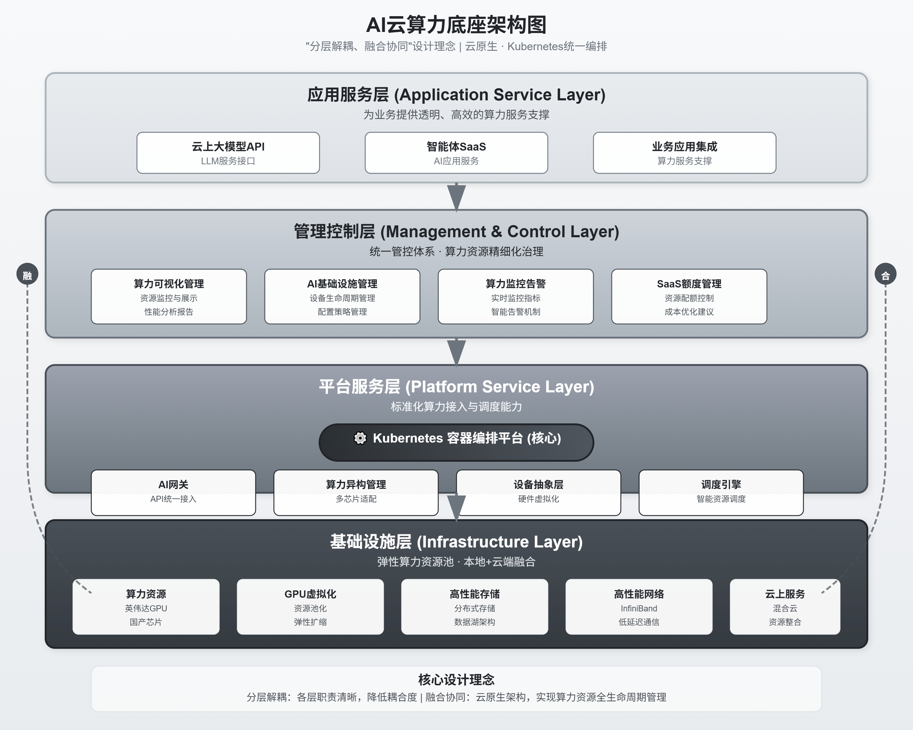
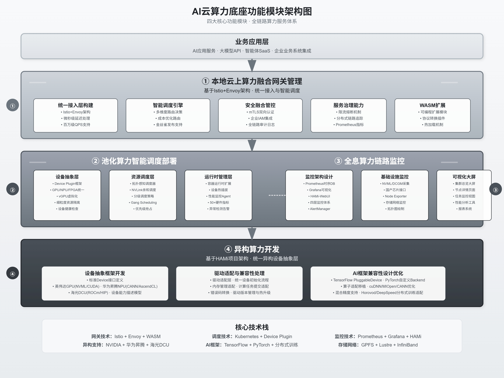
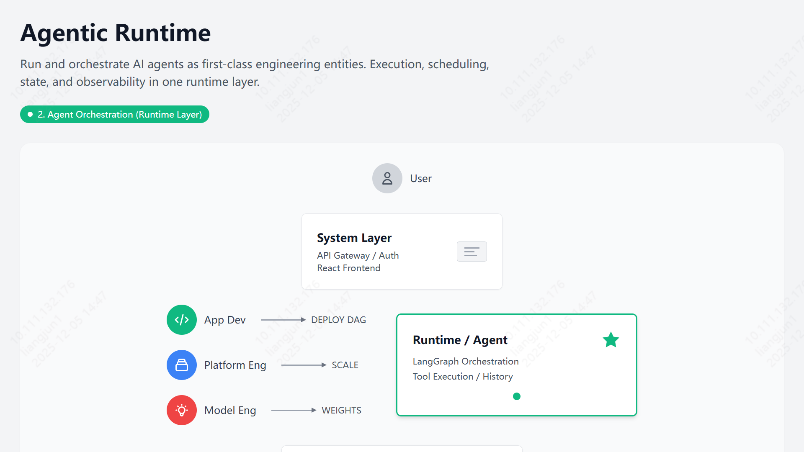
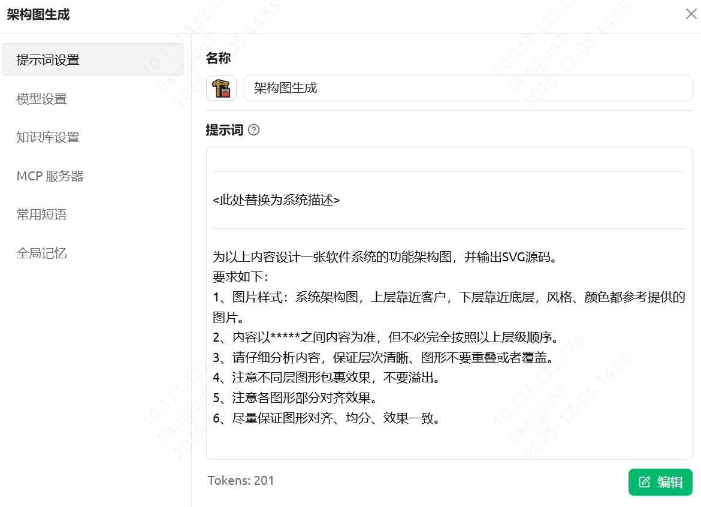
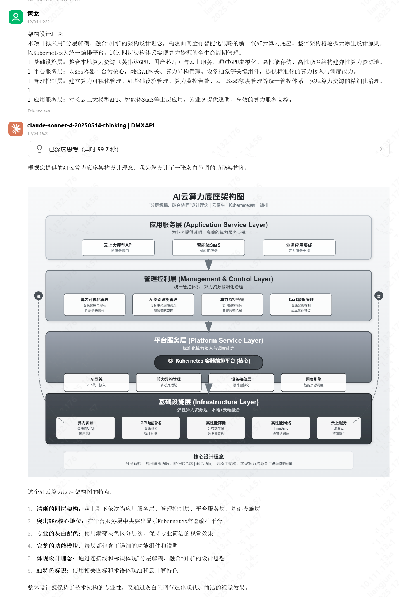
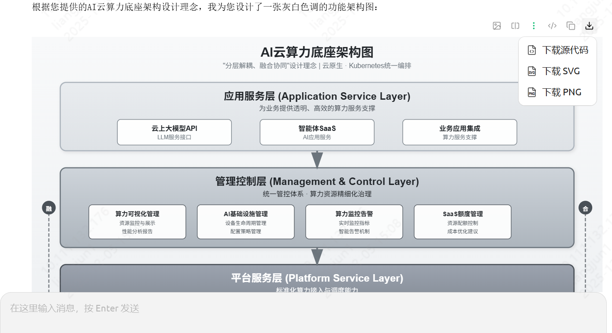

在数字化转型加速的今天，**系统设计与架构能力**已成为技术工作者的核心竞争力。一张清晰、美观的架构图，往往胜过千言万语，能让复杂的系统逻辑一目了然。

然而，传统的绘图方式往往让人望而却步：

> *   **门槛高**：需要熟练掌握 Visio, OmniGraffle, ProcessOn 等专业工具。
> *   **耗时久**：调整对齐、配色、连线占据了大量时间，修改成本极高。
> *   **风格乱**：难以统一格式，从文本思维到图形表达存在巨大的转换鸿沟。

在多次尝试 WPS AI、豆包、通义千问等工具后，我发现生成的图表在专业度和美观度上仍有欠缺。直到我发现了 **Claude (配合特定 Prompt)** 的强大能力——它可以一键生成代码级的 SVG 或 HTML 架构图，只需简单截图，即可完美嵌入 PPT，极大地提升了技术交流的效率。

本文将分享这一高效方法，助你轻松搞定“高大上”的架构图。

---

## 🎨 效果预览

在深入方法之前，先来看看 AI 生成的实际效果。这些图表均由 Claude/Gemini 3 配合提示词直接生成 SVG/HTML 渲染而成。

### 1. 宣传汇报类
适用于产品介绍、方案推广，风格现代简洁。




### 2. 架构设计类
适用于技术评审、系统蓝图，层次分明，逻辑严密。




### 3. 业务流程类
适用于泳道图、状态流转，清晰直观。



---

## 🛠️ 准备工作

要实现上述效果，你需要准备好以下环境：

### 方案 A：在线直接生成 (推荐)
如果你能顺畅访问 Google 服务，直接使用 **[Google AI Studio](https://aistudio.google.com/apps)** 是最便捷的选择。

### 方案 B：客户端 + API
对于国内网络环境，推荐使用本地客户端配合 API 服务：

1.  **客户端**：下载安装 **[Cherry Studio](https://cherry-ai.com/)** (支持多模型管理的优秀客户端)。
2.  **API 服务**：你需要一个支持 Claude 3.5 Sonnet 或 Gemini 1.5 Pro 的 API。
    *   *推荐渠道*：[DMX API](https://www.dmxapi.cn/register?aff=bDx3) (使用邀请码 `bDx3` 可获赠额度)
    *   *备选渠道*：OpenRouter 等其他聚合服务商。

---

## 🚀 实战演练：4步生成架构图

以 **Cherry Studio + Claude 4 Sonnet** 为例，生成一张架构图仅需四步：

1.  **准备文档**：梳理好你的系统描述、功能列表或技术栈说明。
2.  **输入指令**：将下方的“万能提示词”填入对话框。
3.  **获取代码**：AI 会输出一段 SVG 或 HTML 代码。
4.  **渲染保存**：Cherry Studio 会自动渲染预览，直接截图或保存即可。

### 🪄 核心提示词 (Prompt)

复制以下 Prompt，将 `<此处替换为系统描述>` 替换为你实际的业务内容：

```markdown
*****
<此处替换为系统描述>
*****

为以上内容设计一张软件系统的功能架构图，并输出 SVG 源码。

**设计要求：**
1.  **视觉风格**：采用专业的系统架构图样式。
    *   布局：逻辑分层，上层靠近用户/业务，下层靠近底层/数据。
    *   配色：参考现代科技风格（如蓝、白、灰主色调），配色和谐专业。
2.  **内容准则**：
    *   内容严格以 ***** 之间的描述为准。
    *   层级顺序可根据架构逻辑进行微调，不必完全死板照搬。
3.  **布局细节**：
    *   层次清晰，模块之间严禁重叠或遮挡。
    *   容器包裹效果要自然，子模块不要溢出父容器。
    *   严格对齐（左对齐、居中对齐），模块间距均匀。
4.  **最终输出**：仅输出一段完整的、可直接渲染的 SVG 代码。
```

### 输入示例

Cherry Studio示例：



### 最终产出

经过 AI 的即时运算，你将获得类似下图的精美架构图。



如果你用**Cherry Studio**可以直接**复制**/**下载**图片用于 PPT 汇报绝对吸睛！


---

## 💡 总结

AI 正在重塑我们的工作流。通过将“绘图”这一繁琐过程转化为“描述”这一认知过程，我们不仅节省了时间，更能将精力集中在**系统设计**本身的逻辑与价值上。下次做 PPT 时，不妨试试这个方法。
